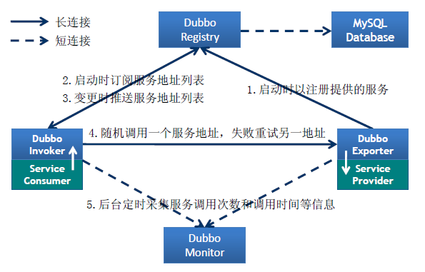
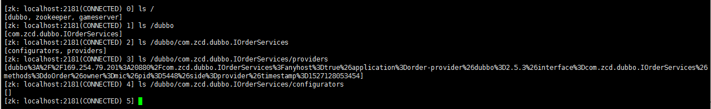
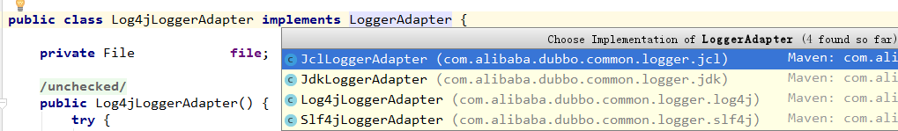
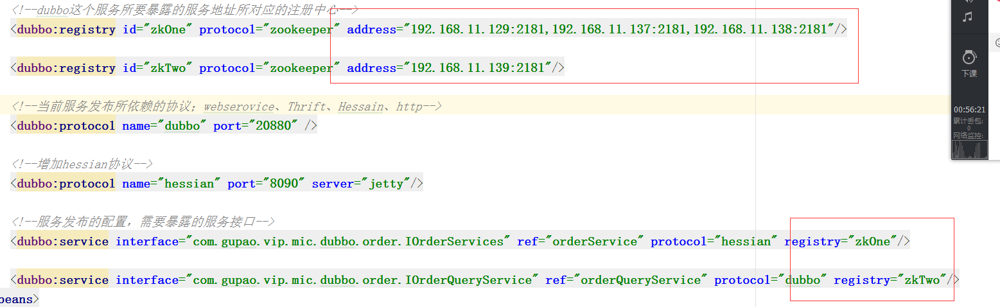
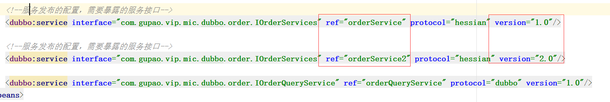
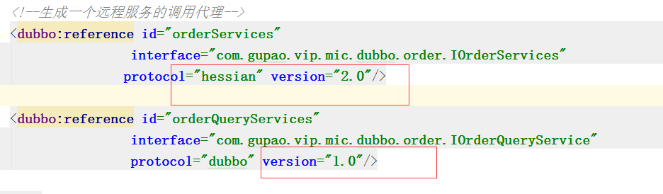

# Dubbo 简介

## Dubbo的设计角色




# Dubbo  HelloWorld

## Dubbo-Api（就是同享信息）

### 接口

```java
public interface IOrderServices {

    /*
     * 下单操作
     */
    DoOrderResponse doOrder(DoOrderRequest request);

}
```

### 请求参数

```java
public class DoOrderRequest implements Serializable{

    private static final long serialVersionUID = 4632876501724851634L;

    private String name;

    public String getName() {
        return name;
    }

    public void setName(String name) {
        this.name = name;
    }

    @Override
    public String toString() {
        return "DoOrderRequest{" +
                "name='" + name + '\'' +
                '}';
    }
}
```

### 返回参数

```java
public class DoOrderResponse implements Serializable{

    private static final long serialVersionUID = 3938659532219361525L;
    private Object data;

    private String code;

    private String memo;

    public Object getData() {
        return data;
    }

    public void setData(Object data) {
        this.data = data;
    }

    public String getCode() {
        return code;
    }

    public void setCode(String code) {
        this.code = code;
    }

    public String getMemo() {
        return memo;
    }

    public void setMemo(String memo) {
        this.memo = memo;
    }

    @Override
    public String toString() {
        return "DoOrderResponse{" +
                "data=" + data +
                ", code='" + code + '\'' +
                ", memo='" + memo + '\'' +
                '}';
    }
}
```


## Dubbo-Provider（服务发布方）

### 配置

在Resources 目录下面新建`META-INF`文件，然后在新建`spring`文件，在这个文件中定义一个叫o`order-provider.xml` 文件，目录结构如下图：


此配置文件的内容如下：

注意：目前我们只是操作点对点，就是服务消费方直接和服务提供方联系，没有中间的服务注册中心，所以如论是Provider 还是 Consumer 的注册中心配置都是`<dubbo:registry address="N/A"/>`

```xml
<?xml version="1.0" encoding="UTF-8"?>
<beans xmlns="http://www.springframework.org/schema/beans"
       xmlns:xsi="http://www.w3.org/2001/XMLSchema-instance"
       xmlns:dubbo="http://code.alibabatech.com/schema/dubbo"
       xsi:schemaLocation="http://www.springframework.org/schema/beans        http://www.springframework.org/schema/beans/spring-beans.xsd        http://code.alibabatech.com/schema/dubbo        http://code.alibabatech.com/schema/dubbo/dubbo.xsd">

    <!--当前项目在整个分布式架构里面的唯一名称，计算依赖关系的标签-->
    <dubbo:application name="order-provider" owner="mic"/>

    <dubbo:monitor protocol="registry"/>

  	<!--N/A 表示不用注册中心 -->
	<dubbo:registry address="N/A">
  
    <!--dubbo这个服务所要暴露的服务地址所对应的注册中心-->
    <!--<dubbo:registry protocol="zookeeper" address="192.168.11.129:2181,192.168.11.137:2181,192.168.11.138:2181,192.168.11.139:2181"/>
	-->

    <!--当前服务发布所依赖的协议；webserovice、Thrift、Hessain、http-->
    <dubbo:protocol name="dubbo" port="20880"/>

    <!--服务发布的配置，需要暴露的服务接口-->
    <dubbo:service
            interface="com.gupao.vip.mic.dubbo.order.IOrderServices"
            ref="orderService"/>

    <!--Bean bean定义-->
    <bean id="orderService" class="com.gupao.vip.mic.dubbo.order.OrderServiceImpl"/>

</beans>
<!--N/A 表示不用注册中心 -->
<dubbo:registry address="N/A">
```

### 引入日志

dubbo 默认支持log4j，所以只需要在resources 目录下面加入一个 log4j.properties 文件即可。

```properties
log4j.rootLogger=info, stdout

log4j.appender.stdout=org.apache.log4j.ConsoleAppender

log4j.appender.stdout.layout=org.apache.log4j.PatternLayout

log4j.appender.stdout.layout.ConversionPattern=%d %p [%c] - %m%n
```

### 接口实现

```java
public class OrderServiceImpl implements IOrderServices {
    @Override
    public DoOrderResponse doOrder(DoOrderRequest request) {
        System.out.println("曾经来过：" + request);
        DoOrderResponse response = new DoOrderResponse();
        response.setCode("1000");
        response.setMemo("处理成功");
        return response;
    }
}
```

### Dubbo服务启动

很简单，其实就一行代码`Main.main(args);`, 后面来解释这个

```java
public class App {
    public static void main( String[] args ) {
        Main.main(args);
    }
}
```

### 运行结果

特别的把此服务的URL也拷贝过来了，在点对点的消费端需要这个URL

```
2018-05-23 23:07:55,814 INFO [com.alibaba.dubbo.config.AbstractConfig] -  [DUBBO] Export dubbo service com.zcd.dubbo.IOrderServices to url dubbo://192.168.99.1:20880/com.zcd.dubbo.IOrderServices?anyhost=true&application=order-provider&dubbo=2.5.3&interface=com.zcd.dubbo.IOrderServices&methods=doOrder&owner=mic&pid=14560&side=provider&timestamp=1527088075679, dubbo version: 2.5.3, current host: 127.0.0.1
2018-05-23 23:07:55,997 INFO [com.alibaba.dubbo.remoting.transport.AbstractServer] -  [DUBBO] Start NettyServer bind /0.0.0.0:20880, export /192.168.99.1:20880, dubbo version: 2.5.3, current host: 127.0.0.1
2018-05-23 23:07:55,998 INFO [com.alibaba.dubbo.container.Main] -  [DUBBO] Dubbo SpringContainer started!, dubbo version: 2.5.3, current host: 127.0.0.1
[2018-05-23 23:07:56] Dubbo service server started!
曾经来过：DoOrderRequest{name='mic'}
```


## Dubbo-Consumer（服务消费方）

### 配置

注意：目前我们只是操作点对点，就是服务消费方直接和服务提供方联系，没有中间的服务注册中心，所以如论是Provider 还是 Consumer 的注册中心配置都是`<dubbo:registry address="N/A"/>`

1. `dubbo:reference` 标签的url必须配置，因为是点对点的，这个URL在服务提供方启动的时候console 中有，可以从中拷贝过来。

```java
<?xml version="1.0" encoding="UTF-8"?>
<beans xmlns="http://www.springframework.org/schema/beans"
       xmlns:xsi="http://www.w3.org/2001/XMLSchema-instance"
       xmlns:dubbo="http://code.alibabatech.com/schema/dubbo"
       xsi:schemaLocation="http://www.springframework.org/schema/beans        http://www.springframework.org/schema/beans/spring-beans.xsd        http://code.alibabatech.com/schema/dubbo        http://code.alibabatech.com/schema/dubbo/dubbo.xsd">

    <!--当前项目在整个分布式架构里面的唯一名称，计算依赖关系的标签-->
    <dubbo:application name="order-provider" owner="mic"/>

    <!--dubbo这个服务所要暴露的服务地址所对应的注册中心-->
    <dubbo:registry address="N/A"/>

    <!--生成一个远程服务的调用代理-->
    <dubbo:reference id="orderServices" interface="com.zcd.dubbo.IOrderServices"
        url="dubbo://192.168.99.1:20880/com.zcd.dubbo.IOrderServices"/>

</beans>
```

### 服务消费

```java
public class App {
    public static void main( String[] args ) throws IOException {
        ClassPathXmlApplicationContext context=new ClassPathXmlApplicationContext("order-consumer.xml");

        //用户下单过程
        IOrderServices services=(IOrderServices)context.getBean("orderServices");

        DoOrderRequest request=new DoOrderRequest();
        request.setName("mic");
        DoOrderResponse response=services.doOrder(request);

        System.out.println(response);

        //Order.doOrder();
        System.in.read();
    }
}
```

### 运行结果

```
DoOrderResponse{data=null, code='1000', memo='处理成功'}
```

# Dubbo 注册中心

## 使用zookeeper集群作为注册中心

### 配法

因为服务提供方和消费方都是需要注册到注册中心的，所以提供方和消费方的**注册中心配置一样**

方法一：

```xml
<dubbo:registry protocol="zookeeper" address="192.168.11.129:2181,192.168.11.137:2181,192.168.11.138:2181,192.168.11.139:2181"/>
```

方法二：

```xml
<dubbo:registry address="zookeeper://192.168.11.129:2181?backup=192.168.11.137:2181,192.168.11.138:2181,192.168.11.139:2181"/>
```

### zookeeper 集群节点情况

当我们服务提供方在启动的时候，会把自己提供的服务注册到zookeeper注册中心，方便消费方发现，会在zookeeper 集群中生成如下的一些节点

大概结构是：

/

|	/dubbo

|	|	/interface

|	|	|	/provider

|	|	|	|	/url

|	|	|	|	/url

上面的节点中，就/url 是临时节点，因为zookeeper只有永久节点才可以挂临时节点，当然业务上的考虑就是url是变化的，

大概长下面这个样子：



# Dubbo 一些原理

## 提供方启动过程

之前我们在写helloworld项目的时候，我们启动服务提供方是使用如下的代码来启动的：

```java
public class App {
    public static void main( String[] args ) {
        Main.main(args);
    }
}
```

这个Main 类是Dubbo的，现在我们就展开看看：

```java
public static void main(String[] args) {
	try {
		if (args == null || args.length == 0) {
			String config = ConfigUtils.getProperty(CONTAINER_KEY, loader.getDefaultExtensionName());
			args = Constants.COMMA_SPLIT_PATTERN.split(config);
		}
		
		final List<Container> containers = new ArrayList<Container>();
		for (int i = 0; i < args.length; i ++) {
			containers.add(loader.getExtension(args[i]));
		}
		logger.info("Use container type(" + Arrays.toString(args) + ") to run dubbo serivce.");
		
		if ("true".equals(System.getProperty(SHUTDOWN_HOOK_KEY))) {
			Runtime.getRuntime().addShutdownHook(new Thread() {
				public void run() {
					for (Container container : containers) {
						try {
							container.stop();
							logger.info("Dubbo " + container.getClass().getSimpleName() + " stopped!");
						} catch (Throwable t) {
							logger.error(t.getMessage(), t);
						}
						synchronized (Main.class) {
							running = false;
							Main.class.notify();
						}
					}
				}
			});
		}
		
		for (Container container : containers) {
			container.start();
			logger.info("Dubbo " + container.getClass().getSimpleName() + " started!");
		}
		System.out.println(new SimpleDateFormat("[yyyy-MM-dd HH:mm:ss]").format(new Date()) + " Dubbo service server started!");
	} catch (RuntimeException e) {
		e.printStackTrace();
		logger.error(e.getMessage(), e);
		System.exit(1);
	}
	synchronized (Main.class) {
		while (running) {
			try {
				Main.class.wait();
			} catch (Throwable e) {
			}
		}
	}
}
```

###容器启动

我们先看看关键的部分：

```java
for (Container container : containers) {
	container.start();
	logger.info("Dubbo " + container.getClass().getSimpleName() + " started!");
}
```

`containers` 是一个什么东西呢，它其实是Dubbo提供的容器，而Dubbo提供了这么几种容器

 


而我们刚刚使用的又是spring容器，我们就打开`SpringContainer` 的 start() 方法：

```java
/**
 * SpringContainer. (SPI, Singleton, ThreadSafe)
 * 
 * @author william.liangf
 */
public class SpringContainer implements Container {

    private static final Logger logger = LoggerFactory.getLogger(SpringContainer.class);

    public static final String SPRING_CONFIG = "dubbo.spring.config";
    
    public static final String DEFAULT_SPRING_CONFIG = "classpath*:META-INF/spring/*.xml";

    static ClassPathXmlApplicationContext context;
    
    public static ClassPathXmlApplicationContext getContext() {
		return context;
	}

	public void start() {
        String configPath = ConfigUtils.getProperty(SPRING_CONFIG);
        if (configPath == null || configPath.length() == 0) {
            configPath = DEFAULT_SPRING_CONFIG;
        }
        context = new ClassPathXmlApplicationContext(configPath.split("[,\\s]+"));
        context.start();
    }

    public void stop() {
        try {
            if (context != null) {
                context.stop();
                context.close();
                context = null;
            }
        } catch (Throwable e) {
            logger.error(e.getMessage(), e);
        }
    }
}
```

通过start 方法和 属性`DEFAULT_SPRING_CONFIG` 我们就应该知道为什么我们当时写dubbo 的helloworld的时候配置的配置文件目录是`META-INF/spring/` 下面的一个xml文件了

### 让程序不终止

看看main方法的如下部分：

```java
	synchronized (Main.class) {
		while (running) {
			try {
				Main.class.wait();
			} catch (Throwable e) {
			}
		}
	}
```

## 日志怎么集成的

我们在前面的hello world中，我们在提供方直接在资源文件下面加入了一个log4j.properties 就能使用日志了，那么原理是怎么样的呢？

在dubbo 中有一个类叫`LogFactory`, 这个类有如下的一块静态代码：

```java
	// 查找常用的日志框架
	static {
	    String logger = System.getProperty("dubbo.application.logger");
	    if ("slf4j".equals(logger)) {
    		setLoggerAdapter(new Slf4jLoggerAdapter());
    	} else if ("jcl".equals(logger)) {
    		setLoggerAdapter(new JclLoggerAdapter());
    	} else if ("log4j".equals(logger)) {
    		setLoggerAdapter(new Log4jLoggerAdapter());
    	} else if ("jdk".equals(logger)) {
    		setLoggerAdapter(new JdkLoggerAdapter());
    	} else {
    		try {
    			setLoggerAdapter(new Log4jLoggerAdapter());
            } catch (Throwable e1) {
                try {
                	setLoggerAdapter(new Slf4jLoggerAdapter());
                } catch (Throwable e2) {
                    try {
                    	setLoggerAdapter(new JclLoggerAdapter());
                    } catch (Throwable e3) {
                        setLoggerAdapter(new JdkLoggerAdapter());
                    }
                }
            }
    	}
	}
```

###怎么配置自己的日志

在第一行那个获取`dubbo.application.logger`的系统参数，我们可以这样配置，在提供方的配置文件的如下位置这么配置：

```xml
<dubbo:application name="order-provider" owner="mic" logger="log4j"/>
```

我们不难看出配置的`dubbo:application`标签和logger属性结合起来不就是`dubbo.application.logger`么，所以这么配置。

### 没有配置日志组件时

在上面的服务提供方的配置中，我们没有在`<dubbo:application`节点配置 `logger` 属性，我们只是在`resources`目录下加了一个`log4j.properties`文件，就可以使用`log4j`日志了。原因如下，因为没有配置，就直接跳转到最后：

```java
try {
	setLoggerAdapter(new Log4jLoggerAdapter());
} catch (Throwable e1) {
	try {
		setLoggerAdapter(new Slf4jLoggerAdapter());
	} catch (Throwable e2) {
		try {
			setLoggerAdapter(new JclLoggerAdapter());
		} catch (Throwable e3) {
			setLoggerAdapter(new JdkLoggerAdapter());
		}
	}
}
```

从上面代码和下面的图我们也可以看出，dubbo提供了四种日志组件的处理，在第一个try里面使用的就是log4j，所以默认的日志处理就是log4j




# admin 控制台

## 作用

控制中心是用来做服务治理的，比如控制服务的权重、服务的路由等等，其实在大型企业或者项目使用这个的比较少，

ps：点对点的模式不能使用这个admin控制台

##怎么启动

1. 下载dubbo的源码


2. 找到dubbo-admin
3. 修改webapp/WEB-INF/dubbo.properties

修改此文件如下部分

**dubbo.registry.address=zookeeper的集群地址**

那个后面的就是网站访问的账户和密码

启动后大概长这个样子：


# simple 监控中心

## 作用

监控服务的调用次数、调用关系、响应事件");

## 安装

1. 下载`dubbo-monitor-simple-2.5.3-assembly.tar.gz`
2. 解压后有下面的一些文件：


3. 修改conf 下面的dubbo.properties 文件，修改注册中心

```properties
##
# Copyright 1999-2011 Alibaba Group.
#  
# Licensed under the Apache License, Version 2.0 (the "License");
# you may not use this file except in compliance with the License.
# You may obtain a copy of the License at
#  
#      http://www.apache.org/licenses/LICENSE-2.0
#  
# Unless required by applicable law or agreed to in writing, software
# distributed under the License is distributed on an "AS IS" BASIS,
# WITHOUT WARRANTIES OR CONDITIONS OF ANY KIND, either express or implied.
# See the License for the specific language governing permissions and
# limitations under the License.
##
dubbo.container=log4j,spring,registry,jetty
dubbo.application.name=simple-monitor
dubbo.application.owner=
dubbo.registry.address=multicast://224.5.6.7:1234
#dubbo.registry.address=zookeeper://127.0.0.1:2181
#dubbo.registry.address=redis://127.0.0.1:6379
#dubbo.registry.address=dubbo://127.0.0.1:9090
dubbo.protocol.port=7070
dubbo.jetty.port=8080
#下面配置的就是一些报表生成的目录配置
dubbo.jetty.directory=${user.home}/monitor
dubbo.charts.directory=${dubbo.jetty.directory}/charts
dubbo.statistics.directory=${user.home}/monitor/statistics
dubbo.log4j.file=logs/dubbo-monitor-simple.log
dubbo.log4j.level=WARN
```

4. 修改服务提供方的的配置文件加上这么一句：

   ```xml
   <dubbo:monitor protocol="registry"/>
   ```

   ​

## 启动

在bin 目录下面根据不同的平台选择相应的启动脚本，

大概长这个样子：


## 介绍

这个监控中心，或者说moniter自己也是dubbo服务会注册在注册中心上面，也会有端口和url

## 原理

### 简介

监控机制：

服务消费者和提供者，自己在内存中累计调用次数和调用时间，然后定时每分钟发送一次统计数据到监控中心。

监控中心负责统计各服务调用次数，调用时间等。也就是说还是需要服务器消费方和提供者自己发送消息到监控中心统计。

### 具体

看看`DubboMonitor` 这个类的构造器

```java
    public DubboMonitor(Invoker<MonitorService> monitorInvoker, MonitorService monitorService) {
        this.monitorInvoker = monitorInvoker;
        this.monitorService = monitorService;
        this.monitorInterval = monitorInvoker.getUrl().getPositiveParameter("interval", 60000);
        // 启动统计信息收集定时器
        sendFuture = scheduledExecutorService.scheduleWithFixedDelay(new Runnable() {
            public void run() {
                // 收集统计信息
                try {
                    send();
                } catch (Throwable t) { // 防御性容错
                    logger.error("Unexpected error occur at send statistic, cause: " + t.getMessage(), t);
                }
            }
        }, monitorInterval, monitorInterval, TimeUnit.MILLISECONDS);
    }
```

结论

1. 每60秒发送一次 `monitorInterval` 默认是60秒

信息统计的方法：

```java
//就是 monitorInterval 的 collet方法来统计
public void collect(URL url) {
}
```


# telnet

我们可以使用telnet 连接上dubbo的某个服务，并且可以进行一些简单的操作，比如查看哪些接口暴露的服务，以及简单调用等等，用于生产上去排查一些问题。大概示意图如下：


连接：telnet  ip port 

命令： ls、cd、pwd、clear、invoke

ps：使用telnet去调用服务的方法是不受监控的

# Dubbo 一些机制

## 启动服务检查

dubbo的服务，有可能依赖其他的服务，比如A服务依赖B服务

启动服务检查就是，在A服务启动的时候，去检查B服务是否已经启动好

很多配置的节点都可以使用`check`属性来设置是否检查


 通过`<dubbo:reference`  节点的 `check`属性来设置，默认是`true`，

一般设为`true` 可以在服务启动的就是就可以检查一些错误，但是有些时候就需要设置为`false`, 比如循环依赖的时候，总有一方需要先启动，先启动的时候就需要设置为false


# Dubbo扩展

使用`ExtensionLoader`来扩展，具体的使用和原理后面深入

# Dubbo多协议

dubbo支持的协议： dubbo、RMI、**hessian**、webservice、http、thrift

## Hessian协议使用演示

1、引入包

```xml
<dependency>
  <groupId>com.caucho</groupId>
  <artifactId>hessian</artifactId>
  <version>4.0.38</version>
</dependency>
<dependency>
  <groupId>javax.servlet</groupId>
  <artifactId>servlet-api</artifactId>
  <version>2.5</version>
</dependency>
<dependency>
  <groupId>org.mortbay.jetty</groupId>
  <artifactId>jetty</artifactId>
  <version>6.1.26</version>
</dependency>
```

分别是`hessian`，以及`jetty`,但是因为jetty是一个web容器，所以需要引入`servlet`的包

2、配置协议

在前面的helloworld中服务提供方的配置中配置中加入下面的一行配置，如下：

```xml
<dubbo:protocol name="dubbo" port="20880"/>
<!-- hessian协议基于http，所以需要web容器 -->
<dubbo:protocol name="hessian" port="8090" server="jetty"/>
```


3、protocal可以使用逗号分隔配多个，这样生成的url就会有多个

```xml
<!--服务发布的配置，需要暴露的服务接口-->
<dubbo:service
               interface="com.gupao.vip.mic.dubbo.order.IOrderServices"
               ref="orderService"
               protocol="hessian,dubbo"/>
```


4、消费端配置修改

```xml
<!--生成一个远程服务的调用代理-->
<dubbo:reference id="orderServices" interface="com.zcd.dubbo.IOrderServices" protocol="hessian"/>
```

即在后面加入`protocol="hessian"`


# 多注册中心支持

可以类似如下的做法：

服务端的注册中心这么配置：

```xml
<!--dubbo这个服务所要暴露的服务地址所对应的注册中心-->
<dubbo:registry protocol="zookeeper" address="192.168.11.129:2181,192.168.11.137:2181,192.168.11.138:2181"/>

<dubbo:registry protocol="zookeeper" address="192.168.11.139:2181"/>
```




# 多版本支持

服务端这么配置



消费段这么配置：



这样就可以根据版本来调用

# 异步调用

前面我们的消费端的调用都是等待返回结果，Dubbo支持异步调用。

服务端不需要做改变，只需要改变客户端如下：


就是async 属性设置为true，

获取结果的代码：

```java
// 此调用会立即返回null
fooService.findFoo(fooId);
// 拿到调用的Future引用，当结果返回后，会被通知和设置到此Future
Future<Foo> fooFuture = RpcContext.getContext().getFuture(); 
```

##为什么RpcContext知道这个就是此接口的返回结果


实线表示同步，虚线表示异步

原理就是使用多线程的异步回调

ps：hessian协议，使用async异步回调会报错,会报空指针异常。

# 主机绑定

在服务端发布的时候我们在控制台看见有下面这个东西。

provider://177.1.1.82:20880

这就是我们的主机绑定

我们也可以自己配置，如下：

```xml
<dubbo:protocol name="dubbo" port="20880" host="177.1.1.82"/>
```

具体实现参看`ServiceConfig`的`doExportUrlsFor1Protocol`方法的部分源码：

```java
        String host = protocolConfig.getHost();
        if (provider != null && (host == null || host.length() == 0)) {
            host = provider.getHost();
        }
        boolean anyhost = false;
        if (NetUtils.isInvalidLocalHost(host)) {
            anyhost = true;
            try {
                host = InetAddress.getLocalHost().getHostAddress();
            } catch (UnknownHostException e) {
                logger.warn(e.getMessage(), e);
            }
            if (NetUtils.isInvalidLocalHost(host)) {
                if (registryURLs != null && registryURLs.size() > 0) {
                    for (URL registryURL : registryURLs) {
                        try {
                            Socket socket = new Socket();
                            try {
                                SocketAddress addr = new InetSocketAddress(registryURL.getHost(), registryURL.getPort());
                                socket.connect(addr, 1000);
                                host = socket.getLocalAddress().getHostAddress();
                                break;
                            } finally {
                                try {
                                    socket.close();
                                } catch (Throwable e) {}
                            }
                        } catch (Exception e) {
                            logger.warn(e.getMessage(), e);
                        }
                    }
                }
                if (NetUtils.isInvalidLocalHost(host)) {
                    host = NetUtils.getLocalHost();
                }
            }
        }
```

对这段代码的解释：

通过<dubbo:protocol host配置的地址去找

`host = InetAddress.getLocalHost().getHostAddress();`

通过socket发起连接连接到注册中心的地址。再获取连接过去以后本地的ip地址

获取本地地址：`host = NetUtils.getLocalHost();`，有可能是`127.0.0.1`

# 服务只订阅

对于有些服务我们正处于开发阶段还不稳定，不希望把他暴露在注册中心，但是这些正在开发的项目有依赖其他服务，这时候就可以使用服务只订阅

配置：

```xml
<dubbo:registry protocol="zookeeper" address="192.168.11.129:2181,192.168.11.137:2181,192.168.11.138:2181,192.168.11.139:2181" register = "false"/>
```

# 服务只注册

配置：

```xml
<dubbo:registry protocol="zookeeper" address="192.168.11.129:2181,192.168.11.137:2181,192.168.11.138:2181,192.168.11.139:2181" subscribe="false"/>
```

# 负载均衡

在集群负载均衡时，Dubbo提供了多种均衡策略，

1. 缺省为random随机调用
2. 可以自行扩展负载均衡策略
3. 负载的逻辑是在客户端

有个`LoadBalance`接口

其实现类大概有下面这些：


## Random LoadBalance

随机，按权重设置随机概率。

在一个截面上碰撞的概率高，但调用量越大分布越均匀，而且按概率使用权重后也比较均匀，有利于动态调整提供者权重。

## RoundRobin LoadBalance

轮循，按公约后的权重设置轮循比率。

存在慢的提供者累积请求的问题，比如：第二台机器很慢，但没挂，当请求调到第二台时就卡在那，久而久之，所有请求都卡在调到第二台上。

 

## LeastActive LoadBalance

最少活跃调用数，相同活跃数的随机，活跃数指调用前后计数差。

使慢的提供者收到更少请求，因为越慢的提供者的调用前后计数差会越大。

## ConsistentHash LoadBalance

一致性Hash，相同参数的请求总是发到同一提供者。

当某一台提供者挂时，原本发往该提供者的请求，基于虚拟节点，平摊到其它提供者，不会引起剧烈变动。


# 连接超时

一般都会设置服务处理的超时时间

1. 单位是毫秒
2. 默认是xxx

配置，在服务器提供端和消费端都可以配置：

```xml
<dubbo:service
               interface="com.gupao.vip.mic.dubbo.order.IOrderServices"
               ref="orderService" timeout="20"/>
```

或者

```xml
<dubbo:reference id="orderServices" interface="com.zcd.dubbo.IOrderServices"
                 url="dubbo://192.168.99.1:20880/com.zcd.dubbo.IOrderServices"
                 timeout="20"/>
```

如果两端都配置了参考配置的优先级部分

# 集群容错

dubbo提供以下集群容错模式:

| 模式        | 功能                       | 适用场景              | 使用方法                  |
| --------- | ------------------------ | ----------------- | --------------------- |
| Failover  | 默认值。失败自动切换到其他服务器         | 适用于读操作或幂等性操作      | 如：retries=”2”         |
| Failfast  | 只发起一次调用，失败立即报错           | 适用于非幂等性的操作，比如新增记录 |                       |
| Failsafe  | 忽略失败                     | 用于写入审计日志等操作       |                       |
| Failback  | 失败自动恢复，后台记录失败请求，定时重发     | 通常用于消息通知操作        |                       |
| Forking   | 并行调用多个服务器，只要一个成功即返回      | 用于实时性要求较高的读操作     | 如：通过forks=”2”来设置最大并行数 |
| Broadcast | 广播调用所有提供者，逐个调用，任意一台报错则报错 | 用于通知所有提供者更新缓存或日志  |                       |

对于默认的容错模式不需要配置，但是其他的都要类似这种配置生效`<dubbo:reference cluster="failback"/>`或`<dubbo:service cluster="failback"/>`

配置：

在dubbo的消费端和服务器都可以配置：

```xml
<dubbo:reference id="orderServices" interface="com.zcd.dubbo.IOrderServices"
                 url="dubbo://192.168.99.1:20880/com.zcd.dubbo.IOrderServices"
                 cluster="failfast"/>
```

或者

```xml
<dubbo:service
               interface="com.gupao.vip.mic.dubbo.order.IOrderServices"
               ref="orderService"
               cluster="failfast"/>
```


# 配置的优先级

针对于一些配置有优先级，比如timeout之类的

范围越小的有限，消费端优先于提供端

reference：method > service:method >reference > service > consumer 统一配置 > provider 统一配置