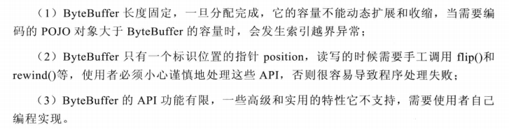
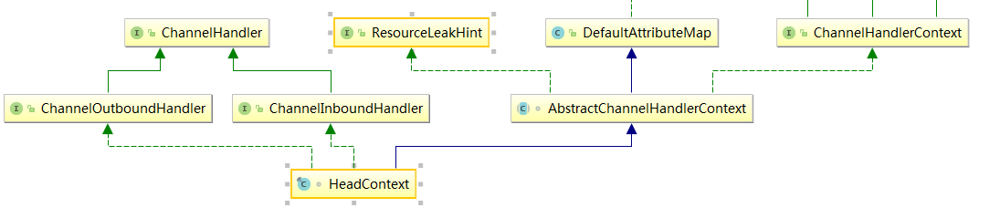
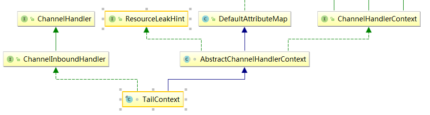
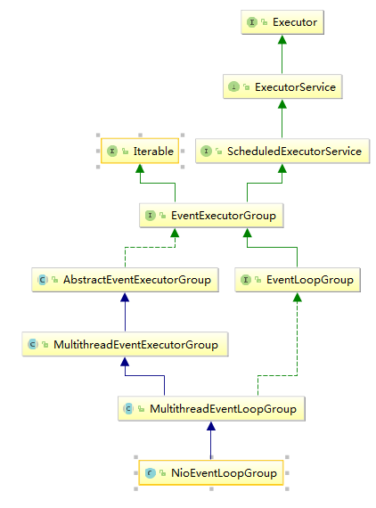
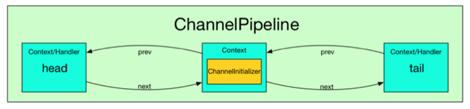
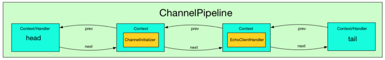
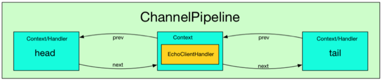

# Netty 相关API

## ByteBuf

### 先来说说JDK ByteBuffer 不足




# Netty 核心组件

## Channel

### 怎么理解Channel

Channel 是 Java NIO的一个基本构件。

它代表一个实体，（如一个硬件设备、一个文件、一个网路套接字或者一个能够执行一个或者多个不同的I/O操作的程序组件）的开放连接，如读操作或者写操作。

在 Netty 中, Channel 是一个 Socket 的抽象, 它为用户提供了关于 Socket 状态(是否是连接还是断开) 以及对 Socket 的读写等操作. 每当 Netty 建立了一个连接后, 都会有一个对应的 Channel 实例.


### Channel和其他对象的关系

每个Channel都会分配一个ChannelPipeline和ChannelConfig。ChannelConfig负责设置并存储配置，并允许在运行期间更新它们。传输一般有特定的配置设置，只作用于传输，没有其他的实现。ChannelPipeline容纳了使用的ChannelHandler实例，这些ChannelHandler将处理通道传递的“入站”和“出站”数据。

### 常用方法或者接口：

1. eventLoop()，返回分配给Channel的EventLoop
2. pipeline()，返回分配给Channel的ChannelPipeline
3. isActive()，返回Channel是否激活，已激活说明与远程连接对等
4. localAddress()，返回已绑定的本地SocketAddress
5. remoteAddress()，返回已绑定的远程SocketAddress
6. write()，写数据到远程客户端，数据通过ChannelPipeline传输过去

### Channel是线程安全(thread-safe)的

Channel是线程安全(thread-safe)的，它可以被多个不同的线程安全的操作，在多线程环境下，所有的方法都是安全的。正因为Channel是安全的，我们存储对Channel的引用，并在学习的时候使用它写入数据到远程已连接的客户端，使用多线程也是如此。下面的代码是一个简单的多线程例子：

```java
final Channel channel = ...
//Create ByteBuf that holds data to write
final ByteBuf buf = Unpooled.copiedBuffer("your data", CharsetUtil.UTF_8);
//Create Runnable which writes data to channel
Runnable writer = new Runnable() {
	@Override
	public void run() {
		channel.write(buf.duplicate());
	}
};
//Obtain reference to the Executor which uses threads to execute tasks
Executor executor = Executors.newChachedThreadPool();
// write in one thread
//Hand over write task to executor for execution in thread
executor.execute(writer);
// write in another thread
//Hand over another write task to executor for execution in thread
```

此外，这种方法保证了写入的消息以相同的顺序通过写入它们的方法。想了解所有方法的使用可以参考Netty API文档。

## ChannelHandler

此类的特点：

1. 现在我们可以使用ChannelHandler做下面一些事情：

> 传输数据时，将数据从一种格式转换到另一种格式

> 异常通知

> Channel变为有效或无效时获得通知

> Channel被注册或从EventLoop中注销时获得通知

> 通知用户特定事件

2. 这些ChannelHandler实例添加到ChannelPipeline中，

## EventLoopGroup

Netty中的EventLoopGroup包含一个或多个EventLoop

## EventLoop

1. EventLoop总是绑定一个单一的线程，在其生命周期内不会改变
2. 当注册一个Channel后，Netty将这个Channel绑定到一个EventLoop，在Channel的生命周期内总是被绑定到一个EventLoop。在Netty IO操作中，你的程序不需要同步，因为一个指定通道的所有IO始终由同一个线程来执行。


# 源码分析

## 客户端启动

### 看看实例代码

首先, 让我们从客户端方面的代码开始：

```java
EventLoopGroup group = new NioEventLoopGroup();
try {
    Bootstrap b = new Bootstrap();
    b.group(group)
     .channel(NioSocketChannel.class)
     .option(ChannelOption.TCP_NODELAY, true)
     .handler(new ChannelInitializer<SocketChannel>() {
         @Override
         public void initChannel(SocketChannel ch) throws Exception {
             ChannelPipeline p = ch.pipeline();
             p.addLast(new EchoClientHandler());
         }
     });

    // Start the client.
    ChannelFuture f = b.connect(HOST, PORT).sync();

    // Wait until the connection is closed.
    f.channel().closeFuture().sync();
} finally {
    // Shut down the event loop to terminate all threads.
    group.shutdownGracefully();
}
```

### 初步映像或者说猜测

看到上面的那段代码初步映像如下：

1. 创建一个`Bootstrap`对象，靠它的一些方法来配置，最后靠`connect(HOST, PORT).sync()`这段代码来真正的启动客户端。


2. `channel` 、`handler`等方法有点Builder类的感觉，应该还是返回的是`this`。


### channel()

直接看代码：

```java
public B channel(Class<? extends C> channelClass) {
	if (channelClass == null) {
		throw new NullPointerException("channelClass");
	}
	return channelFactory(new ReflectiveChannelFactory<C>(channelClass));
}

public B channelFactory(ChannelFactory<? extends C> channelFactory) {
	if (channelFactory == null) {
		throw new NullPointerException("channelFactory");
	}
	if (this.channelFactory != null) {
		throw new IllegalStateException("channelFactory set already");
	}
	//就是就是重点
	this.channelFactory = channelFactory;
	return (B) this;
}
```

在上面的代码中已经标出来了，其实这个方法就是创建了一个`ChannelFactory`实例，然后保存在`Bootstrap`的如下属性中：

```java
private volatile ChannelFactory<? extends C> channelFactory;
```

留待后面使用.

#### channel 实例化

在上一节（channel（））中，channel工厂的是实例是`ReflectiveChannelFactory` ，顾名思义，`ChannelFactory`就是一个创建Channel实例的工厂，这个类中用来创建实例的方法就是如下：

```java
@Override
public T newChannel() {
	try {
		return clazz.newInstance();
	} catch (Throwable t) {
		throw new ChannelException("Unable to create Channel from class " + clazz, t);
	}
}
```

这个方法很简单，就是反射创建了一个`Channel`的实例，

然后看看这个方法哪里被调用了，使用idea以检索，就只有如下的的一个地方：

`AbstractBootstrap` 类的如下方法，`newChannel` 被调用

```java
final ChannelFuture initAndRegister() {
    // 去掉非关键代码
    final Channel channel = channelFactory().newChannel();
    init(channel);
    ChannelFuture regFuture = group().register(channel);
}
```

在 **newChannel** 中, 通过类对象的 newInstance 来获取一个新 Channel 实例, 因而会调用NioSocketChannel 的默认构造器.NioSocketChannel 默认构造器代码如下:

```java
public NioSocketChannel() {
	this(DEFAULT_SELECTOR_PROVIDER);
}

public NioSocketChannel(SelectorProvider provider) {
	this(newSocket(provider));
}
```

`这里的代码比较关键`, 我们看到, 在这个构造器中, 会调用 **newSocket** 来打开一个新的 Java NIO SocketChannel:

```java
private static SocketChannel newSocket(SelectorProvider provider) {
    // 去掉非关键代码
    return provider.openSocketChannel();
}
```

接着会调用父类, 即 AbstractNioByteChannel 的构造器:

```java
protected AbstractNioByteChannel(Channel parent, SelectableChannel ch) {
	super(parent, ch, SelectionKey.OP_READ);
}
```

并传入参数 parent 为 null, ch 为刚才使用 newSocket 创建的  Java NIO SocketChannel, 因此生成的 NioSocketChannel 的 parent channel 是空的.

接着会继续调用父类 AbstractNioChannel 的构造器, 并传入了参数 **readInterestOp = SelectionKey.OP_READ**:

```java
protected AbstractNioChannel(Channel parent, SelectableChannel ch, int readInterestOp) {
    super(parent);
    this.ch = ch;
    this.readInterestOp = readInterestOp;
    // 省略 try 块
    // 配置 Java NIO SocketChannel 为非阻塞的.
    ch.configureBlocking(false);
}
```

然后继续调用父类 AbstractChannel 的构造器:

```java
protected AbstractChannel(Channel parent) {
    this.parent = parent;
    unsafe = newUnsafe();
  	//这儿创建了一个ChannelPipeline
    pipeline = new DefaultChannelPipeline(this);
}
```

到这里, 一个完整的 NioSocketChannel 就初始化完成了, 我们可以稍微总结一下构造一个 NioSocketChannel 所需要做的工作:

- 调用 NioSocketChannel.newSocket(DEFAULT_SELECTOR_PROVIDER) 打开一个新的 Java NIO SocketChannel
- AbstractChannel(Channel parent) 中初始化 AbstractChannel 的属性:
  - parent 属性置为 null
  - unsafe 通过newUnsafe() 实例化一个 unsafe 对象, 它的类型是 AbstractNioByteChannel.NioByteUnsafe 内部类
  - pipeline 是 new DefaultChannelPipeline(this) 新创建的实例. `这里体现了:Each channel has its own pipeline and it is created automatically when a new channel is created.`
- AbstractNioChannel 中的属性:
  - SelectableChannel ch 被设置为 Java SocketChannel, 即 NioSocketChannel#newSocket 返回的 Java NIO SocketChannel.
  - readInterestOp 被设置为 SelectionKey.OP_READ
  - SelectableChannel ch 被配置为非阻塞的 **ch.configureBlocking(false)**
- NioSocketChannel 中的属性:
  - SocketChannelConfig config = new NioSocketChannelConfig(this, socket.socket())

#### 关于 unsafe 字段的初始化

**ps：这儿的unsafe 不是JDK底层的对于并发处理的 unsafe**

我们简单地提到了, 在实例化 NioSocketChannel 的过程中, 会在父类 AbstractChannel 的构造器中, 调用 newUnsafe() 来获取一个 unsafe 实例. 那么 unsafe 是怎么初始化的呢? 它的作用是什么?
其实 unsafe 特别关键, **它封装了对 Java 底层 Socket 的操作**, 因此实际上是沟通 Netty 上层和 Java 底层的重要的桥梁.

那么我们就来看一下 Unsafe 接口所提供的方法吧:

```java
interface Unsafe {
    SocketAddress localAddress();
    SocketAddress remoteAddress();
    void register(EventLoop eventLoop, ChannelPromise promise);
    void bind(SocketAddress localAddress, ChannelPromise promise);
    void connect(SocketAddress remoteAddress, SocketAddress localAddress, ChannelPromise promise);
    void disconnect(ChannelPromise promise);
    void close(ChannelPromise promise);
    void closeForcibly();
    void deregister(ChannelPromise promise);
    void beginRead();
    void write(Object msg, ChannelPromise promise);
    void flush();
    ChannelPromise voidPromise();
    ChannelOutboundBuffer outboundBuffer();
}
```

一看便知, 这些方法其实都会对应到相关的 Java 底层的 Socket 的操作.
回到 AbstractChannel 的构造方法中, 在这里调用了 newUnsafe() 获取一个新的 unsafe 对象, 而 newUnsafe 方法在 NioSocketChannel 中被重写了:

```
@Override
protected AbstractNioUnsafe newUnsafe() {
    return new NioSocketChannelUnsafe();
}
```

NioSocketChannel.newUnsafe 方法会返回一个 NioSocketChannelUnsafe 实例. 从这里我们就可以确定了, 在实例化的 NioSocketChannel 中的 unsafe 字段, 其实是一个 NioSocketChannelUnsafe 的实例.

#### 关于 pipeline 的初始化

上面我们分析了一个 Channel (在这个例子中是 NioSocketChannel) 的大体初始化过程, 但是我们漏掉了一个关键的部分, 即 ChannelPipeline 的初始化. 
根据 `Each channel has its own pipeline and it is created automatically when a new channel is created.`,
 我们知道, 在实例化一个 Channel 时, 必然伴随着实例化一个 ChannelPipeline. 而我们确实在 
AbstractChannel 的构造器看到了 pipeline 字段被初始化为 DefaultChannelPipeline 的实例. 
那么我们就来看一下, DefaultChannelPipeline 构造器做了哪些工作吧:

```
public DefaultChannelPipeline(AbstractChannel channel) {
    if (channel == null) {
        throw new NullPointerException("channel");
    }
    this.channel = channel;

    tail = new TailContext(this);
    head = new HeadContext(this);

    head.next = tail;
    tail.prev = head;
}
```

我们调用 DefaultChannelPipeline 的构造器, 传入了一个 channel, 而这个 channel 其实就是我们实例化的 NioSocketChannel, DefaultChannelPipeline 会将这个 NioSocketChannel 对象保存在channel 字段中. DefaultChannelPipeline 中, 还有两个特殊的字段, 即 head 和 tail, 而这两个字段是一个双向链表的头和尾. 其实在 DefaultChannelPipeline 中, 维护了一个以 AbstractChannelHandlerContext 为节点的双向链表, 这个链表是 Netty 实现 Pipeline 机制的关键. 关于 DefaultChannelPipeline 中的双向链表以及它所起的作用, 我在这里暂时不表, 在 **Netty 源码分析之 二 贯穿Netty 的大动脉 ── ChannelPipeline** 中会有详细的分析.

HeadContext 的继承层次结构如下所示:



TailContext 的继承层次结构如下所示:



我们可以看到, 链表中 head 是一个 **ChannelOutboundHandler**, 而 tail 则是一个 **ChannelInboundHandler**.
接着看一下 HeadContext 的构造器:

```java
HeadContext(DefaultChannelPipeline pipeline) {
    super(pipeline, null, HEAD_NAME, false, true);
    unsafe = pipeline.channel().unsafe();
}
```

它调用了父类 AbstractChannelHandlerContext 的构造器, 并传入参数 inbound = false, outbound = true.
TailContext 的构造器与 HeadContext 的相反, 它调用了父类 AbstractChannelHandlerContext 的构造器, 并传入参数 inbound = true, outbound = false.
即header 是一个 outboundHandler, 而 tail 是一个inboundHandler, 关于这一点, 大家要特别注意, 
因为在分析到 Netty Pipeline 时, 我们会反复用到 inbound 和 outbound 这两个属性.

### group()

#### 关于 EventLoop 初始化

回到最开始的客户端启动的代码中, 我们在一开始就实例化了一个 NioEventLoopGroup 对象, 因此我们就从它的构造器中追踪一下 EventLoop 的初始化过程.
首先来看一下 NioEventLoopGroup 的类继承层次:



`NioEventLoopGroup`有几个重载的构造器, 不过内容都没有什么大的区别, 最终都是调用的父类`MultithreadEventLoopGroup`构造器:

```java
protected MultithreadEventLoopGroup(int nThreads, ThreadFactory threadFactory, Object... args) {
    super(nThreads == 0? DEFAULT_EVENT_LOOP_THREADS : nThreads, threadFactory, args);
}
```

其中有一点有意思的地方是, 如果我们传入的线程数 nThreads 是0, 那么 Netty 会为我们设置默认的线程数 DEFAULT_EVENT_LOOP_THREADS, 而这个默认的线程数是怎么确定的呢?
其实很简单, 在静态代码块中, 会首先确定 DEFAULT_EVENT_LOOP_THREADS 的值:

```java
static {
    DEFAULT_EVENT_LOOP_THREADS = Math.max(1, SystemPropertyUtil.getInt(
            "io.netty.eventLoopThreads", Runtime.getRuntime().availableProcessors() * 2));
}
```

Netty 会首先从系统属性中获取 "io.netty.eventLoopThreads" 的值, 如果我们没有设置它的话, 那么就返回默认值: 处理器核心数 * 2.

回到`MultithreadEventLoopGroup`构造器中, 这个构造器会继续调用父类 `MultithreadEventExecutorGroup `的构造器:

```java
protected MultithreadEventExecutorGroup(int nThreads, ThreadFactory threadFactory, Object... args) {
    // 去掉了参数检查, 异常处理 等代码.
    children = new SingleThreadEventExecutor[nThreads];
    if (isPowerOfTwo(children.length)) {
        chooser = new PowerOfTwoEventExecutorChooser();
    } else {
        chooser = new GenericEventExecutorChooser();
    }

    for (int i = 0; i < nThreads; i ++) {
        children[i] = newChild(threadFactory, args);
    }
}
```

根据代码, 我们就很清楚 MultithreadEventExecutorGroup 中的处理逻辑了:

- 创建一个大小为 nThreads 的 SingleThreadEventExecutor 数组
- 根据 nThreads 的大小, 创建不同的 Chooser, 即如果 nThreads 是 2 的幂, 则使用 PowerOfTwoEventExecutorChooser, 反之使用 GenericEventExecutorChooser. 不论使用哪个 Chooser, 它们的功能都是一样的, 即从 children 数组中选出一个合适的 EventExecutor 实例.
- 调用 newChhild 方法初始化 children 数组.

根据上面的代码, 我们知道, MultithreadEventExecutorGroup 内部维护了一个 EventExecutor 
数组, Netty 的 EventLoopGroup 的实现机制其实就建立在 MultithreadEventExecutorGroup 之上.
 每当 Netty 需要一个 EventLoop 时, 会调用 next() 方法获取一个可用的 EventLoop.
上面代码的最后一部分是 newChild 方法, 这个是一个抽象方法, 它的任务是实例化 EventLoop 对象. 我们跟踪一下它的代码, 可以发现, 这个方法在 NioEventLoopGroup 类中实现了, 其内容很简单:

```
@Override
protected EventExecutor newChild(
        ThreadFactory threadFactory, Object... args) throws Exception {
    return new NioEventLoop(this, threadFactory, (SelectorProvider) args[0]);
}
```

其实就是实例化一个 NioEventLoop 对象, 然后返回它.

最后总结一下整个 EventLoopGroup 的初始化过程吧:

- EventLoopGroup(其实是MultithreadEventExecutorGroup) 内部维护一个类型为 EventExecutor children 数组, 其大小是 nThreads, 这样就构成了一个线程池
- 如果我们在实例化 NioEventLoopGroup 时, 如果指定线程池大小, 则 nThreads 就是指定的值, 反之是处理器核心数 * 2
- MultithreadEventExecutorGroup 中会调用 newChild 抽象方法来初始化 children 数组
- 抽象方法 newChild 是在 NioEventLoopGroup 中实现的, 它返回一个 NioEventLoop 实例.
- NioEventLoop 属性:
  - SelectorProvider provider 属性: NioEventLoopGroup 构造器中通过 SelectorProvider.provider() 获取一个 SelectorProvider
  - Selector selector 属性: NioEventLoop 构造器中通过调用通过 selector = provider.openSelector() 获取一个 selector 对象.

### channel 的注册过程

在前面的分析中, 我们提到, channel 会在 Bootstrap.initAndRegister 中进行初始化, 但是这个方法还会将初始化好的 Channel 注册到 EventGroup 中. 接下来我们就来分析一下 Channel 注册的过程.
回顾一下 AbstractBootstrap.initAndRegister 方法:

```java
final ChannelFuture initAndRegister() {
    // 去掉非关键代码
    final Channel channel = channelFactory().newChannel();
    init(channel);
    ChannelFuture regFuture = group().register(channel);
}
```

当Channel 初始化后, 会紧接着调用 group().register() 方法来注册 Channel, 我们继续跟踪的话, 会发现其调用链如下:
AbstractBootstrap.initAndRegister
 -> MultithreadEventLoopGroup.register -> 
SingleThreadEventLoop.register -> AbstractUnsafe.register
通过跟踪调用链, 最终我们发现是调用到了 unsafe 的 register 方法, 那么接下来我们就仔细看一下 AbstractUnsafe.register 方法中到底做了什么:

```java
@Override
public final void register(EventLoop eventLoop, final ChannelPromise promise) {
    // 省略条件判断和错误处理
    AbstractChannel.this.eventLoop = eventLoop;
    register0(promise);
}
```

首先, 将 eventLoop 赋值给 Channel 的 eventLoop 属性, 而我们知道这个 eventLoop 对象其实是 MultithreadEventLoopGroup.next() 方法获取的, 根据我们前面 **关于 EventLoop 初始化** 小节中, 我们可以确定 next() 方法返回的 eventLoop 对象是 NioEventLoop 实例.
register 方法接着调用了 register0 方法:

```java
private void register0(ChannelPromise promise) {
    boolean firstRegistration = neverRegistered;
    doRegister();
    neverRegistered = false;
    registered = true;
    safeSetSuccess(promise);
    pipeline.fireChannelRegistered();
    // Only fire a channelActive if the channel has never been registered. This prevents firing
    // multiple channel actives if the channel is deregistered and re-registered.
    if (firstRegistration && isActive()) {
        pipeline.fireChannelActive();
    }
}
```

register0 又调用了 AbstractNioChannel.doRegister:

```java
@Override
protected void doRegister() throws Exception {
    // 省略错误处理
    selectionKey = javaChannel().register(eventLoop().selector, 0, this);
}
```

javaChannel() 这个方法在前面我们已经知道了, 它返回的是一个 Java NIO SocketChannel, 这里我们将这个 SocketChannel 注册到与 eventLoop 关联的 selector 上了.

我们总结一下 Channel 的注册过程:

- 首先在 AbstractBootstrap.initAndRegister中, 通过 group().register(channel), 调用 MultithreadEventLoopGroup.register 方法
- 在MultithreadEventLoopGroup.register 中, 通过 next() 获取一个可用的 SingleThreadEventLoop, 然后调用它的 register
- 在 SingleThreadEventLoop.register 中, 通过 channel.unsafe().register(this, promise) 来获取 channel 的 unsafe() 底层操作对象, 然后调用它的 register.
- 在 AbstractUnsafe.register 方法中, 调用 register0 方法注册 Channel
- 在 AbstractUnsafe.register0 中, 调用 AbstractNioChannel.doRegister 方法
- AbstractNioChannel.doRegister 方法通过 javaChannel().register(eventLoop().selector, 0, this) 将 Channel 对应的 Java NIO SockerChannel 注册到一个 eventLoop 的 Selector 中, 并且将当前 Channel 作为 attachment.

总的来说, Channel 注册过程所做的工作就是将 Channel 与对应的 EventLoop 关联, 因此这也体现了, 在 Netty 中, 每个 Channel 都会关联一个特定的 EventLoop, 并且这个 Channel 中的所有 IO 操作都是在这个 EventLoop 中执行的; 当关联好 Channel 和 EventLoop 后, 会继续调用底层的 Java NIO SocketChannel 的 register 方法, 将底层的 Java NIO SocketChannel 注册到指定的 selector 中. 通过这两步, 就完成了 Netty Channel 的注册过程.


### handler 的添加过程

Netty 的一个强大和灵活之处就是基于 Pipeline 的自定义 handler 机制. 基于此, 
我们可以像添加插件一样自由组合各种各样的 handler 来完成业务逻辑. 例如我们需要处理 HTTP 数据, 那么就可以在 pipeline 
前添加一个 Http 的编解码的 Handler, 然后接着添加我们自己的业务逻辑的 handler, 这样网络上的数据流就向通过一个管道一样,
 从不同的 handler 中流过并进行编解码, 最终在到达我们自定义的 handler 中.
既然说到这里, 有些读者朋友肯定会好奇, 
既然这个 pipeline 机制是这么的强大, 那么它是怎么实现的呢? 不过我这里不打算详细展开 Netty 的 ChannelPipeline
 的实现机制(具体的细节会在后续的章节中展示), 我在这一小节中, 从简单的入手, 展示一下我们自定义的 handler 是如何以及何时添加到 
ChannelPipeline 中的.
首先让我们看一下如下的代码片段:

```java
...
.handler(new ChannelInitializer<SocketChannel>() {
     @Override
     public void initChannel(SocketChannel ch) throws Exception {
         ChannelPipeline p = ch.pipeline();
         if (sslCtx != null) {
             p.addLast(sslCtx.newHandler(ch.alloc(), HOST, PORT));
         }
         //p.addLast(new LoggingHandler(LogLevel.INFO));
         p.addLast(new EchoClientHandler());
     }
 });
```

这个代码片段就是实现了 handler 的添加功能. 我们看到, Bootstrap.handler 方法接收一个 ChannelHandler, 而我们传递的是一个 派生于 ChannelInitializer 的匿名类, 它正好也实现了 ChannelHandler 接口. 我们来看一下, ChannelInitializer  类内到底有什么玄机:

```java
@Sharable
public abstract class ChannelInitializer<C extends Channel> extends ChannelInboundHandlerAdapter {

    private static final InternalLogger logger = InternalLoggerFactory.getInstance(ChannelInitializer.class);
    protected abstract void initChannel(C ch) throws Exception;

    @Override
    @SuppressWarnings("unchecked")
    public final void channelRegistered(ChannelHandlerContext ctx) throws Exception {
        initChannel((C) ctx.channel());
        ctx.pipeline().remove(this);
        ctx.fireChannelRegistered();
    }
    ...
}
```

ChannelInitializer 是一个抽象类, 它有一个抽象的方法 initChannel, 我们正是实现了这个方法, 
并在这个方法中添加的自定义的 handler 的. 那么 initChannel 是哪里被调用的呢? 答案是 
ChannelInitializer.channelRegistered 方法中. 
我们来关注一下 channelRegistered 
方法. 从上面的源码中, 我们可以看到, 在 channelRegistered 方法中, 会调用 initChannel 方法, 将自定义的 
handler 添加到 ChannelPipeline 中, 然后调用 ctx.pipeline().remove(this) 将自己从 
ChannelPipeline 中删除. 上面的分析过程, 可以用如下图片展示:
一开始, ChannelPipeline 中只有三个 handler, head, tail 和我们添加的 ChannelInitializer.



接着 initChannel 方法调用后, 添加了自定义的 handler:



最后将 ChannelInitializer 删除:



分析到这里, 我们已经简单了解了自定义的 handler 是如何添加到 ChannelPipeline 中的, 不过限于主题与篇幅的原因, 我没有在这里详细展开 ChannelPipeline 的底层机制, 我打算在下一篇 **Netty 源码分析之 二 贯穿Netty 的大动脉 ── ChannelPipeline** 中对这个问题进行深入的探讨.

# codec framework

对于请求协议的编码解码，当然是可以按照协议格式自己操作ChannelBuffer中的字节数据。另一方面，Netty也做了几个很实用的codec helper，这里给出简单的介绍。

decode：解码

encode：编码

Codec：如果一个类是这个结尾就是表示是双工的，什么都干，既要编码也要解码