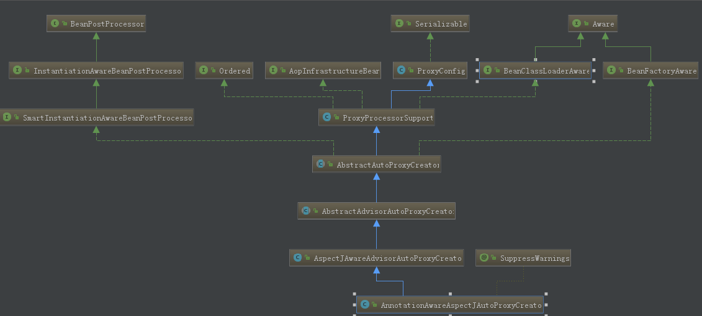

#Spring

### Spring注解

#### @Autowired

自动装配;

​	Spring利用依赖注入（DI），完成对IOC容器中中各个组件的依赖关系赋值；

一般用法如下：

```java
class BookService{
	@Autowired
	BookDao  bookDao;
}
```

使用规则和原理有下面几条： 

1）、默认优先按照类型去容器中找对应的组件:applicationContext.getBean(BookDao.class);找到就赋值
2）、如果找到多个相同类型的组件，再将属性的名称作为组件的id去容器中查找

```java
applicationContext.getBean("bookDao")
```
3）、@Qualifier("bookDao")：使用@Qualifier指定需要装配的组件的id，而不是使用属性名
4）、自动装配默认一定要将属性赋值好，没有就会报错；
```java
可以使用@Autowired(required=false);
```
5）、@Primary：让Spring进行自动装配的时候，默认使用首选的bean；也可以继续使用@Qualifier指定需要装配的bean的名字

**原理：**

**AutowiredAnnotationBeanPostProcessor:解析完成自动装配功能；**

 3）、 @Autowired:**可以注解在构造器，参数，方法，属性**；都是从容器中获取参数组件的值
 		1）、[标注在方法位置]：@Bean+方法参数；参数从容器中获取;默认不写@Autowired效果是一样的；都能自动装配
 		2）、[标在构造器上]：如果组件只有一个有参构造器，这个有参构造器的@Autowired可以省略，参数位置的组件还是可以自动从容器中获取
 		3）、放在参数位置：

####@Bean

`@Configuration` 注解注释的类中的方法加上`@Bean` 注解就是注册一个Bean，如下：

```java
//配置类==配置文件
@Configuration  //告诉Spring这是一个配置类
public class MainConfig {
	
	//给容器中注册一个Bean;类型为返回值的类型，id默认是用方法名作为id
	@Bean("person")
	public Person person01(){
		return new Person("lisi", 20);
	}
}
```

##### 指定初始化和销毁方法

bean的生命周期：

 * 		bean创建---初始化----销毁的过程
    * 	容器管理bean的生命周期；
       * 我们可以自定义初始化和销毁方法；容器在bean进行到当前生命周期的时候来调用我们自定义的初始化和销毁方法

######方法一

我们可以使用`@Bean` 来这个定义：

```java
public class MainConfigOfLifeCycle {
	
	@Bean(initMethod="init",destroyMethod="destory")
	public Car car(){
		return new Car();
	}
}
```

来看看`Car` 这个对象，

```java
@Component
public class Car {
	
	public Car(){
		System.out.println("car constructor...");
	}
	
	public void init(){
		System.out.println("car ... init...");
	}
	
	public void destory(){
		System.out.println("car ... detory...");
	}

}
```

`Car` 中的 `init` 和 `destory` 方法对应上面的 `initMethod="init",destroyMethod="destory"`

####@Cacheable

这个注解引入自spring 3.1，它本质上不是一个具体的缓存实现方案（例如 EHCache 或者 OSCache），而是一个对缓存使用的抽象，通过在既有代码中添加少量它定义的各种 annotation，即能够达到缓存方法的返回对象的效果。

```java

import org.springframework.cache.annotation.Cacheable;
 
public class Book {
	/**
	 * value : 缓存的名字  ,key ： 缓存map中的key
	 * @param id
	 * @return
	 */
    @Cacheable(value = { "sampleCache" },key="#id")
    public String getBook(int id) {
        System.out.println("Method executed..");
        if (id == 1) {
            return "Book 1";
        } else {
            return "Book 2";
        }
    }
}
```

@Cacheable(value=“sampleCache”)，这个注释的意思是，当调用这个方法的时候，会从一个名叫 sampleCache 的缓存(缓存本质是一个map)中查询key为id的值，如果不存在，则执行实际的方法（即查询数据库等服务逻辑），并将执行的结果存入缓存中，否则返回缓存中的对象。这里的缓存中的 key 就是参数 id，value 就是 返回的String 对象 


#### @ComponentScan

```java
//配置类==配置文件
@Configuration  //告诉Spring这是一个配置类

@ComponentScans(
		value = {
				@ComponentScan(value="com.atguigu",includeFilters = {
/*						@Filter(type=FilterType.ANNOTATION,classes={Controller.class}),
						@Filter(type=FilterType.ASSIGNABLE_TYPE,classes={BookService.class}),*/
						@Filter(type=FilterType.CUSTOM,classes={MyTypeFilter.class})
				},useDefaultFilters = false)	
		}
		)
//@ComponentScan  value:指定要扫描的包
//excludeFilters = Filter[] ：指定扫描的时候按照什么规则排除那些组件
//includeFilters = Filter[] ：指定扫描的时候只需要包含哪些组件
//FilterType.ANNOTATION：按照注解
//FilterType.ASSIGNABLE_TYPE：按照给定的类型；
//FilterType.ASPECTJ：使用ASPECTJ表达式
//FilterType.REGEX：使用正则指定
//FilterType.CUSTOM：使用自定义规则
public class MainConfig {
```

**自定义过滤规则**

对于上面代码中提到了一种过滤规则是`FilterType.CUSTOM` ,那我们怎么自定义一个过滤规则呢，看源码注释入下：

```java
/** Filter candidates using a given custom
 * {@link org.springframework.core.type.filter.TypeFilter} implementation.
 */
CUSTOM
```

通过注释，它告诉我们我们要实现`TypeFilter` 接口，如下：

```java
public class MyTypeFilter implements TypeFilter {

	/**
	 * metadataReader：读取到的当前正在扫描的类的信息
	 * metadataReaderFactory:可以获取到其他任何类信息的
	 */
	@Override
	public boolean match(MetadataReader metadataReader, MetadataReaderFactory metadataReaderFactory)
			throws IOException {
		// TODO Auto-generated method stub
		//获取当前类注解的信息
		AnnotationMetadata annotationMetadata = metadataReader.getAnnotationMetadata();
		//获取当前正在扫描的类的类信息
		ClassMetadata classMetadata = metadataReader.getClassMetadata();
		//获取当前类资源（类的路径）
		Resource resource = metadataReader.getResource();
		
		String className = classMetadata.getClassName();
		System.out.println("--->"+className);
		if(className.contains("er")){
			return true;
		}
		return false;
	}
}
```

由上面代码我们就可以看出我们可以根据传入的参数来获取当前正在扫描的类的**注解、类型、路径**等信息，然后供我们来决定怎么过滤

#### @Conditional

按照一定的条件进行判断，满足条件给容器中注册bean，这个注解可以**使用在类上面，或者方法上面**。

使用在方法上面：

```java
/**
 * @Conditional({Condition}) ： 按照一定的条件进行判断，满足条件给容器中注册bean
 * 
 * 如果系统是windows，给容器中注册("bill")
 * 如果是linux系统，给容器中注册("linus")
 */

@Conditional(LinuxCondition.class)
@Bean("bill")
public Person person01(){
  return new Person("Bill Gates",62);
}

@Conditional(LinuxCondition.class)
@Bean("linus")
public Person person02(){
  return new Person("linus", 48);
}
```

` @Conditional` 这个注解需要传入实现了`Condition` 接口的类

```java
public @interface Conditional {

	/**
	 * All {@link Condition}s that must {@linkplain Condition#matches match}
	 * in order for the component to be registered.
	 */
	Class<? extends Condition>[] value();
}
```

这儿我用两个类实现了这个接口：

```java
//判断是否linux系统
public class LinuxCondition implements Condition {

	/**
	 * ConditionContext：判断条件能使用的上下文（环境）
	 * AnnotatedTypeMetadata：注释信息
	 */
	@Override
	public boolean matches(ConditionContext context, AnnotatedTypeMetadata metadata) {
		// TODO是否linux系统
		//1、能获取到ioc使用的beanfactory
		ConfigurableListableBeanFactory beanFactory = context.getBeanFactory();
		//2、获取类加载器
		ClassLoader classLoader = context.getClassLoader();
		//3、获取当前环境信息
		Environment environment = context.getEnvironment();
		//4、获取到bean定义的注册类
		BeanDefinitionRegistry registry = context.getRegistry();
		
		String property = environment.getProperty("os.name");
		
		//可以判断容器中的bean注册情况，也可以给容器中注册bean
		boolean definition = registry.containsBeanDefinition("person");
		if(property.contains("linux")){
			return true;
		}
		return false;
	}
}
```

```java
//判断是否windows系统
public class WindowsCondition implements Condition {

	@Override
	public boolean matches(ConditionContext context, AnnotatedTypeMetadata metadata) {
		Environment environment = context.getEnvironment();
		String property = environment.getProperty("os.name");
		if(property.contains("Windows")){
			return true;
		}
		return false;
	}
}

```

使用在类上面：

```java
//类中组件统一设置。满足当前条件，这个类中配置的所有bean注册才能生效；
@Conditional({WindowsCondition.class})
@Configuration
public class MainConfig2 {
}
```


#### @Configuration

告诉Spring这是一个配置类，就像以前使用xml配置时候的一个Bean配置文件，如下：

```java
//配置类==配置文件
@Configuration  //告诉Spring这是一个配置类
public class MainConfig {
}
```

下面是创建一个注解Spring上下文，来获取Bean的测试

```java
ApplicationContext applicationContext = new AnnotationConfigApplicationContext(MainConfig.class);
Person bean = applicationContext.getBean(Person.class);
System.out.println(bean);

String[] namesForType = applicationContext.getBeanNamesForType(Person.class);
for (String name : namesForType) {
	System.out.println(name);
}
```

#### @EnableAspectJAutoProxy

开启基于注解的aop模式:

具体可以参看Spring Aop部分

#### @EnableCaching

@EnableCaching注解是spring framework中的注解驱动的缓存管理功能。自spring版本3.1起加入了该注解。如果你使用了这个注解，那么你就不需要在XML文件中配置cache manager了。

当你在配置类(**@Configuration**)上使用**@EnableCaching**注解时，会触发一个**post processor**，这会扫描每一个spring bean，查看是否已经存在注解对应的缓存。如果找到了，就会自动创建一个代理拦截方法调用，使用缓存的bean执行处理.


#### @Import(容器中注册组件)

给容器中注册组件有下面的四种方式：

```java
/**
 * 给容器中注册组件；
 * 1）、包扫描+组件标注注解（@Controller/@Service/@Repository/@Component）[自己写的类]
 * 2）、@Bean[导入的第三方包里面的组件]
 * 3）、@Import[快速给容器中导入一个组件]
 *    1）、@Import(要导入到容器中的组件)；容器中就会自动注册这个组件，id默认是全类名
 *    2）、ImportSelector:返回需要导入的组件的全类名数组；
 *    3）、ImportBeanDefinitionRegistrar:手动注册bean到容器中
 * 4）、使用Spring提供的 FactoryBean（工厂Bean）;
 *    1）、默认获取到的是工厂bean调用getObject创建的对象
 *    2）、要获取工厂Bean本身，我们需要给id前面加一个&
 *      &colorFactoryBean
 */
```

上面的3-1，就是说的是使用`@Import` 注解导入组件的方式，下面来看一个示例

```java
@Import({Color.class,Red.class})
//@Import导入组件，id默认是组件的全类名
public class MainConfig2 {
}
```

Color 类代码：

```java
public class Color {
	private Car car;
	public Car getCar() {
		return car;
	}
	public void setCar(Car car) {
		this.car = car;
	}
	@Override
	public String toString() {
		return "Color [car=" + car + "]";
	}
}
```

##### ImportSelector

对于`@Import` 注解不仅能直接传类似上面`Color` 类这样的单纯的Bean，还可以传入`ImportSelector` 接口的实现类，我们看看

`@Import` 注解的注释：

```java
@Target(ElementType.TYPE)
@Retention(RetentionPolicy.RUNTIME)
@Documented
public @interface Import {

	/**
	 * {@link Configuration}, {@link ImportSelector}, {@link ImportBeanDefinitionRegistrar}
	 * or regular component classes to import.
	 */
	Class<?>[] value();

}
```

这儿有一个`ImportSelector` 的实现类：

```java
//自定义逻辑返回需要导入的组件
public class MyImportSelector implements ImportSelector {

	//返回值，就是到导入到容器中的组件全类名
	//AnnotationMetadata:当前标注@Import注解的类的所有注解信息
	@Override
	public String[] selectImports(AnnotationMetadata importingClassMetadata) {
		// TODO Auto-generated method stub
		//importingClassMetadata
		//方法不要返回null值
		return new String[]{"com.atguigu.bean.Blue","com.atguigu.bean.Yellow"};
	}
}
```

这个接口的`selectImports` 方法返回的组件的全类名数组，都是被注册进容器

##### ImportBeanDefinitionRegistrar

由上面还可以看出，`@Import` 注解还可以传入`ImportBeanDefinitionRegistrar` 接口的实现类，我们来看看这个接口：

```java
public interface ImportBeanDefinitionRegistrar {

	/**
	 * Register bean definitions as necessary based on the given annotation metadata of
	 * the importing {@code @Configuration} class.
	 * <p>Note that {@link BeanDefinitionRegistryPostProcessor} types may <em>not</em> be
	 * registered here, due to lifecycle constraints related to {@code @Configuration}
	 * class processing.
	 * @param importingClassMetadata annotation metadata of the importing class
	 * @param registry current bean definition registry
	 */
	public void registerBeanDefinitions(
			AnnotationMetadata importingClassMetadata, BeanDefinitionRegistry registry);

}
```

看到这个接口的唯一方法`registerBeanDefinitions` 的名字，我们就感觉这个接口可以让我们自己注册`BeanDefinition`

下面自定义个一个实现

```java
public class MyImportBeanDefinitionRegistrar implements ImportBeanDefinitionRegistrar {

	/**
	 * AnnotationMetadata：当前类的注解信息
	 * BeanDefinitionRegistry:BeanDefinition注册类；
	 * 		把所有需要添加到容器中的bean；调用
	 * 		BeanDefinitionRegistry.registerBeanDefinition手工注册进来
	 */
	@Override
	public void registerBeanDefinitions(AnnotationMetadata importingClassMetadata, BeanDefinitionRegistry registry) {
		
		boolean definition = registry.containsBeanDefinition("com.atguigu.bean.Red");
		boolean definition2 = registry.containsBeanDefinition("com.atguigu.bean.Blue");
		if(definition && definition2){
			//指定Bean定义信息；（Bean的类型，Bean。。。）
			RootBeanDefinition beanDefinition = new RootBeanDefinition(RainBow.class);
			//注册一个Bean，指定bean名
			registry.registerBeanDefinition("rainBow", beanDefinition);
		}
	}

}

```

##### FactoryBean

这儿之所以把`FactoryBean` 放在这里，是因为我们也可以通过`FactoryBean` 来注册组件，

`FactoryBean` 是一个接口，定义如下：

```java
public interface FactoryBean<T> {
	T getObject() throws Exception;
	Class<?> getObjectType();
	boolean isSingleton();
}
```

这儿有个类实现了这个接口：

```java
//创建一个Spring定义的FactoryBean
public class ColorFactoryBean implements FactoryBean<Color> {

	//返回一个Color对象，这个对象会添加到容器中
	@Override
	public Color getObject() throws Exception {
		// TODO Auto-generated method stub
		System.out.println("ColorFactoryBean...getObject...");
		return new Color();
	}

	@Override
	public Class<?> getObjectType() {
		// TODO Auto-generated method stub
		return Color.class;
	}

	//是单例？
	//true：这个bean是单实例，在容器中保存一份
	//false：多实例，每次获取都会创建一个新的bean；
	@Override
	public boolean isSingleton() {
		// TODO Auto-generated method stub
		return false;
	}

}
```

我们把这个类`ColorFactoryBean` 注册进入容器中：

```java
 /*
 * 4）、使用Spring提供的 FactoryBean（工厂Bean）;
 *       1）、默认获取到的是工厂bean调用getObject创建的对象
 *       2）、要获取工厂Bean本身，我们需要给id前面加一个&
 *          &colorFactoryBean
 */
@Bean
public ColorFactoryBean colorFactoryBean(){
   return new ColorFactoryBean();
}
```

基于之前我们在 `@Bean`  这一节提到的，我们可以根据`colorFactoryBean` 这个id 从容器中获取到Bean，但是默认获取到的Bean的类型是`Color` 而不是 `ColorFactoryBean` ，规则如下：

 *    1）、默认获取到的是工厂bean调用getObject创建的对象
 *    2）、要获取工厂Bean本身，我们需要给id前面加一个&

      &colorFactoryBean


####@Lazy

这个注解用于懒加载，懒加载只针对于**单例的Bean**

```java
/*
 * 懒加载：
 *    单实例bean：默认在容器启动的时候创建对象；
 *    懒加载：容器启动不创建对象。第一次使用(获取)Bean创建对象，并初始化；
 */
@Lazy
@Bean("person")
public Person person(){
  System.out.println("给容器中添加Person....");
  return new Person("张三", 25);
}
```

因为单例的Bean默认的`Scope` 是单例，然而单例的会在容器启动的时候创建对象，我们加上`@Lazy` 这个注解就会让**此对象不在容器创建的时候被创建**

#### @PostConstruct  (JSR250)

1.这个注解是只能放在方法上面的：并且一般和`@PreDestroy`一起配对使用

```java
@Documented
@Retention (RUNTIME)
@Target(METHOD)
public @interface PostConstruct {
}
```

看一个实例来看看怎么使用这个注解：

```java
@Component
public class Dog{	
	public Dog(){
		System.out.println("dog constructor...");
	}
	
	//对象创建并赋值之后调用
	@PostConstruct
	public void init(){
		System.out.println("Dog....@PostConstruct...");
	}
	
	//容器移除对象之前
	@PreDestroy
	public void detory(){
		System.out.println("Dog....@PreDestroy...");
	}
}
```

#### @PreDestroy  (JSR250)

参考`@PostConstruct` 

#### @Profile

  Profile：
  		Spring为我们提供的可以根据当前环境，动态的激活和切换一系列组件的功能；

  开发环境、测试环境、生产环境；
  数据源：(/A)(/B)(/C)；


  @Profile：指定组件在哪个环境的情况下才能被注册到容器中，不指定，任何环境下都能注册这个组件

  1）、加了环境标识的bean，只有这个环境被激活的时候才能注册到容器中。默认是default环境
  2）、写在配置类上，只有是指定的环境的时候，整个配置类里面的所有配置才能开始生效
  3）、没有标注环境标识的bean在，任何环境下都是加载的；


接下来看看一个实例：

```java
@PropertySource("classpath:/dbconfig.properties")
@Configuration
public class MainConfigOfProfile implements EmbeddedValueResolverAware{
	
	@Value("${db.user}")
	private String user;
	
	private StringValueResolver valueResolver;
	
	private String  driverClass;
	
	
	@Bean
	public Yellow yellow(){
		return new Yellow();
	}
	
	@Profile("test")
	@Bean("testDataSource")
	public DataSource dataSourceTest(@Value("${db.password}")String pwd) throws Exception{
		ComboPooledDataSource dataSource = new ComboPooledDataSource();
		dataSource.setUser(user);
		dataSource.setPassword(pwd);
		dataSource.setJdbcUrl("jdbc:mysql://localhost:3306/test");
		dataSource.setDriverClass(driverClass);
		return dataSource;
	}
	
	
	@Profile("dev")
	@Bean("devDataSource")
	public DataSource dataSourceDev(@Value("${db.password}")String pwd) throws Exception{
		ComboPooledDataSource dataSource = new ComboPooledDataSource();
		dataSource.setUser(user);
		dataSource.setPassword(pwd);
		dataSource.setJdbcUrl("jdbc:mysql://localhost:3306/ssm_crud");
		dataSource.setDriverClass(driverClass);
		return dataSource;
	}
	
	@Profile("prod")
	@Bean("prodDataSource")
	public DataSource dataSourceProd(@Value("${db.password}")String pwd) throws Exception{
		ComboPooledDataSource dataSource = new ComboPooledDataSource();
		dataSource.setUser(user);
		dataSource.setPassword(pwd);
		dataSource.setJdbcUrl("jdbc:mysql://localhost:3306/scw_0515");
		
		dataSource.setDriverClass(driverClass);
		return dataSource;
	}

	@Override
	public void setEmbeddedValueResolver(StringValueResolver resolver) {
		// TODO Auto-generated method stub
		this.valueResolver = resolver;
		driverClass = valueResolver.resolveStringValue("${db.driverClass}");
	}

}
```

##### 激活某个Profile

第一种方式：加vm参数 -Dspring.profiles.active=xxx

第二种方式：使用无参的Spring上下文

```java
AnnotationConfigApplicationContext configApplicationContext = new AnnotationConfigApplicationContext();
configApplicationContext.getEnvironment().setActiveProfiles("XXX");
configApplicationContext.register(MyConfig.class);
configApplicationContext.refresh();
```

这个步骤相对于Spring 上下文的源码就是**多了一个设置环境**，可以看看下面对比一下：

```java
public AnnotationConfigApplicationContext(Class<?>... annotatedClasses) {
    this();
    register(annotatedClasses);
    refresh();
}
```


#### @PropertySource

用来制定`Properties` 文件的位置

在以前我们在bean.xml 配置文件配置 properties 配置文件我们是这么做的：

```xml
<context:property-placeholder location="classpath:person.properties"/>
```

现在我们可以这么做：

```java
//使用@PropertySource读取外部配置文件中的k/v保存到运行的环境变量中;加载完外部的配置文件以后使用${}取出配置文件的值
@PropertySource(value={"classpath:/person.properties"})
@Configuration
public class MainConfigOfPropertyValues {
	
	@Bean
	public Person person(){
		return new Person();
	}
}
```


#### @Scope

此注解用来调整作用域，即单例或者原型等等

可以有四个取值：默认是 singleton

singleton、prototype、request、sesssion

 prototype：多实例的：ioc容器启动并不会去调用方法创建对象放在容器中。每次获取的时候才会调用方法创建对象；

singleton：单实例的（默认值）：ioc容器启动会调用方法创建对象放到ioc容器中。以后每次获取就是直接从容器（map.get()）中拿，

```java
//默认是单实例的
/**
 * ConfigurableBeanFactory#SCOPE_PROTOTYPE    
 * @see ConfigurableBeanFactory#SCOPE_SINGLETON  
 * @see org.springframework.web.context.WebApplicationContext#SCOPE_REQUEST  request
 * @see org.springframework.web.context.WebApplicationContext#SCOPE_SESSION  sesssion
 * @return\
 * @Scope:调整作用域
 * prototype：多实例的：ioc容器启动并不会去调用方法创建对象放在容器中。
 *          每次获取的时候才会调用方法创建对象；
 * singleton：单实例的（默认值）：ioc容器启动会调用方法创建对象放到ioc容器中。
 *      以后每次获取就是直接从容器（map.get()）中拿，
 * request：同一次请求创建一个实例
 * session：同一个session创建一个实例
 */
@Scope("prototype")
@Bean("person")
public Person person(){
  System.out.println("给容器中添加Person....");
  return new Person("张三", 25);
}
```

#### @Value

这个注解可用来属性赋值，用法大概如下：

```java
public class Person {
	
	//使用@Value赋值；
	//1、基本数值
	//2、可以写SpEL； #{}
	//3、可以写${}；取出配置文件【properties】中的值（在运行环境变量里面的值）
	
	@Value("张三")
	private String name;
}
```


### Spring接口

####BeanPostProcessor

BeanPostProcessor【interface】：bean的后置处理器；**初始化前后**

在bean初始化前后进行一些处理工作；怎么来理解这个初始化，先看看`BeanPostProcessor` 中`postProcessBeforeInitialization` 方法的部分注释

```java
   /**
	* Apply this BeanPostProcessor to the given new bean instance <i>before</i> any bean
	* initialization callbacks (like InitializingBean's {@code afterPropertiesSet}
	* or a custom init-method). The bean will already be populated with property values.
	*/
	Object postProcessBeforeInitialization(Object bean, String beanName) throws BeansException;
```

说的是，这个方法会在，`InitializingBean` 接口的 `afterPropertiesSet` 方法和 我们自定义的 init-method 的方法之前调用，让我们来看看一个实例，下面是一个Bean 实现了`InitializingBean, DisposableBean` 接口，

```java
/**
 * Created by zcd on 2018/3/14.
 */
public class Dog implements InitializingBean, DisposableBean{

    public Dog(){
        System.out.println("Dog's Constructor ....");
    }

    public void init(){
        System.out.println("Dog init");
    }

    public void myDestroy(){
        System.out.println("Dog myDestroy");
    }

    public void afterPropertiesSet() throws Exception {
        System.out.println("Dog afterPropertiesSet");
    }

    public void destroy() throws Exception {
        System.out.println("Dog destroy");
    }
}
```

在这儿注册进入容器：

```java
@Configuration
public class MyConfig {

    @Bean(initMethod = "init", destroyMethod = "myDestroy")
    public Dog dog(){
        return new Dog();
    }
}
```

来看一下运行结果：

```
Dog's Constructor ....
postProcessBeforeInitialization -> beanName=dog  bean,s Classcom.atguigu.bean.Dog
Dog afterPropertiesSet
Dog init
postProcessAfterInitialization -> beanName=dog  bean,s Classcom.atguigu.bean.Dog

Dog destroy
Dog myDestroy
```

得出初步结论：

优先级

postProcessBeforeInitialization 》afterPropertiesSet 》自定义 init方法

来看看一段源代码(来自Spring `AbstractAutowireCapableBeanFactory` 的`initializeBean` 方法)来说明我们刚刚上面得出的结论：

```java
Object wrappedBean = bean;
if (mbd == null || !mbd.isSynthetic()) {
    wrappedBean = applyBeanPostProcessorsBeforeInitialization(wrappedBean, beanName);
}

try {
    invokeInitMethods(beanName, wrappedBean, mbd);
}
catch (Throwable ex) {
    throw new BeanCreationException(
            (mbd != null ? mbd.getResourceDescription() : null),
            beanName, "Invocation of init method failed", ex);
}

if (mbd == null || !mbd.isSynthetic()) {
    wrappedBean = applyBeanPostProcessorsAfterInitialization(wrappedBean, beanName);
}
```

 BeanPostProcessor原理
 populateBean(beanName, mbd, instanceWrapper);给bean进行属性赋值
 initializeBean
 {
 applyBeanPostProcessorsBeforeInitialization(wrappedBean, beanName);
 invokeInitMethods(beanName, wrappedBean, mbd);执行自定义初始化
 applyBeanPostProcessorsAfterInitialization(wrappedBean, beanName);
 }

在Spring 中有个方法先给bean 的属性赋值`populateBean` ,然后进入 `initializeBean` 方法，然后调用顺序就如同上面所所说的

##### BeanPostProcessor在Spring底层运用

 Spring底层对 BeanPostProcessor 的使用；

      bean赋值，注入其他组件，@Autowired，生命周期注解功能，@Async,xxx BeanPostProcessor;

###### ApplicationContextAwareProcessor

我们自己定义的Bean可以实现 `ApplicationContextAware` 这个接口来让这个Bean感知到Spring 容器，如下：

```java
@Component
public class Dog implements ApplicationContextAware {
	
	//@Autowired
	private ApplicationContext applicationContext;
	
	public Dog(){
		System.out.println("dog constructor...");
	}

	@Override
	public void setApplicationContext(ApplicationContext applicationContext) throws BeansException {
		// TODO Auto-generated method stub
		this.applicationContext = applicationContext;
	}

}
```

这个`ApplicationContextAware` 的实现原理就是`ApplicationContextAwareProcessor` ,来看看这个类：

```java
class ApplicationContextAwareProcessor implements BeanPostProcessor {

	private final ConfigurableApplicationContext applicationContext;

	private final StringValueResolver embeddedValueResolver;

	@Override
	public Object postProcessBeforeInitialization(final Object bean, String beanName) throws BeansException {
		AccessControlContext acc = null;

		if (System.getSecurityManager() != null &&
				(bean instanceof EnvironmentAware || bean instanceof EmbeddedValueResolverAware ||
						bean instanceof ResourceLoaderAware || bean instanceof ApplicationEventPublisherAware ||
						bean instanceof MessageSourceAware || bean instanceof ApplicationContextAware)) {
			acc = this.applicationContext.getBeanFactory().getAccessControlContext();
		}

		if (acc != null) {
			AccessController.doPrivileged(new PrivilegedAction<Object>() {
				@Override
				public Object run() {
					invokeAwareInterfaces(bean);
					return null;
				}
			}, acc);
		}
		else {
			invokeAwareInterfaces(bean);
		}

		return bean;
	}

	private void invokeAwareInterfaces(Object bean) {
		if (bean instanceof Aware) {
			if (bean instanceof EnvironmentAware) {
				((EnvironmentAware) bean).setEnvironment(this.applicationContext.getEnvironment());
			}
			if (bean instanceof EmbeddedValueResolverAware) {
				((EmbeddedValueResolverAware) bean).setEmbeddedValueResolver(this.embeddedValueResolver);
			}
			if (bean instanceof ResourceLoaderAware) {
				((ResourceLoaderAware) bean).setResourceLoader(this.applicationContext);
			}
			if (bean instanceof ApplicationEventPublisherAware) {
				((ApplicationEventPublisherAware) bean).setApplicationEventPublisher(this.applicationContext);
			}
			if (bean instanceof MessageSourceAware) {
				((MessageSourceAware) bean).setMessageSource(this.applicationContext);
			}
			if (bean instanceof ApplicationContextAware) {
				((ApplicationContextAware) bean).setApplicationContext(this.applicationContext);
			}
		}
	}

	@Override
	public Object postProcessAfterInitialization(Object bean, String beanName) {
		return bean;
	}

}
```

这个类`ApplicationContextAwareProcessor` 实现了`BeanPostProcessor` 接口，而且在`postProcessBeforeInitialization` 会检查我们的Bean 是否实现了`ApplicationContextAware` 接口，然后在`invokeAwareInterfaces` 方法中调用`setApplicationContext` 方法

###### BeanValidationPostProcessor

可以用来对Bean做验证

```java
public class BeanValidationPostProcessor implements BeanPostProcessor, InitializingBean {
	@Override
	public Object postProcessBeforeInitialization(Object bean, String beanName) throws BeansException {
		if (!this.afterInitialization) {
			doValidate(bean);
		}
		return bean;
	}
}
```

###### InitDestroyAnnotationBeanPostProcessor

用来处理JSR250的 @PostConstruct 注解和 @PreDestroy 注解

```java
public class InitDestroyAnnotationBeanPostProcessor
		implements DestructionAwareBeanPostProcessor, MergedBeanDefinitionPostProcessor, PriorityOrdered, Serializable 
{
	/**
	 * Specify the init annotation to check for, indicating initialization
	 * methods to call after configuration of a bean.
	 * <p>Any custom annotation can be used, since there are no required
	 * annotation attributes. There is no default, although a typical choice
	 * is the JSR-250 {@link javax.annotation.PostConstruct} annotation.
	 */
	public void setInitAnnotationType(Class<? extends Annotation> initAnnotationType) {
		this.initAnnotationType = initAnnotationType;
	}
	
		@Override
	public Object postProcessBeforeInitialization(Object bean, String beanName) throws BeansException {
	     //先获取类注解信息
		LifecycleMetadata metadata = findLifecycleMetadata(bean.getClass());
		try {
		    //反射调用
			metadata.invokeInitMethods(bean, beanName);
		}
		catch (InvocationTargetException ex) {
			throw new BeanCreationException(beanName, "Invocation of init method failed", ex.getTargetException());
		}
		catch (Throwable ex) {
			throw new BeanCreationException(beanName, "Failed to invoke init method", ex);
		}
		return bean;
	}
}
		
```

###### AutowiredAnnotationBeanPostProcessor

这个是用来处理`@Autowired` 注解和 JSR-330 的`@Inject` 注解的实现原理的


#### InitializingBean & DisposableBean 

我们还可以让我们自己的Bean 实现`InitializingBean`  和 `DisposableBean` 接口，**从而让Bean可以做一些初始化和销毁工作**，分别对应于`@bean` 中配置的 `initMethod` 和

`destroyMethod` ,我们来看一个实例

```java
@Component
public class Cat implements InitializingBean,DisposableBean {
	
	public Cat(){
		System.out.println("cat constructor...");
	}

	@Override
	public void destroy() throws Exception {
		// TODO Auto-generated method stub
		System.out.println("cat...destroy...");
	}

	@Override
	public void afterPropertiesSet() throws Exception {
		// TODO Auto-generated method stub
		System.out.println("cat...afterPropertiesSet...");
	}
}
```

这样在容器注册这个Bean的时候，就会在Bean创建好，并且属性赋值好之后调用，`afterPropertiesSet` 方法，在容器关闭的时候调用`destroy` 方法，有一点要注意，就是有如下的规则；

- **销毁：**
  - **单实例：容器关闭的时候会调用`destroy` 方法**
  - **多实例：容器不会管理这个bean；容器不会调用销毁方法；**


#### 


### Spring问题整理

#### 指定Bean的初始化和销毁方法


**1. **通过@Bean指定init-method和destroy-method；

**2. **通过让Bean实现InitializingBean（定义初始化逻辑），DisposableBean（定义销毁逻辑）;

**3.** 可以使用JSR250；

@PostConstruct：在bean创建完成并且属性赋值完成；来执行初始化方法

@PreDestroy：在容器销毁bean之前通知我们进行清理工作

**4. **BeanPostProcessor【interface】：bean的后置处理器；
* 	在bean初始化前后进行一些处理工作；
   * postProcessBeforeInitialization:在初始化之前工作
    * postProcessAfterInitialization:在初始化之后工作


#### 自动装配

1）、就是使用`@Autowired` 这个可以参考上面注解中

2）、Spring还支持使用@Resource(JSR250)和@Inject(JSR330)[java规范的注解]

	@Resource:
		可以和@Autowired一样实现自动装配功能；默认是按照组件名称进行装配的；
		没有能支持@Primary功能没有支持@Autowired（reqiured=false）;
	@Inject:
		需要导入javax.inject的包，和Autowired的功能一样。没有required=false的功能；
@Autowired:Spring定义的； @Resource、@Inject都是java规范

**ps：使用`@Inject` 注解还要导入其他的依赖：**

```xml
<!-- https://mvnrepository.com/artifact/javax.inject/javax.inject -->
<dependency>
    <groupId>javax.inject</groupId>
    <artifactId>javax.inject</artifactId>
    <version>1</version>
</dependency>

```

#### Aware注入Spring底层组件

`Aware` 接口是Spring的一个标志型接口

 自定义组件想要使用Spring容器底层的一些组件（ApplicationContext，BeanFactory，xxx）；
 		自定义组件实现xxxAware；在创建对象的时候，会调用接口规定的方法注入相关组件；Aware；
  		把Spring底层一些组件注入到自定义的Bean中；

实现原理：一个xxxAware 都对应着，一个xxxProcessor 来实现，而这个xxxProcessor 就是一个后置处理器；

比如：ApplicationContextAware==》ApplicationContextAwareProcessor；

其实很多的`Aware` 的处理都是在`ApplicationContextAwareProcessor` 中的`invokeAwareInterfaces` 处理的

```java
private void invokeAwareInterfaces(Object bean) {
    if (bean instanceof Aware) {
        if (bean instanceof EnvironmentAware) {
            ((EnvironmentAware) bean).setEnvironment(this.applicationContext.getEnvironment());
        }
        if (bean instanceof EmbeddedValueResolverAware) {
            ((EmbeddedValueResolverAware) bean).setEmbeddedValueResolver(this.embeddedValueResolver);
        }
        if (bean instanceof ResourceLoaderAware) {
            ((ResourceLoaderAware) bean).setResourceLoader(this.applicationContext);
        }
        if (bean instanceof ApplicationEventPublisherAware) {
            ((ApplicationEventPublisherAware) bean).setApplicationEventPublisher(this.applicationContext);
        }
        if (bean instanceof MessageSourceAware) {
            ((MessageSourceAware) bean).setMessageSource(this.applicationContext);
        }
        if (bean instanceof ApplicationContextAware) {
            ((ApplicationContextAware) bean).setApplicationContext(this.applicationContext);
        }
    }
}
```

#### 使用Properties配置中的值

有下面几种方式：

第一种：属性上使用`@Value` 注解

```java
@Value("${db.user}")
private String user;
```

第二种：参数上使用`@Value` 注解

```java
	@Bean("testDataSource")
	public DataSource dataSourceTest(@Value("${db.password}")String pwd) throws Exception{
		//TODO
	}
```

第三种：使用`EmbeddedValueResolverAware` 接口，自己注入进来String解析器，来自己解析

```java
	@Override
	public void setEmbeddedValueResolver(StringValueResolver resolver) {
		// TODO Auto-generated method stub
		this.valueResolver = resolver;
		driverClass = valueResolver.resolveStringValue("${db.driverClass}");
	}
```

具体的代码可以参考下面：

```java
@PropertySource("classpath:/dbconfig.properties")
@Configuration
public class MainConfigOfProfile implements EmbeddedValueResolverAware{
	
	@Value("${db.user}")
	private String user;
	
	private StringValueResolver valueResolver;
	
	private String  driverClass;
	
	
	@Bean
	public Yellow yellow(){
		return new Yellow();
	}
	
	@Profile("test")
	@Bean("testDataSource")
	public DataSource dataSourceTest(@Value("${db.password}")String pwd) throws Exception{
		ComboPooledDataSource dataSource = new ComboPooledDataSource();
		dataSource.setUser(user);
		dataSource.setPassword(pwd);
		dataSource.setJdbcUrl("jdbc:mysql://localhost:3306/test");
		dataSource.setDriverClass(driverClass);
		return dataSource;
	}

	@Override
	public void setEmbeddedValueResolver(StringValueResolver resolver) {
		// TODO Auto-generated method stub
		this.valueResolver = resolver;
		driverClass = valueResolver.resolveStringValue("${db.driverClass}");
	}

}
```

### Spring Aop

 AOP：【动态代理】
 		指在程序运行期间动态的将某段代码切入到指定方法指定位置进行运行的编程方式；

#### 基本玩法

 1、导入aop模块；Spring AOP：(spring-aspects)

```xml
<!-- https://mvnrepository.com/artifact/org.springframework/spring-aspects -->
<dependency>
    <groupId>org.springframework</groupId>
    <artifactId>spring-aspects</artifactId>
    <version>4.3.12.RELEASE</version>
</dependency>

```

 2、定义一个业务逻辑类（MathCalculator）；在业务逻辑运行的时候将日志进行打印（方法之前、方法运行结束、方法出现异常，xxx）

```java
public class MathCalculator {
	
	public int div(int i,int j){
		System.out.println("MathCalculator...div...");
		return i/j;	
	}
}
```

 3、定义一个日志切面类（LogAspects）：切面类里面的方法需要动态感知MathCalculator.div运行到哪里然后执行；
 		通知方法：
 			前置通知(@Before)：logStart：在目标方法(div)运行之前运行
 			后置通知(@After)：logEnd：在目标方法(div)运行结束之后运行（无论方法正常结束还是异常结束）
 			返回通知(@AfterReturning)：logReturn：在目标方法(div)正常返回之后运行
 			异常通知(@AfterThrowing)：logException：在目标方法(div)出现异常以后运行
 			环绕通知(@Around)：动态代理，手动推进目标方法运行（joinPoint.procced()）

```java
/**
 * 切面类
 * @author lfy
 * 
 * @Aspect： 告诉Spring当前类是一个切面类
 *
 */
@Aspect
public class LogAspects {
	
	//抽取公共的切入点表达式
	//1、本类引用
	//2、其他的切面引用
	@Pointcut("execution(public int com.atguigu.aop.MathCalculator.*(..))")
	public void pointCut(){};
	
	//@Before在目标方法之前切入；切入点表达式（指定在哪个方法切入）
	@Before("pointCut()")
	public void logStart(JoinPoint joinPoint){
		Object[] args = joinPoint.getArgs();
		System.out.println(""+joinPoint.getSignature().getName()+"运行。。。@Before:参数列表是：{"+Arrays.asList(args)+"}");
	}
	
	@After("com.atguigu.aop.LogAspects.pointCut()")
	public void logEnd(JoinPoint joinPoint){
		System.out.println(""+joinPoint.getSignature().getName()+"结束。。。@After");
	}
	
	//JoinPoint一定要出现在参数表的第一位
	@AfterReturning(value="pointCut()",returning="result")
	public void logReturn(JoinPoint joinPoint,Object result){
		System.out.println(""+joinPoint.getSignature().getName()+"正常返回。。。@AfterReturning:运行结果：{"+result+"}");
	}
	
	@AfterThrowing(value="pointCut()",throwing="exception")
	public void logException(JoinPoint joinPoint,Exception exception){
		System.out.println(""+joinPoint.getSignature().getName()+"异常。。。异常信息：{"+exception+"}");
	}

}
```

 4、给切面类的目标方法标注何时何地运行（通知注解）；

截取上面类中的某些代码

```java
	//抽取公共的切入点表达式
	//1、本类引用
	//2、其他的切面引用
	@Pointcut("execution(public int com.atguigu.aop.MathCalculator.*(..))")
	public void pointCut(){};
```

 5、将切面类和业务逻辑类（目标方法所在类）都加入到容器中;

```java
@Configuration
public class MainConfigOfAOP {
	 
	//业务逻辑类加入容器中
	@Bean
	public MathCalculator calculator(){
		return new MathCalculator();
	}

	//切面类加入到容器中
	@Bean
	public LogAspects logAspects(){
		return new LogAspects();
	}
}
```

 6、必须告诉Spring哪个类是切面类(给切面类上加一个注解：@Aspect)

```java
@Aspect
public class LogAspects {
}
```

 7、给配置类中加 @EnableAspectJAutoProxy 【开启基于注解的aop模式】
 		在Spring中很多的 @EnableXXX;

```java
@EnableAspectJAutoProxy
@Configuration
public class MainConfigOfAOP {
}
```

#### Aop 注解原理

因为需要加` @EnableAspectJAutoProxy ` 注解才能开启基于注解的aop模式，那我们打开这个注解看看

```java
@Target(ElementType.TYPE)
@Retention(RetentionPolicy.RUNTIME)
@Documented
@Import(AspectJAutoProxyRegistrar.class)
public @interface EnableAspectJAutoProxy {
	boolean proxyTargetClass() default false;
	boolean exposeProxy() default false;
}
```

因为我们在使用`@EnableAspectJAutoProxy` 注解的时候没有使用属性，所以我们暂时不用管这个注解的两个属性

**1.**我们发现这个注解中使用的一个注解如下：

```java
@Import(AspectJAutoProxyRegistrar.class)
```

**2.**我们来看看这个类`AspectJAutoProxyRegistrar` :

```java
class AspectJAutoProxyRegistrar implements ImportBeanDefinitionRegistrar {

	/**
	 * Register, escalate, and configure the AspectJ auto proxy creator based on the value
	 * of the @{@link EnableAspectJAutoProxy#proxyTargetClass()} attribute on the importing
	 * {@code @Configuration} class.
	 */
	@Override
	public void registerBeanDefinitions(
			AnnotationMetadata importingClassMetadata, BeanDefinitionRegistry registry) {

		AopConfigUtils.registerAspectJAnnotationAutoProxyCreatorIfNecessary(registry);

		AnnotationAttributes enableAspectJAutoProxy =
				AnnotationConfigUtils.attributesFor(importingClassMetadata, EnableAspectJAutoProxy.class);
		if (enableAspectJAutoProxy.getBoolean("proxyTargetClass")) {
			AopConfigUtils.forceAutoProxyCreatorToUseClassProxying(registry);
		}
		if (enableAspectJAutoProxy.getBoolean("exposeProxy")) {
			AopConfigUtils.forceAutoProxyCreatorToExposeProxy(registry);
		}
	}

}
```

我们之前接触过`@Import` 这个注解，知道这个注解可以可以传入`ImportBeanDefinitionRegistrar` 的实现类

（ps：抛出一个问题，见猜想1） 

**3.**我们看看`registerBeanDefinitions` 方法中的这么一段代码：

```java
AopConfigUtils.registerAspectJAnnotationAutoProxyCreatorIfNecessary(registry);
```

这段代码先不进去看，先知道结果，这段代码就是向Spring容器中加一个类型是`AnnotationAwareAspectJAutoProxyCreator.class`的一个Bean

**4.**打开这个类`AnnotationAwareAspectJAutoProxyCreator`，发现有点复杂，看看继承关系



我们发现这个类是`BeanPostProcessor` 和`BeanFactoryAware` 这两个接口的实现类，而这两个接口我们比较熟悉，可以从这儿入手

5.

### Spring 类

#### BeanWrapper

`BeanWrapper` 是 Spring 提供的一个用来操作JavaBean属性的工具，使用它可以直接修改一个对象的属性，示例如下：

```java
public class User {
    private String userName;

    public String getUserName() {
        return userName;
    }
    public void setUserName(String userName) {
        this.userName = userName;
    }
}

public class AppTest {

    public static void main(String[] args) {
        User user = new User();
        BeanWrapper beanWrapper = PropertyAccessorFactory.forBeanPropertyAccess(user);
        beanWrapper.setPropertyValue("userName","lishi");
        System.out.println(user.getUserName());
        PropertyValue propertyValue = new PropertyValue("userName", "zhagnsan");
        beanWrapper.setPropertyValue(propertyValue);
        System.out.println(user.getUserName());
    }
}
```


### Spring猜想和验证

#### 1，ImportBeanDefinitionRegistrar 的实现类是否会加入Spring容器

具体描述：

我们之前接触过`@Import` 这个注解，知道这个注解可以可以传入`ImportBeanDefinitionRegistrar` 的实现类

Spring容器中是否有这个实现类，还是只有`registerBeanDefinitions` 这个方法中加入`BeanDefinitionRegistry` 注册器中的Bean才在Spring容器中。

答案是：**Spring容器中没有这个`ImportBeanDefinitionRegistrar` 接口的实现类**

代码如下：

`ImportBeanDefinitionRegistrar` 接口实现类：

```java
public class MyImportBeanDefinitionRegistrar implements ImportBeanDefinitionRegistrar {

    public void registerBeanDefinitions(AnnotationMetadata importingClassMetadata, BeanDefinitionRegistry registry) {

        RootBeanDefinition definition = new RootBeanDefinition(Dog.class);
        registry.registerBeanDefinition("dog", definition);
    }
}
```

配饰类：

```java
@Import(MyImportBeanDefinitionRegistrar.class)
@Configuration
public class MyConfig {

}
```

测试类：

```java
public class IOCTest {

    @Test
    public void teatPostBeanProcessor(){
        final AnnotationConfigApplicationContext applicationContext = new AnnotationConfigApplicationContext(MyConfig.class);
        for (String s : applicationContext.getBeanDefinitionNames()) {
            System.out.println("Bean Name:"+s);
        }
        // Object object = applicationContext.getBean(MyImportBeanDefinitionRegistrar.class);
        applicationContext.close();
    }
}
```

结果展示：

```
Bean Name:org.springframework.context.annotation.internalConfigurationAnnotationProcessor
Bean Name:org.springframework.context.annotation.internalAutowiredAnnotationProcessor
Bean Name:org.springframework.context.annotation.internalRequiredAnnotationProcessor
Bean Name:org.springframework.context.annotation.internalCommonAnnotationProcessor
Bean Name:org.springframework.context.event.internalEventListenerProcessor
Bean Name:org.springframework.context.event.internalEventListenerFactory
Bean Name:myConfig
Bean Name:myPostProcessor
Bean Name:springDao
Bean Name:springService
Bean Name:dog
```

结果显示：只有`Dog` 加入了容器，`MyImportBeanDefinitionRegistrar` 没有加入容器

## Template

在Spring 中有 很多的 Template 比如：`JdbcTemplate` ，`RedisTemplate`， `RestTemplate`.

他们的使用方法也是大同小异的；这儿暂时不写使用的方法，而是借助`JdbcTemplate` 源码来理解其中的思想以及代理和回调的妙处。

从 `JdbcTemplate` 的 `execute` 方法开始：


# Spring 缓存


# SpringJPA


## 常见错误

### Hibernate JAP 字段自动添加下划线问题

数据库中的字段名是productName，实体中应当这样写    

```java
@Column(name = "productname")
private String productName;
```

如果按照数据库中字段productName,一样注解在实体类@Column(name = "productName")

执行sql语句时，会把驼峰字符转化为"_"+ 小写驼峰字符，查询时会变成product_name，所以会报异常:

 error[org.hibernate.exception.SQLGrammarException: Unknown column 'fxenterpri0_.product_name' in 'field list']

sql执行语句：

Hibernate: select fxenterpri0_.id as id9_, fxenterpri0_.product_name asproduct_name  from fx_enterprise fxenterpri0_ order by fxenterpri0_.id desc

# SpringAop

先看一个实例：

```java
/**
 * 静态调用session的拦截器
 *
 * @author fengshuonan
 * @date 2016年11月13日 下午10:15:42
 */
@Aspect
@Component
public class SessionHolderInterceptor extends BaseController {

    @Pointcut("execution(* cn.stylefeng.guns.*..controller.*.*(..))")
    public void cutService() {

    }

    @Around("cutService()")
    public Object sessionKit(ProceedingJoinPoint point) throws Throwable {
        HttpSessionContext.put(super.getHttpServletRequest().getSession());
        try {
            return point.proceed();
        } finally {
            HttpSessionContext.remove();
        }
    }
}
```


要对`Spring Aop`有一个深入的理解，应该先对Bean的生命周期有一个全面的认识。对于`Spring Bean的生命周期`可以参看本人的.......，因为本篇文章主要记录在Aop源码阅读时的重要笔记，所以很多时候直接是开门见山的从源码中找
##Aop的使用回顾
###定义被代理类
```
public interface IDemoService {
    String demoHello();

    String normalHello();
}

@Service
public class DemoService implements IDemoService {
    public String demoHello(){
        System.out.println("hello");
        return "hello";
    }
    
    public String normalHello(){
        System.out.println("normal");
        return "normal";
    }
}
```
###定义增强类
```
@Aspect
@Component
public class AspectDemo {

    /**
     * 定义切点：如果有此注解的地方
     */
    @Pointcut("execution(public * com.yummon.braveglory.service.DemoService.demoHello())")
    public void serviceAspect() {
    }
    
    @Before(value = "serviceAspect()")
    public void before(){
        System.out.println("===before===");
    }
    
    @After(value = "serviceAspect()")
    public void after(){
        System.out.println("===after===");
    }
}
```
###测试类
```
@EnableAspectJAutoProxy
@SpringBootApplication(exclude = DataSourceAutoConfiguration.class)
public class PlayertoolApplication {

	public static void main(String[] args) throws IOException {
		final ConfigurableApplicationContext run = SpringApplication.run(PlayertoolApplication.class, args);
		final IDemoService bean = run.getBean(IDemoService.class);
		bean.demoHello();
		System.in.read();
	}
}
```
###运行结果
```
===before===
hello
===after===
```
##Aop 原理探索

各位胖友对于Aop可能听过advice、advisor、pointcut、代理、cglib代理、JDK代理等等名词。

###核心类介绍
各位胖友可能还记得以前Spring Aop 采用XML 配置的时候可以这样配置` <aop:config>`、在Spring的自定义标签中
在上面的测试类中使用`EnableAspectJAutoProxy ` 注解开启Aop，此注解的定义如下：


进入选中的`AspectJAutoProxyRegistrar` 类
```java
//AspectJAutoProxyRegistrar 类
@Override
public void registerBeanDefinitions(
		AnnotationMetadata importingClassMetadata, BeanDefinitionRegistry registry) {
    //<1>
	AopConfigUtils.registerAspectJAnnotationAutoProxyCreatorIfNecessary(registry);
    //<2>
	AnnotationAttributes enableAspectJAutoProxy =
			AnnotationConfigUtils.attributesFor(importingClassMetadata, EnableAspectJAutoProxy.class);
    //<3>
	if (enableAspectJAutoProxy != null) {
		if (enableAspectJAutoProxy.getBoolean("proxyTargetClass")) {
			AopConfigUtils.forceAutoProxyCreatorToUseClassProxying(registry);
		}
		if (enableAspectJAutoProxy.getBoolean("exposeProxy")) {
			AopConfigUtils.forceAutoProxyCreatorToExposeProxy(registry);
		}
	}
}
```
<1>：注入Aop的关键处理类
<2>：获取`EnableAspectJAutoProxy`注解的配置类信息
<3>：根据配置信息，初始化相应的配置。

继续进入上面的步骤<1>,
```java
public static BeanDefinition registerAspectJAnnotationAutoProxyCreatorIfNecessary(
		BeanDefinitionRegistry registry, @Nullable Object source) {

	return registerOrEscalateApcAsRequired(AnnotationAwareAspectJAutoProxyCreator.class, registry, source);
}
```
终于看到我想给各位胖友说得关键类了，`AnnotationAwareAspectJAutoProxyCreator`类以及其继承体系的类就是Aop的关键实现。
类我们找到了，然后呢，这个类如此庞大的继承体系，如下图，我们从哪儿入手呢？从Bean的生命周期开始


## 从哪儿开始包装类

在Bean的生命周期那一章我们提到了

请看如下的一段代码：
```java
//AbstractAutowireCapableBeanFactory#doCreateBean
//在 doCreateBean 方法内有这么一段代码
// Initialize the bean instance.
Object exposedObject = bean;
try {
	populateBean(beanName, mbd, instanceWrapper);
	exposedObject = initializeBean(beanName, exposedObject, mbd);
}
catch (Throwable ex) {
}
```
在`Bean 的生命周期`那章中说过，`populateBean` 和 `initializeBean` 是 Bean的生命周期中非常重要的两个步骤，分别是属性注入 和 初始化Bean。本章要说的`Aop`的原理，就能在`initializeBean` 方法中找到答案（ps：请看一下`exposedObject `这个临时变量的定义，翻译一下就是暴露的对象的意思，也就是说`exposedObject `才才是最终暴露的Bean，这个对象可能是经过处理和包装的代理对象。`initializeBean `传入的是原始的Bean，比如`demoService`）

进入`initializeBean `方法，这个方法同样在Bean的生命周期中，重点讲过，这儿我们直接看本篇的重点：
```
if (mbd == null || !mbd.isSynthetic()) {
    //Bean 的后置处理
	wrappedBean = applyBeanPostProcessorsAfterInitialization(wrappedBean, beanName);
}
```

这儿就是我们理解Aop的入口。在上面的`AnnotationAwareAspectJAutoProxyCreator 继承图` 的右上角表示此关键类是一个`BeanPostProcessor` 、而`applyBeanPostProcessorsAfterInitialization` 方法处理的是`BeanPostProcessor` 的 `postProcessAfterInitialization` 方法，那我们就看`AnnotationAwareAspectJAutoProxyCreator ` 的 `postProcessAfterInitialization` 方法，如下：

```java
@Override
public Object postProcessAfterInitialization(@Nullable Object bean, String beanName) {
	if (bean != null) {
		Object cacheKey = getCacheKey(bean.getClass(), beanName);
		if (this.earlyProxyReferences.remove(cacheKey) != bean) {
            //如果必要对Bean进行包装或者增强
			return wrapIfNecessary(bean, beanName, cacheKey);
		}
	}
	return bean;
}
```

## wrapIfNecessary


进入`wrapIfNecessary` 方法

```java
protected Object wrapIfNecessary(Object bean, String beanName, Object cacheKey) {
	//<1>
    if (StringUtils.hasLength(beanName) && this.targetSourcedBeans.contains(beanName)) {
		return bean;
	}
    //<2> 
	if (Boolean.FALSE.equals(this.advisedBeans.get(cacheKey))) {
		return bean;
	}
    //<3>
	if (isInfrastructureClass(bean.getClass()) || shouldSkip(bean.getClass(), beanName)) {
		this.advisedBeans.put(cacheKey, Boolean.FALSE);
		return bean;
	}

	// Create proxy if we have advice.
    //<4>
	Object[] specificInterceptors = getAdvicesAndAdvisorsForBean(bean.getClass(), beanName, null);
	if (specificInterceptors != DO_NOT_PROXY) {
        //<5>
		this.advisedBeans.put(cacheKey, Boolean.TRUE);
        //<6>
		Object proxy = createProxy(
				bean.getClass(), beanName, specificInterceptors, new SingletonTargetSource(bean));
        //<7>
		this.proxyTypes.put(cacheKey, proxy.getClass());
		return proxy;
	}
	//<8>
	this.advisedBeans.put(cacheKey, Boolean.FALSE);
	return bean;
}
```

<1>:

<2>: 如果`advisedBeans` 包含了此Bean，并且为false，表示此Bean 不需要增强了，参看<5><8>这两处代码

<3>: 对于一些需要跳过wrap的bean的判断，有两种情况，一种就是`Advice`、`Advisor`等类的子类，还有一种就是根据`shouldSkip` 来判断，注意这个方法洛，此方法返回true 表示不需要增强，并且会在第一次调用此方法的时候把整个BeanFactory的Advisor（Advisor封装了，pointCut 和 Advice）都加载好，具体我们后面详细展开。

<4>: 获取与当前Bean匹配的Advisor也就是增强器。因为第一次调用上面的`shouldSkip`方法时就已经加载了所有的`Advisor`, 此步骤就是遍历所有的`Advisor`，确定当前处理的Bean 是否有匹配的 `Advisor`。

<5>: 如果表示有匹配的增强器，就`advisedBeans`  的 Bean的值置为TRUE，表示此类需要增强，结合<8>理解

<6>: 创建目标Bean的代理对象，这儿是很重要的一步，下面详细展开

<7>: 在`proxyTypes` 也就是代理类型中加入缓存

<8>: 因为已经增强过了，就把`advisedBeans`  对应的Bean置为False，那么以后就不处理了，结合<2>理解

其实这上面的几个步骤是关键步骤。


## buildAspectJAdvisors

此方法主要用来在当前BeanFactory中 寻找所有被`Aspect` 注解的Bean，并被转化为Advisor 列表，一个Advisor 代表一个 Aspect Bean的一个方法。

```java
//BeanFactoryAspectJAdvisorsBuilder#buildAspectJAdvisors
public List<Advisor> buildAspectJAdvisors() {
	List<String> aspectNames = this.aspectBeanNames;

	if (aspectNames == null) {
		synchronized (this) {
			aspectNames = this.aspectBeanNames;
			if (aspectNames == null) {
				List<Advisor> advisors = new ArrayList<>();
				aspectNames = new ArrayList<>();
				String[] beanNames = BeanFactoryUtils.beanNamesForTypeIncludingAncestors(
						this.beanFactory, Object.class, true, false);
                //遍历所有的Bean
				for (String beanName : beanNames) {
					if (!isEligibleBean(beanName)) {
						continue;
					}
					// We must be careful not to instantiate beans eagerly as in this case they
					// would be cached by the Spring container but would not have been weaved.
					Class<?> beanType = this.beanFactory.getType(beanName);
					if (beanType == null) {
						continue;
					}
                    //<2>:此Bean 是否被Aspect 注解注释
					if (this.advisorFactory.isAspect(beanType)) {
						aspectNames.add(beanName);
						AspectMetadata amd = new AspectMetadata(beanType, beanName);
						if (amd.getAjType().getPerClause().getKind() == PerClauseKind.SINGLETON) {
							MetadataAwareAspectInstanceFactory factory =
									new BeanFactoryAspectInstanceFactory(this.beanFactory, beanName);
                            //创建Advisor
							List<Advisor> classAdvisors = this.advisorFactory.getAdvisors(factory);
							if (this.beanFactory.isSingleton(beanName)) {
								this.advisorsCache.put(beanName, classAdvisors);
							}
							else {
								this.aspectFactoryCache.put(beanName, factory);
							}
							advisors.addAll(classAdvisors);
						}
						//省略部分代码
					}
				}
				this.aspectBeanNames = aspectNames;
				return advisors;
			}
		}
	}

	if (aspectNames.isEmpty()) {
		return Collections.emptyList();
	}
	List<Advisor> advisors = new ArrayList<>();
	for (String aspectName : aspectNames) {
		List<Advisor> cachedAdvisors = this.advisorsCache.get(aspectName);
		if (cachedAdvisors != null) {
			advisors.addAll(cachedAdvisors);
		}
		else {
			MetadataAwareAspectInstanceFactory factory = this.aspectFactoryCache.get(aspectName);
			advisors.addAll(this.advisorFactory.getAdvisors(factory));
		}
	}
	return advisors;
}
```

## Aop 重要配置参数`proxyTargetClass` 和 `exposeProxy` 说明

```java
	/**
	 * Indicate whether subclass-based (CGLIB) proxies are to be created as opposed
	 * to standard Java interface-based proxies. The default is {@code false}.
	 */
	boolean proxyTargetClass() default false;

	/**
	 * Indicate that the proxy should be exposed by the AOP framework as a {@code ThreadLocal}
	 * for retrieval via the {@link org.springframework.aop.framework.AopContext} class.
	 * Off by default, i.e. no guarantees that {@code AopContext} access will work.
	 * @since 4.3.1
	 */
	boolean exposeProxy() default false;
```


 Spring提供了JDK动态代理和CGLIB代理两种方式为目标类创建代理，默认情况下，如果目标类实现了一个以上的用户自定义的接口或者目标类本身就是接口，就会使用JDK动态代理，如果目标类本身不是接口并且没有实现任何接口，就会使用CGLIB代理，**如果想强制使用CGLIB代理，则可以将proxy-target-class设置true**， 

expose-proxy用来解决对象内部this调用无法被切面增强的问题，例如我们在A类的对象内部x方法中调用另外一个内部方法y时，y方法不会被切面增强，这时可以配置expose-proxy为true并将this.y()改为((A)AopContext.currentProxy()).y()，即可让y方法被切面增强。 


# 怎么看Spring的源码

##创建bean需要什么

## 怎么创建Bean

## bean的属性赋值

## bean的销毁

# Spring 组件

## Spring 自定义标签

`org.springframework.beans.factory.xml.BeanDefinitionParser`

```java
public interface BeanDefinitionParser {

	/**
	 * Parse the specified {@link Element} and register the resulting
	 * {@link BeanDefinition BeanDefinition(s)} with the
	 * {@link org.springframework.beans.factory.xml.ParserContext#getRegistry() BeanDefinitionRegistry}
	 * embedded in the supplied {@link ParserContext}.
	 * <p>Implementations must return the primary {@link BeanDefinition} that results
	 * from the parse if they will ever be used in a nested fashion (for example as
	 * an inner tag in a {@code <property/>} tag). Implementations may return
	 * {@code null} if they will <strong>not</strong> be used in a nested fashion.
	 * @param element the element that is to be parsed into one or more {@link BeanDefinition BeanDefinitions}
	 * @param parserContext the object encapsulating the current state of the parsing process;
	 * provides access to a {@link org.springframework.beans.factory.support.BeanDefinitionRegistry}
	 * @return the primary {@link BeanDefinition}
	 */
	BeanDefinition parse(Element element, ParserContext parserContext);

}
```


# 问题抽离

## 1.Spring 中对象注入的几种方式和区别

## 2.注入原理

相互注入：

即一个bean引用了哪些bean，这个bean，被哪些bean引用，都分别记录在`dependentBeanMap` 和`dependenciesForBeanMap` 中

`org.springframework.beans.factory.support.DefaultSingletonBeanRegistry`

```java
	public void registerDependentBean(String beanName, String dependentBeanName) {
		String canonicalName = canonicalName(beanName);

		synchronized (this.dependentBeanMap) {
			Set<String> dependentBeans =
					this.dependentBeanMap.computeIfAbsent(canonicalName, k -> new LinkedHashSet<>(8));
			if (!dependentBeans.add(dependentBeanName)) {
				return;
			}
		}

		synchronized (this.dependenciesForBeanMap) {
			Set<String> dependenciesForBean =
					this.dependenciesForBeanMap.computeIfAbsent(dependentBeanName, k -> new LinkedHashSet<>(8));
			dependenciesForBean.add(canonicalName);
		}
	}
```

@Autowired 此注解的处理是在`org.springframework.beans.factory.annotation.AutowiredAnnotationBeanPostProcessor` 中进行的

此类有两个内部类：

AutowiredFieldElement

AutowiredMethodElement

分别处理字段上使用`@Autowired`, 和方法上面使用`@Autowired` 

这两个类的inject 就是用来给目标Bean 的字段或者方法设值

```java
if (arguments != null) {
  try {
    ReflectionUtils.makeAccessible(method);
    method.invoke(bean, arguments);
  }
  catch (InvocationTargetException ex){
    throw ex.getTargetException();
  }
}
```

# 临时笔记

`BeanFactoryPostProcessor` 此接口在 `BeanFactory` 成功创建之后被调用


`AnnotationConfigUtils#registerAnnotationConfigProcessors(BeanDefinitionRegistry, .Object)` 此方法中会注册很多的注解处理器


# Spring类说明

## AbstractBeanDefinition

```java
/**
	 * Return whether this bean definition is 'synthetic', that is,
	 * not defined by the application itself.
	 */
public boolean isSynthetic() {
    return this.synthetic;
}
```


## BeanDefinitionHolder

`BeanDefinitionHolder` 是 `BeanDefinition` 的包装器，代码如下：

```java
public class BeanDefinitionHolder implements BeanMetadataElement {

	private final BeanDefinition beanDefinition;

	private final String beanName;

	private final String[] aliases;
}
```


## BeanFactoryPostProcessor

###  是什么

`BeanFactoryPostProcessor` 是一个接口，在里面只有一个方法定义：

```
@FunctionalInterface
public interface BeanFactoryPostProcessor {
	void postProcessBeanFactory(ConfigurableListableBeanFactory beanFactory) throws BeansException;
}
```

**定义：是 Spring 对外提供可扩展的接口，能够在容器加载了所有 bean 信息（AbstractApplicationContext#obtainFreshBeanFactory 方法）之后，bean 实例化之前执行，用来修改 bean 的定义属性。**

**可以看到，方法参数是 ConfigurableListableBeanFactory beanFactory ，说明我们可以通过引用该接口，在方法中实现逻辑，对容器中 bean 的定义（配置元数据）进行处理**

同时，执行后处理器是有先后顺序的概念，我们可以通过设置 `order` 属性来控制它们的执行次序，前提是 `BeanFactoryPostProcessor` 实现了 `Order` 接口。


