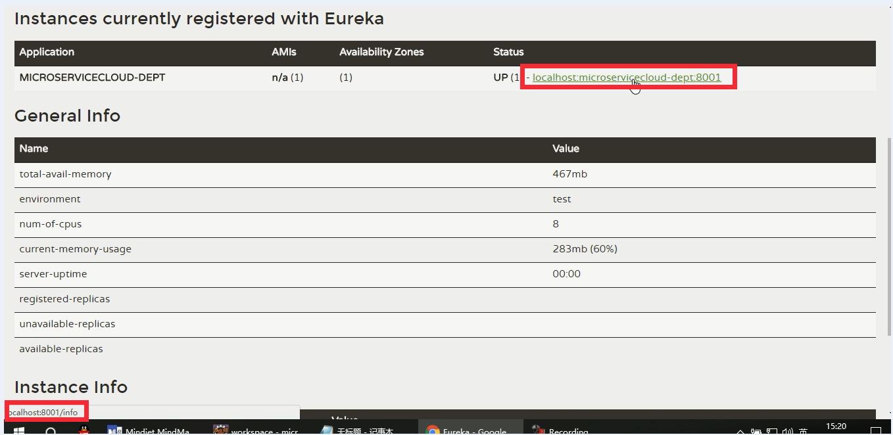

# SpringCloud面试题

什么是微服务？

微服务之间是如何独立通讯的？

SpringCloud 和 Dubbo有哪些区别？
SpringBoot 和 SpringCloud，请你谈谈对他们的理解？
什么是服务熔断？什么是服务降级？
微服务的优缺点分别是什么？说下你在项目开发中碰到的坑

你锁知道的微服务的技术栈有哪些？请列举一二

Eureka 和 Zookeeper 都可以提供服务注册与发现的功能，请说说两个的区别？

# 微服务概述

##微服务和微服务架构

### 微服务

建议先看看下面的描述什么是`微服务架构`，了解了微服务架构，那么微服务就是一个单独的小的服务，业务单一，独立部署，强调的是服务的大小，它关注的是某一个点，是具体解决某一个问题/提供落地对应服务的一个服务应用。

### 微服务架构

什么是微服务？

​	业界大牛马丁.福勒（Martin Fowler），[这样描述微服务](](https://martinfowler.com/articles/microservices.html))

```
The term "Microservice Architecture" has sprung up over the last few years to describe a particular way of designing software applications as suites of independently deployable services. While there is no precise definition of this architectural style, there are certain common characteristics around organization around business capability, automated deployment, intelligence in the endpoints, and decentralized control of languages and data.
```


就目前而言，对于微服务业界并没有一个统一的标准的定义。

但通常而言，微服务架构是一种架构模式或者说架构风格，它提倡将**单一应用程序划分成一组小的服务**，每个服务运行在其**独立的自己的进程**中，服务之间互相协调、互相配合，为用户提供最终价值，服务之间采用轻量级的通信机制互相沟通(通常是基于Http的RESTful API)。每个服务都围绕着具体业务进行构建，并且能够独立的部署到生产环境、类生产环境等。另外，应尽量避免统一、集中式的服务管理机制，对具体的一个服务而言，应根据业务上下文，选择合适的语言、工具对其进行构建，可以有一个非常轻量级的集中式管理来协调这些服务，可以使用不同的语言来编写服务，也可以使用不同的数据存储。

### 总结

微服务就是一个功能单一的小服务，而众多的微服务组成一个大型的系统，对应能给用户提供完整的功能，这样的架构叫微服务架构。

## 微服务的优缺点

### 优点

每个服务足够内聚、足够小、代码容易理解这样能聚焦一个指定的业务功能或业务需求。

开发简单、开发效率提高，一个服务可能就是专一的只干一件事。

微服务能够被小团队单独开发，这个小团队是2到5人的开发人员组成。

微服务是松耦合的，是有功能意义的服务，无论是在开发阶段还是部署阶段都是独立的。

微服务能使用不同的语言开发。

易于和第三方集成，微服务允许容易且灵活的方式集成自动部署，通过持续集成工具，如Jenkins，Hudson，Bambo。

微服务易于被一个开发人员理解，修改和维护，这样小团队能够更关注自己的工作成果。无需通过合作才能实现价值。

微服务允许你融合最新技术。

微服务只是业务逻辑的代码，不会和HTML、CSS或其他的界面组件组合。

每个微服务都有自己的存储能力，可以有自己的数据库，也可以有统一数据库。

### 缺点

开发人员要处理分布式系统的复杂性

多服务运维难度，随着服务的增加，运维的压力也在增大。

系统部署依赖

服务间通信成本

数据一致性

系统集成测试

性能监控。。。

## 微服务技术栈有哪些

什么是微服务技术栈呢？就是一个算是微服务的架构那么就需要在项目中有一些服务调用、服务注册与发现、负载均衡等等技术。这些技术就像我们平时接触的java的接口一样，有对应的落地实现，就像实现类。下面我们来看看：

| 微服务条目                | 落地技术                                     | 备注   |
| -------------------- | ---------------------------------------- | ---- |
| 服务开发                 | SpringBoot、Spring、SpringMVC              |      |
| 服务配置与管理              | Netflix公司的Archaius、阿里的Diamond等           |      |
| 服务注册与发现              | Eureka、Consul、Zookeeper等                 |      |
| 服务调用                 | Rest、RPC、gRPC                            |      |
| 服务熔断器                | Hystrix、Envoy等                           |      |
| 负载均衡                 | Ribbon、Nginx等                            |      |
| 服务接口调用（客户端调用服务的简化工具） | Feign等                                   |      |
| 消息队列                 | Kafka、RabbitMQ、ActiveMQ等                 |      |
| 服务器配置中心管理            | SpringCloudConfig、Chef等                  |      |
| 服务路由(API网关)          | Zuul等                                    |      |
| 服务监控                 | Zabbix、Nggios、Metrics、Spectator等         |      |
| 全链路追踪                | Zipkin、Brave、Dapper等                     |      |
| 服务部署                 | Docker、OpenStack、Kubernetes等             |      |
| 数据流操作开发包             | SpringCloud Stream(封装与Redis、Rabbit、Kafka等发送接收消息) |      |
| 事件消息总线               | SpringCloud Bus                          |      |

## 微服务架构选型依据

整体解决方案和框架成熟度

社区热度

可维护性

学习曲线

## 目前各大IT公司的微服务架构有哪些？

阿里Dubbo/HSF(好舒服)

京东JSF(京舒服)

新浪微博Motan

当当网Dubbox

## 各微服务框架对比

# SpringCloud

## SpringCloud概述

### 是什么

先看看官网说明，[看这里](spring.io)

#### COORDINATE ANYTHING: DISTRIBUTED SYSTEMS SIMPLIFIED

Building distributed systems doesn't need to be complex and error-prone. Spring Cloud offers a simple and accessible programming model to the most common distributed system patterns, helping developers build resilient, reliable, and coordinated applications. Spring Cloud is built on top of Spring Boot, making it easy for developers to get started and become productive quickly.

SpringCloud=分布式微服务架构下的一站式解决方案，是各个微服务架构落地技术的集合体。

### 能干嘛

### 怎么学习

官网：

http://projects.spring.io/spring-cloud/

参考书：

Spring Cloud Netflix 中文参考文档：https://springcloud.cc/spring-cloud-netflix.html

API说明：

```java
http://cloud.spring.io/spring-cloud-static/Dalston.SR1/
https://springcloud.cc/spring-cloud-dalston.html
```

SpringCloud中国社区：http://springcloud.cn/

SpringCloud中文网：http://springcloud.cc/


### 怎么玩

### SpringCloud国内使用情况

各个大厂都在使用SpringCloud，联通，华为等等

阿里云也在使用

## SpringBoot和SpringCloud的关系

SpringBoot 专注于快速开发单个体微服务。

SpringCloud是关注全局的微服务协调治理框架，它将SpringBoot开发的一个个单体微服务整合病管理起来。为哥哥微服务之间提供，配置管理、服务发现、断路器、路由、微代理、事件总线、全局锁、决策竞选、分布式会话等等集成服务。

SpringBoot可以离开SpringCloud独立使用开发项目。但是SpringCloud离不开SpringBoot。属于依赖关系。

**SpringBoot专注于快速、方便的开发单个微服务个体，SpringCloud关注全局的服务治理框架。**

## SpringCloud 和 Dubbo的区别

###功能实现的区别

先来看一张表对比一下：

| 微服务技术  | Dubbo         | SpringCloud                  |
| ------ | ------------- | ---------------------------- |
| 服务注册中心 | Zookeeper     | Spring Cloud Netflix Eureka  |
| 服务调用方式 | RPC           | REST API                     |
| 服务监控   | Dubbo-monitor | SpringBoot Admin             |
| 断路器    | 不完善           | Spring Cloud Netflix Hystnix |
| 服务网关   | 无             | Spring Cloud Netflix Zuul    |
| 分布式配置  | 无             | Spring Cloud Config          |
| 服务跟踪   | 无             | Spring Cloud Sleuth          |
| 消息总线   | 无             | Spring Cloud Bus             |
| 数据流    | 无             | Spring Cloud Stream          |
| 批量任务   | 无             | Spring Cloud Task            |

### 社区活跃度

可以查看两个网站，然后看看两个网站的活跃对比：

https://github.com/dubbo

https://github.com/spring-cloud


###区别总结

**最大的区别：SpringCloud抛弃了Dubbo的RPC通信，采用的是基于HTTP的REST方式**

严格来说，这两种方式各有优劣。虽然从一定程度来说，后者牺牲了服务调用的性能，但也避免了上面提到的原生RPC带来的问题。而且REST相比RPC更为灵活，服务提供方和调用方的依赖只依靠一纸契约，不存在代码级别的强依赖，这在强调快速演化的微服务环境中，显得更加合适。

## RestTemplet

它提供了多做便捷访问远程Http服务的的方法。

是一种简单便捷的访问restful 服务模板类，是spring 提供的用于访问Rest服务的**客户端模板工具**集


[官网点我](https://docs.spring.io/spring/docs/3.0.x/javadoc-api/org/springframework/web/client/RestTemplate.html)


使用总规则：
使用RestTemplate 访问restful服务接口非常的方便无脑

(url, requestMap, ResponseBean.class) 这三个参数分别代表

REST 请求地址，请求参数，HTTP响应转换成的对象类型

### 常见用法

```java
    public static final String REST_URL_PREFIX = "http://localhost:8001";

    @Autowired
    private RestTemplate restTemplate;

    /**
     * add 操作
     * @param dept
     */
    @RequestMapping(value = "/consumer/dept/add")
    public boolean add(Dept dept){
        return restTemplate.postForObject(REST_URL_PREFIX+"/dept/add", dept, Boolean.class);
    }

    /**
     * get 操作
     * @param id
     */
    @RequestMapping(value = "/consumer/dept/get/{id}")
    public Dept get(@PathVariable Long id){
        return restTemplate.getForObject(REST_URL_PREFIX+"/dept/get/"+id,Dept.class);
    }

    /**
     * list 操作
     */
    @RequestMapping(value = "/consumer/dept/list")
    public List<Dept> list(){
        return restTemplate.getForObject(REST_URL_PREFIX+"/dept/list" , List.class);
    }
```


# Eureka（服务注册与发现）

## 是什么

参看[官网](https://github.com/Netflix/eureka)

简单说说就是：

Eureka 是 Netflix 的一个子模块，也是核心模块之一。Eureka 是一个基于REST 的服务，用于定位服务，以实现云端中间层服务发现和故障转移。服务注册与发现对于微服务架构来说非常重要的，有了服务注册与发现，**只需要使用服务的标识符，就可以访问到服务，而不需要修改服务调用的配置文件了。功能类似`dubbo`的注册中心，比如Zookeeper。**


**Netflix 在设计 Eureka时遵守的是AP原则。**


## 原理

Spring Cloud 封装了 Netflix 公司开发的 Eureka,来实现服务注册和发现

Eureka 采用了 C - S 的设计架构，Eureka Server 作为服务注册功能的的服务器， 它是服务注册中心。

而系统中的其他微服务，使用Eureka 的客户端连接到 Eureka Server 并维持心跳连接，这样系统的维护人员就可以通过 Eureka Server 来监控各个微服务是否正常运行，SpringCloud 的一些其他模块（比如Zuul）就可以通过Eureka Server 来发现系统中的其他服务，并执行相关逻辑。


Eureka 包含两大组件：Eureka Server 和 Eureka Client

Eureka Server 提供服务注册服务

各个节点启动后，会在 Eureka Server 中进行注册，这样Eureka Server中的服务注册表中将会存储所有可用服务节点信息，服务节点的信息可以在界面中直观的看到。

Eureka Client 是一个Java 客户端，用于简化 与Eureka Server的交互，客户端同时也具备一个内置的、使用轮询(round-robin)负载算法的负载均衡器。在应用启动后，将回向 Eureka Server 发送心跳（默认周期是30秒），如果Eureka Server 在多个心跳周期内没有接收到某个节点的心跳，Eureka Srever 将会从服务器注册表中把这个服务节点移除（默认是90秒）。

## 角色

有三大角色：

Eureka Server 提供服务注册与发现

Service Provider 服务提供方将自身服务注册到Eureka，从而使服务消费方能够找到

Service Consumer 服务消费方从Eureka Server 获取注册的服务列表，从而能够消费服务

## 怎么玩

###Eureka Server

1.导入相应得maven 依赖：

```xml
<!--eureka-server服务端 -->
<dependency>
  <groupId>org.springframework.cloud</groupId>
  <artifactId>spring-cloud-starter-eureka-server</artifactId> <!-- 后面跟着server就是server端，没有就是客户端-->
</dependency>
```

2.配置文件

```yaml
server:
  port: 7001

eureka:
  instance:
    hostname: eureka7001.com #eureka服务端的实例名称
  client:
    register-with-eureka: false     #false表示不向注册中心注册自己。
    fetch-registry: false     #false表示自己端就是注册中心，我的职责就是维护服务实例，并不需要去检索服务
    service-url:
      单机 defaultZone: http://${eureka.instance.hostname}:${server.port}/eureka/       #设置与Eureka Server交互的地址查询服务和注册服务都需要依赖这个地址（单机）。
#      defaultZone: http://eureka7002.com:7002/eureka/,http://eureka7003.com:7003/eureka/
```

3.在主启动类上面加上一个注解`EnableEurekaServer`

```java
@SpringBootApplication
@EnableEurekaServer // EurekaServer服务器端启动类,接受其它微服务注册进来
public class EurekaServer7001_App {
    public static void main(String[] args) {
        SpringApplication.run(EurekaServer7001_App.class, args);
    }
}
```

4.怎么确定Eureka Server已经启动好了呢？

在浏览器输入`http://localhost:7001/` 能看到相应得页面，那就是启动成功了。

### Eureka Client

1.导入相应得maven 依赖：

```xml
<!-- 将微服务provider侧注册进eureka -->
<dependency>
  <groupId>org.springframework.cloud</groupId>
  <artifactId>spring-cloud-starter-eureka</artifactId>
</dependency>
```

2.配置文件

```yaml
eureka:
  client: #客户端注册进eureka服务列表内
    service-url: 
      #defaultZone: http://localhost:7001/eureka
       defaultZone: http://eureka7001.com:7001/eureka/,http://eureka7002.com:7002/eureka/,http://eureka7003.com:7003/eureka/       
```


3.在主启动类上面加上一个注解`@EnableEurekaClient`

```java
@SpringBootApplication
@EnableEurekaClient //本服务启动后会自动注册进eureka服务中
// @EnableDiscoveryClient //服务发现
public class DeptProvider8001_App {
    public static void main(String[] args) {
        SpringApplication.run(DeptProvider8001_App.class, args);
    }
}
```

## Eureka 自我保护机制

简单点就是**好死不如赖活着**：

某时刻某一个微服务不可用了，Eureka 不会立刻清理，依旧会对改微服务的信息进行保存。

### 关闭自我保护

一般不推荐关闭自我保护

```properties
eureka.server.enable-self-preservation=false
```


## Eureka 的info 信息

info信息是什么？先看看下面的这张图



当我们在Eureka Server的网站上，看见注册进入Eureka Server的服务时，我们把鼠标放在上面，看看浏览器的左下角显示的是，这个链接实际访问的就是这个服务的**根目录**加上`info` , 这儿的info就是 Eureka 服务的 info 信息，**正常情况下打开是会报错的**。因为没有配置。

## Eureka 优化

### 主机名称和服务名称修改

在上面Eureka 的 info 信息那一节的截图，会发现，我们的服务的名字很长不好认，怎么修改呢？
就是修改我们自己服务的yaml 或者 properties 配置文件：

```yaml
eureka:     
  instance:
    instance-id: microservicecloud-dept8001  #这儿就是配置服务实例的名字，这样Erueka Server的浏览器上面显示的就会是我们配置的名字，而不是那么长的
```

### 访问路径可以显示IP地址

还是上面的图看左下角，会注意到显示的ip是 localhost，我们现在要做的就是让那儿显示IP；

```yaml
eureka:     
  instance:
    prefer-ip-address: true     #访问路径可以显示IP地址 
```

### ErueKa info 界面的配置和优化

问题：还是上面的图，超链接点击会报ErrorPage

解决：

1.在目标微服务的pom文件中添加 `actuator`, 因为它主管信息监控和信息完善

```xml
<!-- actuator监控信息完善 -->
<dependency>
  <groupId>org.springframework.boot</groupId>
  <artifactId>spring-boot-starter-actuator</artifactId>
</dependency>
```

2.在总的父工程microservicecloud修改pom添加构建build信息

```xml
<!-- 这个插件的具体用法，参看Maven文章 -->  
<build>
    <finalName>microservicecloud</finalName>
    <resources>
      <resource>
        <directory>src/main/resources</directory>
        <filtering>true</filtering>
      </resource>
    </resources>
    <plugins>
      <plugin>
        <groupId>org.apache.maven.plugins</groupId>
        <artifactId>maven-resources-plugin</artifactId>
        <configuration>
          <delimiters>
            <delimit>$</delimit>
          </delimiters>
        </configuration>
      </plugin>
    </plugins>
  </build>
```

3.在目标服务中的yaml 文件中添加如下内容：

那么点开那个超链接的时间，那么这些内容就会以json串的形式显示。

```yaml
info: 
  app.name: atguigu-microservicecloud
  company.name: www.atguigu.com
  build.artifactId: $project.artifactId$
  build.version: $project.version$
```

## 查看Eureka 默认配置

 `Eureka Server`  查看类`EurekaServerConfigBean` 即可

`Eureka Client`  查看类 `EurekaClientConfigBean` 即可

## 服务发现

### @EnableDiscoveryClient 和 @EnableEurekaClient 的区别

## Eureka 集群搭建

###Eureka Server 的修改

这个我使用三个应用来作为Eureka Server 的集群：

注意的地方：

第一：hostname 必须不一样 `eureka.instance.hostname`

第二：`defaultZone` 要配置为互补的方式；具体参看下面的配置文件

服务器1：

```yaml
server:
  port: 7001

eureka:
  instance:
    hostname: eureka7001.com #eureka服务端的实例名称
  client:
    register-with-eureka: false     #false表示不向注册中心注册自己。
    fetch-registry: false     #false表示自己端就是注册中心，我的职责就是维护服务实例，并不需要去检索服务
    service-url:
#      单机 defaultZone: http://${eureka.instance.hostname}:${server.port}/eureka/       #设置与Eureka Server交互的地址查询服务和注册服务都需要依赖这个地址（单机）。
      defaultZone: http://eureka7002.com:7002/eureka/,http://eureka7003.com:7003/eureka/
```

服务器2：

```yaml
server:
  port: 7002

eureka:
  instance:
    hostname: eureka7002.com #eureka服务端的实例名称
  client:
    register-with-eureka: false     #false表示不向注册中心注册自己。
    fetch-registry: false     #false表示自己端就是注册中心，我的职责就是维护服务实例，并不需要去检索服务
    service-url:
#      单机 defaultZone: http://${eureka.instance.hostname}:${server.port}/eureka/       #设置与Eureka Server交互的地址查询服务和注册服务都需要依赖这个地址（单机）。
      defaultZone: http://eureka7001.com:7001/eureka/,http://eureka7003.com:7003/eureka/
```

服务器3：

```yaml
server:
  port: 7003

eureka:
  instance:
    hostname: eureka7003.com #eureka服务端的实例名称
  client:
    register-with-eureka: false     #false表示不向注册中心注册自己。
    fetch-registry: false     #false表示自己端就是注册中心，我的职责就是维护服务实例，并不需要去检索服务
    service-url:
#      单机 defaultZone: http://${eureka.instance.hostname}:${server.port}/eureka/       #设置与Eureka Server交互的地址查询服务和注册服务都需要依赖这个地址（单机）。
      defaultZone: http://eureka7002.com:7002/eureka/,http://eureka7001.com:7001/eureka/
```

### Eureka Client 修改

因为要注册进入整个集群，所以客户端的`defaultZone` 也要使用集群的配置，具体参看下面：

```yaml
eureka:
  client: #客户端注册进eureka服务列表内
    service-url: 
      #defaultZone: http://localhost:7001/eureka
       defaultZone: http://eureka7001.com:7001/eureka/,http://eureka7002.com:7002/eureka/,http://eureka7003.com:7003/eureka/ 
```

## Eureka 和 Zookeeper 对比

CAP理论：

C：Consistency（强一致性）

A：Availability（可用性）

P：Partition Tolerance （分区容错性）

**Eureka 遵守AP， Zookeeper 遵守CP**

### Zoopkeeper保证CP： 

当向注册中心查询服务列表时，我们可以容忍注册中心返回的是几分钟以前的注册信息，但是不能接受服务直接down掉不可用。也就是说，服务注册功能对可用性的要求要高于一致性。但是zk会出现这样的一种情况，当master节点因网路故障与其他节点失去联系时，剩余的节点会重新进行leader选举。问题在于，选举leader的时间太长，30~120s，且选举期间整个zk集群是都是不可用的，这就导致在选举期间注册服务瘫痪，在云部署的环境下，因网络问题使得zk集群失去master节点是较大概率会发生的事，虽然服务能够最终恢复，但是漫长的选举时间导致的注册长期不可用是不能容忍的。

### Eureka保证AP： 

Eureka看明白了这一点，因此在设计时就优先保证可用性。Eureka各个节点都是平等的，几个节点挂掉不影响正常节点的工作，剩余的节点依然可以提供注册和查询服务。而Eureka的客户端在向某个Eureka注册时如果发现连接失败，则会自动切换至其他的节点，只要有一台Eureka还在，就能保证注册服务可用（保证可用性），只不过查到的信息可能不是最新的（不保证一致性）。除此之外，Eureka还有一种自我保护机制，如果在15分钟内超过85%的节点都没有正常的心跳，那么Eureka就认为客户端与注册中心出现了网络故障，此时会出现以下几种情况： 
1.Eureka不再从注册列表中移除因为长时间没有收到心跳而应该过期的服务 
2.Eureka仍然能够接受新服务的注册和查询请求，但是不会被同步到其它节点上（即保证当前节点依然可用） 
3.当前网络稳定时，当前实例新的注册信息会被同步到其它节点中 

因此，Eureka可以很好的应对因网络故障导致节点失去联系的情况，而不会像zookeeper那样使整个注册服务瘫痪。

# Ribbon（负载均衡）

## 概述

###Ribbon 是什么

Spring Cloud Ribbon 是 基于Netflix Ribbon 实现的一套**客户端** 的 **负载均衡**工具。

主要功能是提供客户端的软件负载均衡算法，将Netflix的中间层服务连接在一起。Ribbon客户端组件提供一系列完善的配置项如连接超时，重试等。简单的说，就是在配置文件中列出Load Balancer（简称LB）后面所有的机器，Ribbon会自动的帮助你基于某种规则（如简单轮询，随即连接等）去连接这些机器。我们也很容易使用Ribbon实现自定义的负载均衡算法。

Dubbo 和 SpringCloud 中均给我们提供了负载均衡，**但SpringCloud的负载均衡可以自定义**。

### Load Balancer

刚刚上面说Ribbon 是一种负载均衡工具，那么我们就来简单说说什么是负载均衡。负载均衡就是把请求均衡的分摊到对于的服务器上面。


**目前主流的LB方案可分成两类**：

​	一种是集中式LB, 即在服务的消费方和提供方之间使用独立的LB设施(可以是硬件，如F5, 也可以是软件，如nginx), 由该设施负责把访问请求通过某种策略转发至服务的提供方；

​	另一种是进程内LB，将LB逻辑集成到消费方，消费方从服务注册中心获知有哪些地址可用，然后自己再从这些地址中选择出一个合适的服务器。Ribbon就属于后者，它只是一个类库，集成于消费方进程，消费方通过它来获取到服务提供方的地址。 

## 怎么玩

因为Ribbon是一个客户端的负载均衡工具，那么我们就在客户端操作。

1.导入Maven 依赖：

```xml
        <!-- Ribbon相关 -->
        <dependency>
            <groupId>org.springframework.cloud</groupId>
            <artifactId>spring-cloud-starter-eureka</artifactId>
        </dependency>
        <dependency>
            <groupId>org.springframework.cloud</groupId>
            <artifactId>spring-cloud-starter-ribbon</artifactId>
        </dependency>
        <dependency>
            <groupId>org.springframework.cloud</groupId>
            <artifactId>spring-cloud-starter-config</artifactId>
        </dependency>
```

2.在启动类上面加上`@EnableEurekaClient`

3.在`RestTemplate` 上面加上`@LoadBalanced` 注解，这儿使用的就是默认的`RoundRobinRule` 算法来实现负载均衡

```java
@Bean
@LoadBalanced
public RestTemplate getRestTemplate(){
  return new RestTemplate();
}
```


## IRule

根据特定算法从服务列表中选取一个要访问的服务；

```
RoundRobinRule : 轮询算法

```

##怎么自己切换负载均衡规则

```java
@Configuration
public class ConfigBean {

    @Bean
    @LoadBalanced
    public RestTemplate getRestTemplate(){
        return new RestTemplate();
    }

  	//就是在这儿加入一个其他的规则Bean
    @Bean
    public IRule getRule(){
        return new RandomRule();
    }
}
```

## 自定义规则

1.主启动类上面加上`RibbonClient` 注解，具体的内容如下：

```java
@SpringBootApplication
@EnableEurekaClient

//这儿的name 表示这个规则是针对哪个微服务提供者，configuration 表示配置类是谁，就是下面我们自己定义的类
@RibbonClient(name= "MICROSERVICECLOUD-DEPT", configuration = MySelfRule.class)
public class DeptConsumer80_App {

    public static void main(String[] args) {
        SpringApplication.run(DeptConsumer80_App.class, args);
    }
}
```


2.因微服务启动类，默认会扫描其所在目录下的所有配置信息，所以新建规则不能放在启动类的同级目录或者子目录下面：

主目录是`com.zcd.springcloud` , 而我们的规则类的主目录是`com.zcd.myrule`

`MySelfRule` 需要加上`Configuration` 加入Spring容器，

```java
package com.zcd.myrule;

import com.netflix.loadbalancer.IRule;
import org.springframework.context.annotation.Bean;
import org.springframework.context.annotation.Configuration;

@Configuration
public class MySelfRule {

    @Bean
    public IRule myRule() {
        //return new RandomRule();// Ribbon默认是轮询，我自定义为随机
        //return new RoundRobinRule();// Ribbon默认是轮询，我自定义为随机

        return new RandomRule_ZY();// 我自定义为每台机器5次
    }
}

```

3.`RandomRule_ZY` 就是专门自定义规则的类

主要的规则就是，实现`com.netflix.loadbalancer.AbstractLoadBalancerRule` 类，然后重写choose方法，定义我们自己的规则

```java
public class RandomRule_ZY extends AbstractLoadBalancerRule {

    // total = 0 // 当total==5以后，我们指针才能往下走，
    // index = 0 // 当前对外提供服务的服务器地址，
    // total需要重新置为零，但是已经达到过一个5次，我们的index = 1
    // 分析：我们5次，但是微服务只有8001 8002 8003 三台，OK？
    //


    private int total = 0;            // 总共被调用的次数，目前要求每台被调用5次
    private int currentIndex = 0;    // 当前提供服务的机器号

    public Server choose(ILoadBalancer lb, Object key) {
        if (lb == null) {
            return null;
        }
        Server server = null;

        while (server == null) {
            if (Thread.interrupted()) {
                return null;
            }
            List<Server> upList = lb.getReachableServers();
            List<Server> allList = lb.getAllServers();
            System.out.println("allList:" + allList + "  upList:" + upList);
            int serverCount = allList.size();
            if (serverCount == 0) {
                return null;
            }


//			private int total = 0; 			// 总共被调用的次数，目前要求每台被调用5次
//			private int currentIndex = 0;	// 当前提供服务的机器号
            if (total < 5) {
                server = upList.get(currentIndex);
                total++;
            } else {
                total = 0;
                currentIndex++;
                if (currentIndex >= upList.size()) {
                    currentIndex = 0;
                }
            }


            if (server == null) {
                Thread.yield();
                continue;
            }

            if (server.isAlive()) {
                return (server);
            }
            server = null;
            Thread.yield();
        }

        return server;
    }

    @Override
    public Server choose(Object key) {
        return choose(getLoadBalancer(), key);
    }

    @Override
    public void initWithNiwsConfig(IClientConfig clientConfig) {
        // TODO Auto-generated method stub
    }

}
```

# Feign

# Hystrix（熔断器）

## 一些概念

### 服务雪崩

多个微服务之间调用的时候，假设微服务A调用微服务B和微服务C，微服务B和微服务C又调用其他的微服务，这就是所谓的"**扇出**"，如果扇出的链路上某个微服务的调用响应时间过长或者不可用，对微服务A的调用就会占用越来越多的系统资源，进而引起系统崩溃，即所谓的“**雪崩效应**”。

对于高流量的应用来说，单一的后端依赖可能会导致所有服务器上的所有资源都在几秒钟内饱和。比失败更槽糕的是，这些应用程序还可能导致服务之间的延迟增加，备份队列，线程和其他系统资源紧张，导致整个系统发生更多的级联故障。这些都表示需要对故障和延迟进行隔离和管理，以便单个依赖关系的失败，不能取消整个应用程序或系统。

## Hystrix 是什么

hystrxi是一个用于处理分布式系统的**延迟**和**容错**的开源库，在分布式系统里，许多依赖不可避免的会调用失败，比如超时、异常等待，hystrix能够保证在一个依赖出现问题的情况下，不会导致整体服务失败，避免级联故障，以提供分布式系统的弹性。

当某个服务单元发生故障之后，通过断路器的故障监控（类似熔断保险丝），向调用方返回一个**符合预期的、可处理的备选响应(FallBack)**，而不是长时间的等待或者抛出调用方无法处理的异常。这样**保证了服务调用方的线程不会因调用故障服务被长时间占用不释放**，避免了故障在分布式系统中的蔓延，乃至雪崩。

##Hystrix 能干什么

hystrix能够进行：

服务降级

服务熔断

服务限流

接近实时的监控