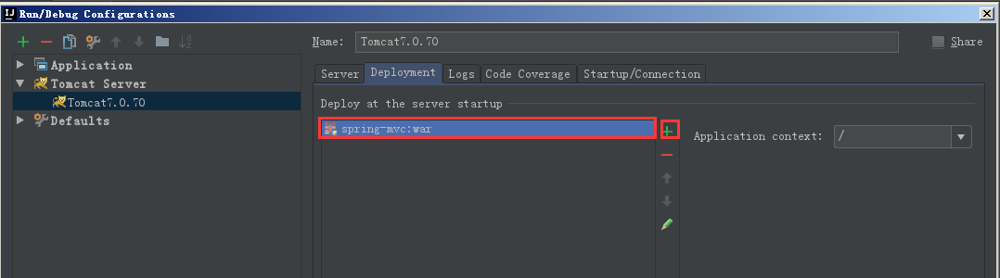
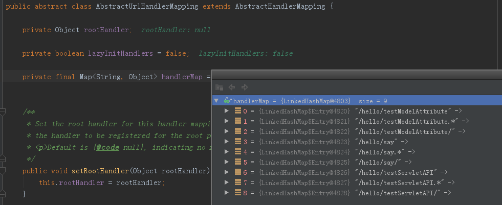
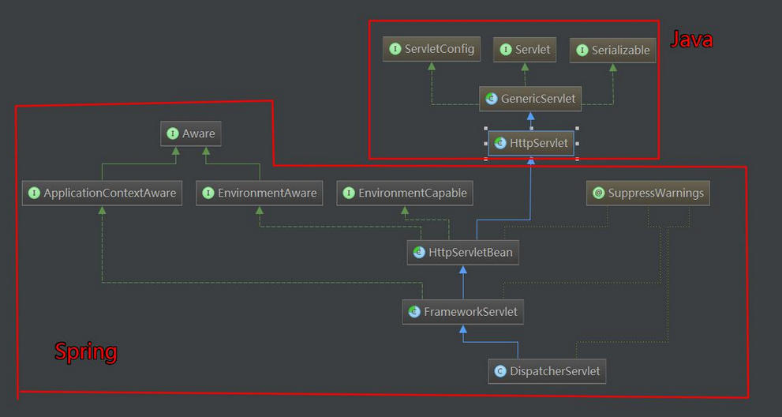

# SpringMVC

## SpringHelloWorld

鉴于以后开发都是使用idea开发，所以开发步骤如下：

1. 创建idea web项目
2. 导包

### 创建 idea web项目

在创建project的和其他的项目一样，只是在new module的时候像下面这样：


#### 配置Tomcat服务器

1. 在下面红色框中配置的 On ‘Update’ action ，选择Update classes and resources 是为了热部署
2. 在下面的After launch 我们看见一个chrome的图标，这儿的配置是为了在Tomcat启动的时候自动的打开该浏览器


#### 部署一个web应用

1. 在tomcat的配置页面选择 Deployment ，然后有个绿色的+来部署一个web应用，（ps：建议选择exploded 结尾的模式，只有这种模式才能热部署，解释如下）

```
是选择war还是war exploded 这里首先看一下他们两个的区别：
war模式：将WEB工程以包的形式上传到服务器 ；
war exploded模式：将WEB工程以当前文件夹的位置关系上传到服务器；1212

（1）war模式这种可以称之为是发布模式，看名字也知道，这是先打成war包，再发布；
（2）war exploded模式是直接把文件夹、jsp页面 、classes等等移到Tomcat 部署文件夹里面，进行加载部署。因此这种方式支持热部署，一般在开发的时候也是用这种方式。
（3）在平时开发的时候，使用热部署的话，应该对Tomcat进行相应的设置，这样的话修改的jsp界面什么的东西才可以及时的显示出来。

```

1. 在下面图片中的Application Context 的那个地方，如果填写的 / 那么就会覆盖tomcat 默认的根目录`ROOT` 所以，建议修改



### 代码编写

#### 配置 `web.xml`

```xml
<!DOCTYPE web-app PUBLIC
 "-//Sun Microsystems, Inc.//DTD Web Application 2.3//EN"
 "http://java.sun.com/dtd/web-app_2_3.dtd" >

<web-app>
  <display-name>Archetype Created Web Application</display-name>

  <servlet>
    <servlet-name>dispactorServlet</servlet-name>
    <servlet-class>org.springframework.web.servlet.DispatcherServlet</servlet-class>
    <init-param>
      <param-name>contextConfigLocation</param-name>
      <!-- 如果不指定就默认使用WEB-INF/[ServletName]-servlet.xml -->
      <param-value>classpath:dispactorServlet.xml</param-value>
    </init-param>
  </servlet>
  
  <servlet-mapping>
    <servlet-name>dispactorServlet</servlet-name>
    <url-pattern>/</url-pattern>
  </servlet-mapping>
  
  <welcome-file-list>
    <welcome-file>index.html</welcome-file>
  </welcome-file-list>
</web-app>
```

#### Spring Bean XML 配置

```xml
<beans xmlns="http://www.springframework.org/schema/beans"
       xmlns:xsi="http://www.w3.org/2001/XMLSchema-instance"
       xmlns:context="http://www.springframework.org/schema/context"
       xmlns:mvc="http://www.springframework.org/schema/mvc"
       xsi:schemaLocation="http://www.springframework.org/schema/beans http://www.springframework.org/schema/beans/spring-beans.xsd http://www.springframework.org/schema/context http://www.springframework.org/schema/context/spring-context.xsd">

    <context:component-scan base-package="com.zcd.spring.springmvc" />

    <!-- 配置视图解析器: 如何把 handler 方法返回值解析为实际的物理视图 -->
    <bean class="org.springframework.web.servlet.view.InternalResourceViewResolver">
        <property name="prefix" value="/WEB-INF/views/"></property>
        <property name="suffix" value=".jsp"></property>
    </bean>
</beans>  
```

#### Handler 编写

```java
@Controller
@RequestMapping("/hello")
public class Handler {

    @RequestMapping("/say")
    public String sayHello(){
        System.out.println("hello world");
        return "success";
    }
}
```

## 入

### 使用 @RequestMapping 映射请求

Spring MVC 使用 @RequestMapping 注解为控制器指定可以处理哪些 URL 请求 .

#### 映射URL

在控制器的类定义及方法定义处都可标注 

```java
@Target({ElementType.METHOD, ElementType.TYPE})
@Retention(RetentionPolicy.RUNTIME)
@Documented
@Mapping
public @interface RequestMapping {
}
```

1. 类定义处：提供初步的请求映射信息。相对于 WEB 应用的根目录
2. 方法处：提供进一步的细分映射信息。相对于类定义处的 URL。若类定义处未标注 @RequestMapping，则方法处标记的 URL 相对于WEB 应用的根目录 

DispatcherServlet 截获请求后，就通过控制器上@RequestMapping 提供的映射信息确定请求所对应的处理方法。 

此实例可以参看前面的`SpringHelloWorld`章节

#### 映射请求参数、请求方法或请求头

@RequestMapping 除了可以使用请求 URL 映射请求外，还可以使用请求方法、请求参数及请求头映射请求 

@RequestMapping 的 value、method、params 及 heads分别表示<u>请求 URL、请求方法、请求参数及请求头</u>的映射条件，他们之间是 <u>**==与==**</u> 的关系，联合使用多个条件可让请求映射更加精确化。 

```java
@Target({ElementType.METHOD, ElementType.TYPE})
@Retention(RetentionPolicy.RUNTIME)
@Documented
@Mapping
public @interface RequestMapping {
    String[] value() default {};

    RequestMethod[] method() default {};

    String[] params() default {};

    String[] headers() default {};

    String[] consumes() default {};

    String[] produces() default {};
}
```

params 和 headers支持简单的表达式：
– param1: 表示请求必须包含名为 param1 的请求参数
– !param1: 表示请求不能包含名为 param1 的请求参数
– param1 != value1: 表示请求包含名为 param1 的请求参数，但其值
不能为 value1
– {“param1=value1”, “param2”}: 请求必须包含名为 param1 和param2
的两个请求参数，且 param1 参数的值必须为 value1 

#### Ant 风格的 URL

@RequestMapping 还支持 Ant 风格的 URL：

Ant 风格资源地址支持 3 种匹配符：
– ?：匹配文件名中的一个字符
– *：匹配文件名中的任意字符
– **：** 匹配多层路径 

– /user/*/createUser: 匹配
/user/aaa/createUser、/user/bbb/createUser 等 URL
– /user/**/createUser: 匹配
/user/createUser、/user/aaa/bbb/createUser 等 URL
– /user/createUser??: 匹配
/user/createUseraa、/user/createUserbb 等 URL 

### @PathVariable 映射 URL 绑定的占位符

带占位符的 URL 是 Spring3.0 新增的功能，该功能在SpringMVC 向 REST 目标挺进发展过程中具有里程碑的意义 

通过 @PathVariable 可以将 URL 中占位符参数绑定到控制器处理方法的入参中：URL 中的 {xxx} 占位符可以通过
@PathVariable("xxx") 绑定到操作方法的入参中。 


实例如下：

```java
/**
	 * @PathVariable 可以来映射 URL 中的占位符到目标方法的参数中.
	 * @param id
	 * @return
	 */
@RequestMapping("/testPathVariable/{id}")
public String testPathVariable(@PathVariable("id") Integer id) {
  System.out.println("testPathVariable: " + id);
  return SUCCESS;
}
```

请求方式：

```html
<a href="springmvc/testPathVariable/1">Test PathVariable</a>
<br><br>
```

### 请求处理方法签名

1. Spring MVC 通过分析处理方法的签名，将 **HTTP **请求信息绑定到处理方法的相应人参中。
2. Spring MVC 对控制器处理方法签名的限制是很宽松的，几乎可以按喜欢的任何方式对方法进行签名。
3. 必要时可以对方法及方法入参标注相应的注解（**@PathVariable**、**@RequestParam**、**@RequestHeader **等）、Spring
4. MVC 框架会将 HTTP 请求的信息绑定到相应的方法入参中，并根据方法的返回值类型做出相应的后续处理。

#### 使用 @RequestParam 绑定请求参数值

在处理方法入参处使用 **@RequestParam **可以把请求参数传递给请求方法.

1. value：参数名
2. required：是否必须。默认为 true, 表示请求参数中必须包含对应的参数，若不存在，将抛出异常

看看`@RequestParam` 的源码

```java
@Target(ElementType.PARAMETER)
@Retention(RetentionPolicy.RUNTIME)
@Documented
public @interface RequestParam {

	String value() default "";
	boolean required() default true;
	String defaultValue() default ValueConstants.DEFAULT_NONE;

}
```

实例：

```java
	/**
	 * @RequestParam 来映射请求参数. value 值即请求参数的参数名 required 该参数是否必须. 默认为 true
	 *               defaultValue 请求参数的默认值
	 */
	@RequestMapping(value = "/testRequestParam")
	public String testRequestParam(
			@RequestParam(value = "username") String un,
			@RequestParam(value = "age", required = false, defaultValue = "0") int age) {
		System.out.println("testRequestParam, username: " + un + ", age: "
				+ age);
		return SUCCESS;
	}
```

#### 使用 @RequestHeader 绑定请求报头的属性值

请求头包含了若干个属性，服务器可据此获知客户端的信息，通过 **@RequestHeader **即可将请求头中的属性值绑
定到处理方法的入参中.

实例：

```java
	/**
	 * 了解: 映射请求头信息 用法同 @RequestParam
	 */
	@RequestMapping("/testRequestHeader")
	public String testRequestHeader(
			@RequestHeader(value = "Accept-Language") String al) {
		System.out.println("testRequestHeader, Accept-Language: " + al);
		return SUCCESS;
	}
```

#### 使用 @CookieValue 绑定请求中的 Cookie 值

**@CookieValue **可让处理方法入参绑定某个 Cookie 值

实例：

```java
	/**
	 * 了解:
	 * 
	 * @CookieValue: 映射一个 Cookie 值. 属性同 @RequestParam
	 */
	@RequestMapping("/testCookieValue")
	public String testCookieValue(@CookieValue("JSESSIONID") String sessionId) {
		System.out.println("testCookieValue: sessionId: " + sessionId);
		return SUCCESS;
	}
```

### 使用 POJO 对象绑定请求参数值

Spring MVC 会按请求参数名和 **POJO **属性名进行自动匹配，自动为该对象填充属性值。支持级联属性。如：dept.deptId、dept.address.tel 等。

实例：

```java
/**
	 * Spring MVC 会按请求参数名和 POJO 属性名进行自动匹配， 自动为该对象填充属性值。支持级联属性。
	 * 如：dept.deptId、dept.address.tel 等
	 */
@RequestMapping("/testPojo")
public String testPojo(User user) {
  System.out.println("testPojo: " + user);
  return SUCCESS;
}

public class User {
	
	private Integer id;
	
	private String username;
	private String password;

	private String email;
	private int age;
}

public class Address {

	private String province;
	private String city;
}
```

请求HTML：

```html
<form action="springmvc/testPojo" method="post">
	username: <input type="text" name="username"/>
	<br>
	password: <input type="password" name="password"/>
	<br>
	email: <input type="text" name="email"/>
	<br>
	age: <input type="text" name="age"/>
	<br>
	city: <input type="text" name="address.city"/>
	<br>
	province: <input type="text" name="address.province"/>
	<br>
	<input type="submit" value="Submit"/>
</form>
<br><br>
```

### 使用 **Servlet API **作为入参

可以接受的ServletAPI 类型的参数

```
HttpServletRequest
HttpServletResponse
HttpSession
java.security.Principal
Locale
InputStream
OutputStream
Reader
Writer

```

实例：

```java
	/**
	 * 可以使用 Serlvet 原生的 API 作为目标方法的参数 具体支持以下类型
	 * 
	 * HttpServletRequest 
	 * HttpServletResponse 
	 * HttpSession
	 * java.security.Principal 
	 * Locale 
	 * InputStream 
	 * OutputStream 
	 * Reader 
	 * Writer
	 * @throws IOException 
	 */
	@RequestMapping("/testServletAPI")
	public void testServletAPI(HttpServletRequest request,
			HttpServletResponse response, Writer out) throws IOException {
		System.out.println("testServletAPI, " + request + ", " + response);
		out.write("hello springmvc");
//		return SUCCESS;
	}
```

## 出

Spring MVC 提供了以下几种途径输出模型数据：

1. ModelAndView：处理方法返回值类型为 `ModelAndView`时, 方法体即可通过该对象添加模型数据
2. **Map **及 **Model**: 入参为org.springframework.ui.Model、org.springframework.ui.ModelMap 或 java.uti.Map 时，处理方法返回时，Map中的数据会自动添加到模型中。
3. **@SessionAttributes**: 将模型中的某个属性暂存到HttpSession 中，以便多个请求之间可以共享这个属性
4. **@ModelAttribute**: 方法入参标注该注解后, 入参的对象就会放到数据模型中

### ModelAndView

控制器处理方法的返回值如果为 **ModelAndView**, **则其既包含视图信息，也包含模型数据信息**。

添加模型数据:
– MoelAndView addObject(String attributeName, Object attributeValue)
– ModelAndView addAllObject(Map<String, ?> modelMap)

设置视图:
– void setView(View view)
– void setViewName(String viewName)

实例：

```java
	/**
	 * 目标方法的返回值可以是 ModelAndView 类型。 
	 * 其中可以包含视图和模型信息
	 * SpringMVC 会把 ModelAndView 的 model 中数据放入到 request 域对象中. 
	 * @return
	 */
	@RequestMapping("/testModelAndView")
	public ModelAndView testModelAndView(){
		String viewName = SUCCESS;
		ModelAndView modelAndView = new ModelAndView(viewName);
		
		//添加模型数据到 ModelAndView 中.
		modelAndView.addObject("time", new Date());
		
		return modelAndView;
	}
```

### Map 及 Model

Spring MVC 在内部使用了一个`org.springframework.ui.Model` 接口存储模型数据。

1. **Spring MVC **在调用方法前会创建一个隐含的模型对象作为模型数据的存储容器。
2. 如果方法的入参为 **Map **或 **Model **类型，Spring MVC 会将隐含模型的引用传递给这些入参。在方法体内，开发者可以通过这个入参对象访问到模型中的所有数据，也可以向模型中添加新的属性数据。

实例：

```java
	/**
	 * 目标方法可以添加 Map 类型(实际上也可以是 Model 类型或 ModelMap 类型)的参数. 
	 * @param map
	 * @return
	 */
	@RequestMapping("/testMap")
	public String testMap(Map<String, Object> map){
		System.out.println(map.getClass().getName()); 
		map.put("names", Arrays.asList("Tom", "Jerry", "Mike"));
		return SUCCESS;
	}
```

### @SessionAttributes

若希望在多个请求之间共用某个模型属性数据，则可以在控制器类上标注一个 **@SessionAttributes**, Spring MVC将在模型中对应的属性暂存到 HttpSession 中。
• @SessionAttributes 除了可以通过属性名指定需要放到会话中的属性外，还可以通过模型属性的对象类型指定哪些模型属性需要放到会话中

常见用法：

– @SessionAttributes(types=User.class) 会将隐含模型中所有类型为 User.class 的属性添加到会话中。
– @SessionAttributes(value={“user1”, “user2”})
– @SessionAttributes(types={User.class, Dept.class})
– @SessionAttributes(value={“user1”, “user2”},types={Dept.class})

### @ModelAttribute

#### 场景描述：

我们要修改数据库中一条数据，但是对于密码和录入时间这些字段是不会修改的，但是我们在数据库的操作的时候传入的一般是一个model，这个model的密码和录入时间在我们没有传值的时候就是null值，所以在做数据库修改的时候就会把他们设置为null值，这明显是不对的，

而我们就可以使用 @ModelAttribute 注解来解决这个问题，加了注解的方法会在我们的目标方法执行之前先去让我们先从数据库查询一个原始的Model，这样我们就能避免上面的那个不合理的情况了。

#### 代码操作

```html
	<!--  
		模拟修改操作
		1. 原始数据为: 1, Tom, 123456,tom@atguigu.com,12
		2. 密码不能被修改.
		3. 表单回显, 模拟操作直接在表单填写对应的属性值
	-->
	<form action="springmvc/testModelAttribute" method="Post">
		<input type="hidden" name="id" value="1"/>
		username: <input type="text" name="username" value="Tom"/>
		<br>
		email: <input type="text" name="email" value="tom@atguigu.com"/>
		<br>
		age: <input type="text" name="age" value="12"/>
		<br>
		<input type="submit" value="Submit"/>
	</form>
	<br><br>
```


```java
	/**
	 * 1. 有 @ModelAttribute 标记的方法, 会在每个目标方法执行之前被 SpringMVC 调用! 
	 * 2. @ModelAttribute 注解也可以来修饰目标方法 POJO 类型的入参, 其 value 属性值有如下的作用:
	 * 1). SpringMVC 会使用 value 属性值在 implicitModel 中查找对应的对象, 若存在则会直接传入到目标方法的入参中.
	 * 2). SpringMVC 会一 value 为 key, POJO 类型的对象为 value, 存入到 request 中. 
	 */
	@ModelAttribute
	public void getUser(@RequestParam(value="id",required=false) Integer id, 
			Map<String, Object> map){
		System.out.println("modelAttribute method");
		if(id != null){
			//模拟从数据库中获取对象
			User user = new User(1, "Tom", "123456", "tom@atguigu.com", 12);
			System.out.println("从数据库中获取一个对象: " + user);
			
			map.put("user", user);
		}
	}
	
    @RequestMapping("/testModelAttribute")
    public String testModelAttribute(User user){
        System.out.println("修改: " + user);
        return "success";
    }
```

#### 原理描述：

运行流程:

1. 执行 @ModelAttribute 注解修饰的方法: 从数据库中取出对象, 把对象放入到了 Map 中. 键为: user
2. SpringMVC 从 Map 中取出 User 对象, 并把表单的请求参数赋给该 User 对象的对应属性.
3. SpringMVC 把上述对象传入目标方法的参数.

SpringMVC 确定目标方法 POJO 类型入参的过程：

1. 确定一个 key:

```
1). 若目标方法(testModelAttribute)的 POJO 类型的参数木有使用 @ModelAttribute(此注解可以用来修饰方法和参数) 作为修饰, 则 key 为 POJO 类名第一个字母的小写
2). 若使用了  @ModelAttribute 来修饰, 则 key 为 @ModelAttribute 注解的 value 属性值.

```

1. 在 implicitModel 中查找 key 对应的对象, 若存在, 则作为入参传入

```
1). 若在 @ModelAttribute 标记的方法中在 Map 中保存过, 且 key 和 1 确定的 key 一致, 则会获取到.

```

1. 若 implicitModel 中不存在 key 对应的对象, 则检查当前的 Handler 是否使用 @SessionAttributes 注解修饰, 若使用了该注解, 且 @SessionAttributes 注解的 value 属性值中包含了 key, 则会从 HttpSession 中来获取 key 所对应的 value 值, 若存在则直接传入到目标方法的入参中. 若不存在则将抛出异常. 
2. 若 Handler 没有标识 @SessionAttributes 注解或 @SessionAttributes 注解的 value 值中不包含 key, 则会通过反射来创建 POJO 类型的参数, 传入为目标方法的参数
3. SpringMVC 会把 key 和 POJO 类型的对象保存到 implicitModel 中, 进而会保存到 request 中. 

 **注意: 在 @ModelAttribute 修饰的方法中, 放入到 Map 时的键需要和目标方法入参类型的第一个字母小写的字符串一致!**


```java
	/**
	 * 
	 * 注意: 在 @ModelAttribute 修饰的方法中, 放入到 Map 时的键需要和目标方法入参类型的第一个字母小写的字符串一致!

	 * 源代码分析的流程
	 * 1. 调用 @ModelAttribute 注解修饰的方法. 实际上把 @ModelAttribute 方法中 Map 中的数据放在了 implicitModel 中.
	 * 2. 解析请求处理器的目标参数, 实际上该目标参数来自于 WebDataBinder 对象的 target 属性
	 * 1). 创建 WebDataBinder 对象:
	 * ①. 确定 objectName 属性: 若传入的 attrName 属性值为 "", 则 objectName 为类名第一个字母小写. 
	 * *注意: attrName. 若目标方法的 POJO 属性使用了 @ModelAttribute 来修饰, 则 attrName 值即为 @ModelAttribute 
	 * 的 value 属性值 
	 * 
	 * ②. 确定 target 属性:
	 * 	> 在 implicitModel 中查找 attrName 对应的属性值. 若存在, ok
	 * 	> *若不存在: 则验证当前 Handler 是否使用了 @SessionAttributes 进行修饰, 若使用了, 则尝试从 Session 中
	 * 获取 attrName 所对应的属性值. 若 session 中没有对应的属性值, 则抛出了异常. 
	 * 	> 若 Handler 没有使用 @SessionAttributes 进行修饰, 或 @SessionAttributes 中没有使用 value 值指定的 key
	 * 和 attrName 相匹配, 则通过反射创建了 POJO 对象
	 * 
	 * 2). SpringMVC 把表单的请求参数赋给了 WebDataBinder 的 target 对应的属性. 
	 * 3). *SpringMVC 会把 WebDataBinder 的 attrName 和 target 给到 implicitModel. 
	 * 近而传到 request 域对象中. 
	 * 4). 把 WebDataBinder 的 target 作为参数传递给目标方法的入参. 
	 */
```

原理：

```java
public final Object invokeHandlerMethod(Method handlerMethod, Object handler,
		NativeWebRequest webRequest, ExtendedModelMap implicitModel) throws Exception {

	Method handlerMethodToInvoke = BridgeMethodResolver.findBridgedMethod(handlerMethod);
	try {
		boolean debug = logger.isDebugEnabled();
		for (String attrName : this.methodResolver.getActualSessionAttributeNames()) {
			Object attrValue = this.sessionAttributeStore.retrieveAttribute(webRequest, attrName);
			if (attrValue != null) {
				implicitModel.addAttribute(attrName, attrValue);
			}
		}
         //遍历所有实现了@ModelAttributes 注解的方法，先调用
		for (Method attributeMethod : this.methodResolver.getModelAttributeMethods()) {
			Method attributeMethodToInvoke = BridgeMethodResolver.findBridgedMethod(attributeMethod);
			Object[] args = resolveHandlerArguments(attributeMethodToInvoke, handler, webRequest, implicitModel);
			if (debug) {
				logger.debug("Invoking model attribute method: " + attributeMethodToInvoke);
			}
			String attrName = AnnotationUtils.findAnnotation(attributeMethod, ModelAttribute.class).value();
			if (!"".equals(attrName) && implicitModel.containsAttribute(attrName)) {
				continue;
			}
			ReflectionUtils.makeAccessible(attributeMethodToInvoke);
			Object attrValue = attributeMethodToInvoke.invoke(handler, args);
			if ("".equals(attrName)) {
				Class<?> resolvedType = GenericTypeResolver.resolveReturnType(attributeMethodToInvoke, handler.getClass());
				attrName = Conventions.getVariableNameForReturnType(attributeMethodToInvoke, resolvedType, attrValue);
			}
			if (!implicitModel.containsAttribute(attrName)) {
				implicitModel.addAttribute(attrName, attrValue);
			}
		}
		Object[] args = resolveHandlerArguments(handlerMethodToInvoke, handler, webRequest, implicitModel);
		if (debug) {
			logger.debug("Invoking request handler method: " + handlerMethodToInvoke);
		}
		ReflectionUtils.makeAccessible(handlerMethodToInvoke);
		return handlerMethodToInvoke.invoke(handler, args);
	}
	catch (IllegalStateException ex) {
		// Internal assertion failed (e.g. invalid signature):
		// throw exception with full handler method context...
		throw new HandlerMethodInvocationException(handlerMethodToInvoke, ex);
	}
	catch (InvocationTargetException ex) {
		// User-defined @ModelAttribute/@InitBinder/@RequestMapping method threw an exception...
		ReflectionUtils.rethrowException(ex.getTargetException());
		return null;
	}
}
```

### 视图和视图解析器

无论目标方法返回的是`String`、`Map`、`ModelAndView`、`View` 最后返回的都是ModelAndView

## SpringMVC 流程

我们直接从`DispacterServlet`的`doDispatch`方法开始，下面就是这个方法的源代码：

```java
protected void doDispatch(HttpServletRequest request, HttpServletResponse response) throws Exception {
	HttpServletRequest processedRequest = request;
	HandlerExecutionChain mappedHandler = null;
	boolean multipartRequestParsed = false;

	WebAsyncManager asyncManager = WebAsyncUtils.getAsyncManager(request);

	try {
		ModelAndView mv = null;
		Exception dispatchException = null;

		try {
			processedRequest = checkMultipart(request);
			multipartRequestParsed = processedRequest != request;

			// Determine handler for the current request.
              //① 根据 HttpServletRequest  获取 HandlerExecutionChain对象
			mappedHandler = getHandler(processedRequest);
			if (mappedHandler == null || mappedHandler.getHandler() == null) {
				noHandlerFound(processedRequest, response);
				return;
			}

			// Determine handler adapter for the current request.
			HandlerAdapter ha = getHandlerAdapter(mappedHandler.getHandler());

			// Process last-modified header, if supported by the handler.
			String method = request.getMethod();
			boolean isGet = "GET".equals(method);
			if (isGet || "HEAD".equals(method)) {
				long lastModified = ha.getLastModified(request, mappedHandler.getHandler());
				if (logger.isDebugEnabled()) {
					String requestUri = urlPathHelper.getRequestUri(request);
					logger.debug("Last-Modified value for [" + requestUri + "] is: " + lastModified);
				}
				if (new ServletWebRequest(request, response).checkNotModified(lastModified) && isGet) {
					return;
				}
			}

			if (!mappedHandler.applyPreHandle(processedRequest, response)) {
				return;
			}

			try {
				// Actually invoke the handler.
				mv = ha.handle(processedRequest, response, mappedHandler.getHandler());
			}
			finally {
				if (asyncManager.isConcurrentHandlingStarted()) {
					return;
				}
			}

			applyDefaultViewName(request, mv);
			mappedHandler.applyPostHandle(processedRequest, response, mv);
		}
		catch (Exception ex) {
			dispatchException = ex;
		}
		processDispatchResult(processedRequest, response, mappedHandler, mv, dispatchException);
	}
	catch (Exception ex) {
		triggerAfterCompletion(processedRequest, response, mappedHandler, ex);
	}
	catch (Error err) {
		triggerAfterCompletionWithError(processedRequest, response, mappedHandler, err);
	}
	finally {
		if (asyncManager.isConcurrentHandlingStarted()) {
			// Instead of postHandle and afterCompletion
			mappedHandler.applyAfterConcurrentHandlingStarted(processedRequest, response);
			return;
		}
		// Clean up any resources used by a multipart request.
		if (multipartRequestParsed) {
			cleanupMultipart(processedRequest);
		}
	}
}
```

### 1.根据`HttpServletRequest`  获取 `HandlerExecutionChain`对象

从`doDispactch`的下面这句代码开始：

```java
mappedHandler = getHandler(processedRequest);
```

点开这个方法看看：

```java
protected HandlerExecutionChain getHandler(HttpServletRequest request) throws Exception {
	for (HandlerMapping hm : this.handlerMappings) {
		if (logger.isTraceEnabled()) {
			logger.trace(
					"Testing handler map [" + hm + "] in DispatcherServlet with name '" + getServletName() + "'");
		}
		HandlerExecutionChain handler = hm.getHandler(request);
		if (handler != null) {
			return handler;
		}
	}
	return null;
}
```

上面这个方法还是是`DispacterServlet`的，`this.handlerMappings`就是其内部的一个属性定义，看看这个属性的定义：

```java
/** List of HandlerMappings used by this servlet */
private List<HandlerMapping> handlerMappings;
```


### 2.获取`HandlerAdapter`

```java
// Determine handler adapter for the current request.
HandlerAdapter ha = getHandlerAdapter(mappedHandler.getHandler());
```

打开这个方法看看


在`DispatcherServlet` 的`this.handlerAdapters`的定义如下：

```java
/** List of HandlerAdapters used by this servlet */
private List<HandlerAdapter> handlerAdapters;
```

这个属性在运行是有三个值，如上面截图所示：

# Spring MVC原理

## URL对应的处理类存放在哪里：




## DispatcherServlet

Spring MVC 核心 Servlet （DispatcherServlet）架构图如下：




这里主要讲 Spring 中的 HttpServletBean、FrameworkServlet、DispatcherServlet 这三个类的创建过程。

通过上面的图，可以看到这三个类直接实现三个接口：EnvironmentCapable、EnvironmentAware、ApplicationContextAware。下面我们直接看下这三个接口的内部是怎样写的。

### EnvironmentCapable

```java
public interface EnvironmentCapable {
    //返回组件的环境，可能返回 null 或者默认环境
    @Nullable
    Environment getEnvironment();
}
```

### EnvironmentAware

```java
public interface EnvironmentAware extends Aware {
    //设置组件的运行环境
    void setEnvironment(Environment environment);
}
```

### ApplicationContextAware

```java
public interface ApplicationContextAware extends Aware {
    //设置运行对象的应用上下文
    //当类实现这个接口后，这个类可以获取ApplicationContext中所有的bean，也就是说这个类可以直接获取Spring配置文件中所有有引用到的bean对象
    void setApplicationContext(ApplicationContext applicationContext) throws BeansException;
}
```


### **HttpServletBean**

这里就直接看其中最重要的 init() 方法的代码了：

```java
@Override
public final void init() throws ServletException {
   //日志代码删除了

   // 从init参数设置bean属性。
   //获得web.xml中的contextConfigLocation配置属性，就是spring MVC的配置文件
   PropertyValues pvs = new ServletConfigPropertyValues(getServletConfig(), this.requiredProperties);
   if (!pvs.isEmpty()) {
      try {
         BeanWrapper bw = PropertyAccessorFactory.forBeanPropertyAccess(this);
         //获取服务器的各种信息
         ResourceLoader resourceLoader = new ServletContextResourceLoader(getServletContext());
         bw.registerCustomEditor(Resource.class, new ResourceEditor(resourceLoader, getEnvironment()));
         //模板方法，可以在子类中调用，做一些初始化工作，bw代表DispatcherServelt
         initBeanWrapper(bw);
         //将配置的初始化值设置到DispatcherServlet中
         bw.setPropertyValues(pvs, true);
      }
      catch (BeansException ex) {
         //日志代码
         throw ex;
      }
   }

   // Let subclasses do whatever initialization they like.
   //模板方法，子类初始化的入口方法
   initServletBean();

   //日志代码删除了
}
```

### **FrameworkServlet**

其中重要方法如下：里面也就两句关键代码，日志代码我直接删掉了

```java
protected final void initServletBean() throws ServletException {
        //日志代码删除了
        long startTime = System.currentTimeMillis();

        //就是 try 语句里面有两句关键代码
        try {
            //初始化 webApplicationContext
            this.webApplicationContext = initWebApplicationContext();
            //模板方法，
            initFrameworkServlet();
        }
        catch (ServletException ex) {
            this.logger.error("Context initialization failed", ex);
            throw ex;
        }
        catch (RuntimeException ex) {
            this.logger.error("Context initialization failed", ex);
            throw ex;
        }

        //日志代码删除了
    }
```

再来看看上面代码中调用的 initWebApplicationContext() 方法

```java
protected WebApplicationContext initWebApplicationContext() {
        //获取 rootContext
        WebApplicationContext rootContext =
                WebApplicationContextUtils.getWebApplicationContext(getServletContext());
        WebApplicationContext wac = null;

        if (this.webApplicationContext != null) {
            // 上下文实例在构造时注入 - >使用它
            wac = this.webApplicationContext;
            if (wac instanceof ConfigurableWebApplicationContext) {
                ConfigurableWebApplicationContext cwac = (ConfigurableWebApplicationContext) wac;
                if (!cwac.isActive()) {
                // 如果上下文尚未刷新 -> 提供诸如设置父上下文，设置应用程序上下文ID等服务
                    if (cwac.getParent() == null) {
            // 上下文实例被注入没有显式的父类 -> 将根应用程序上下文（如果有的话可能为null）设置为父级
                        cwac.setParent(rootContext);
                    }
                    configureAndRefreshWebApplicationContext(cwac);
                }
            }
        }
        if (wac == null) {
    // 当 WebApplicationContext 已经存在 ServletContext 中时，通过配置在 servlet 中的 ContextAttribute 参数获取
            wac = findWebApplicationContext();
        }
        if (wac == null) {
            // 如果 WebApplicationContext 还没有创建，则创建一个
            wac = createWebApplicationContext(rootContext);
        }
        if (!this.refreshEventReceived) {
            // 当 ContextRefreshedEvent 事件没有触发时调用此方法，模板方法，可以在子类重写
            onRefresh(wac);
        }
        if (this.publishContext) {
            // 将 ApplicationContext 保存到 ServletContext 中去
            String attrName = getServletContextAttributeName();
            getServletContext().setAttribute(attrName, wac);
            if (this.logger.isDebugEnabled()) {
                this.logger.debug("Published WebApplicationContext of servlet '" + getServletName() +
                        "' as ServletContext attribute with name [" + attrName + "]");
            }
        }
        return wac;
    }
```

initWebApplicationContext 方法做了三件事：

- 获取 Spring 的根容器 rootContext
- 设置 webApplicationContext 并根据情况调用 onRefresh 方法
- 将 webApplicationContext 设置到 ServletContext 中

这里在讲讲上面代码中的 wac == null 的几种情况：

1）、当 WebApplicationContext 已经存在 ServletContext 中时，通过配置在 servlet 中的 ContextAttribute 参数获取，调用的是 findWebApplicationContext() 方法

```java
protected WebApplicationContext findWebApplicationContext() {
        String attrName = getContextAttribute();
        if (attrName == null) {
            return null;
        }
        WebApplicationContext wac =
                WebApplicationContextUtils.getWebApplicationContext(getServletContext(), attrName);
        if (wac == null) {
            throw new IllegalStateException("No WebApplicationContext found: initializer not registered?");
        }
        return wac;
    }
```

2)、如果 WebApplicationContext 还没有创建，调用的是 createWebApplicationContext 方法

```java
protected WebApplicationContext createWebApplicationContext(@Nullable ApplicationContext parent) {
        //获取创建类型
        Class<?> contextClass = getContextClass();
        //删除了打印日志代码

        //检查创建类型
        if (!ConfigurableWebApplicationContext.class.isAssignableFrom(contextClass)) {
            throw new ApplicationContextException(
                    "Fatal initialization error in servlet with name '" + getServletName() +
                    "': custom WebApplicationContext class [" + contextClass.getName() +
                    "] is not of type ConfigurableWebApplicationContext");
        }
        //具体创建
        ConfigurableWebApplicationContext wac =
                (ConfigurableWebApplicationContext) BeanUtils.instantiateClass(contextClass);

        wac.setEnvironment(getEnvironment());
        wac.setParent(parent);
  //并设置的 contextConfigLocation 参数传给 wac，默认是 WEB-INFO/[ServletName]-Servlet.xml
        wac.setConfigLocation(getContextConfigLocation());

        //调用的是下面的方法
        configureAndRefreshWebApplicationContext(wac);

        return wac;
    }

protected void configureAndRefreshWebApplicationContext(ConfigurableWebApplicationContext wac) {
        if (ObjectUtils.identityToString(wac).equals(wac.getId())) {
            // The application context id is still set to its original default value
            // -> assign a more useful id based on available information
            if (this.contextId != null) {
                wac.setId(this.contextId);
            }
            else {
                // Generate default id...
                wac.setId(ConfigurableWebApplicationContext.APPLICATION_CONTEXT_ID_PREFIX +
                        ObjectUtils.getDisplayString(getServletContext().getContextPath()) + '/' + getServletName());
            }
        }

        wac.setServletContext(getServletContext());
        wac.setServletConfig(getServletConfig());
        wac.setNamespace(getNamespace());
        wac.addApplicationListener(new SourceFilteringListener(wac, new ContextRefreshListener()));

        // The wac environment's #initPropertySources will be called in any case when the context
        // is refreshed; do it eagerly here to ensure servlet property sources are in place for
        // use in any post-processing or initialization that occurs below prior to #refresh
        ConfigurableEnvironment env = wac.getEnvironment();
        if (env instanceof ConfigurableWebEnvironment) {
            ((ConfigurableWebEnvironment) env).initPropertySources(getServletContext(), getServletConfig());
        }

        postProcessWebApplicationContext(wac);
        applyInitializers(wac);
        wac.refresh();
    }
```

里面还有 doXXX() 方法，大家感兴趣的可以去看看。

### **DispatcherServlet**

DispatcherServlet 继承自 FrameworkServlet，onRefresh 方法是 DispatcherServlet 的入口方法，在 initStrategies 方法中调用了 9 个初始化的方法。


这里分析其中一个初始化方法：initLocaleResolver() 方法

```java
private void initLocaleResolver(ApplicationContext context) {
        try {
            //在 context 中获取
            this.localeResolver = context.getBean(LOCALE_RESOLVER_BEAN_NAME, LocaleResolver.class);
            //删除了打印日志的代码
        }
        catch (NoSuchBeanDefinitionException ex) {
            //使用默认的策略
            this.localeResolver = getDefaultStrategy(context, LocaleResolver.class);
            //删除了打印日志的代码
        }
    }
```

查看默认策略代码：

```java
protected <T> T getDefaultStrategy(ApplicationContext context, Class<T> strategyInterface) {
        //调用 getDefaultStrategies 方法
        List<T> strategies = getDefaultStrategies(context, strategyInterface);
        if (strategies.size() != 1) {
            throw new BeanInitializationException(
                    "DispatcherServlet needs exactly 1 strategy for interface [" + strategyInterface.getName() + "]");
        }
        return strategies.get(0);
    }

    
    @SuppressWarnings("unchecked")
    protected <T> List<T> getDefaultStrategies(ApplicationContext context, Class<T> strategyInterface) {
        String key = strategyInterface.getName();
        //根据策略接口的名字从 defaultStrategies 获取所需策略的类型
        String value = defaultStrategies.getProperty(key);
        if (value != null) {
            //如果有多个默认值的话，就以逗号分隔为数组
            String[] classNames = StringUtils.commaDelimitedListToStringArray(value);
            List<T> strategies = new ArrayList<>(classNames.length);
            //按获取到的类型初始化策略
            for (String className : classNames) {
                try {
                    Class<?> clazz = ClassUtils.forName(className, DispatcherServlet.class.getClassLoader());
                    Object strategy = createDefaultStrategy(context, clazz);
                    strategies.add((T) strategy);
                }
                catch (ClassNotFoundException ex) {
                    throw new BeanInitializationException(
                            "Could not find DispatcherServlet's default strategy class [" + className + "] for interface [" + key + "]", ex);
                }
                catch (LinkageError err) {
                    throw new BeanInitializationException(
                            "Error loading DispatcherServlet's default strategy class [" + className + "] for interface [" + key + "]: problem with class file or dependent class", err);
                }
            }
            return strategies;
        }
        else {
            return new LinkedList<>();
        }
    }
```

其他几个方法大概也类似，我就不再写了。

### 小结

主要讲了 Spring MVC 自身创建过程，分析了 Spring MVC 中 Servlet 的三个层次：HttpServletBean、FrameworkServlet 和 DispatcherServlet。HttpServletBean 继承自 Java 的 HttpServlet，其作用是将配置的参数设置到相应的属性上；FrameworkServlet 初始化了 WebApplicationContext；DispatcherServlet 初始化了自身的 9 个组件。

## Spring MVC 流程

分析 Spring MVC 是怎么处理请求的。首先分析 HttpServletBean、FrameworkServlet 和 DispatcherServlet 这三个 Servlet 的处理过程，最后分析 doDispatcher 的结构。

### **HttpServletBean**

参与了创建工作，并没有涉及请求的处理。

### **FrameworkServlet**

在类中的 service() 、doGet()、doPost()、doPut()、doDelete()、doOptions()、doTrace() 这些方法中可以看到都调用了一个共同的方法 processRequest() ，它是类在处理请求中最核心的方法。

```java
protected final void processRequest(HttpServletRequest request, HttpServletResponse response)
            throws ServletException, IOException {

        long startTime = System.currentTimeMillis();
        Throwable failureCause = null;
        //获取 LocaleContextHolder 中原来保存的 LocaleContext
        LocaleContext previousLocaleContext = LocaleContextHolder.getLocaleContext();
        //获取当前请求的 LocaleContext
        LocaleContext localeContext = buildLocaleContext(request);
        //获取 RequestContextHolder 中原来保存的 RequestAttributes
        RequestAttributes previousAttributes = RequestContextHolder.getRequestAttributes();
        //获取当前请求的 ServletRequestAttributes
        ServletRequestAttributes requestAttributes = buildRequestAttributes(request, response, previousAttributes);

        WebAsyncManager asyncManager = WebAsyncUtils.getAsyncManager(request);
        asyncManager.registerCallableInterceptor(FrameworkServlet.class.getName(), new RequestBindingInterceptor());
        //将当前请求的 LocaleContext 和 ServletRequestAttributes 设置到 LocaleContextHolder 和 RequestContextHolder
        initContextHolders(request, localeContext, requestAttributes);

        try {
            //实际处理请求的入口，这是一个模板方法，在 Dispatcher 类中才有具体实现
            doService(request, response);
        }catch (ServletException ex) {
            failureCause = ex;
            throw ex;
        }catch (IOException ex) {
            failureCause = ex;
            throw ex;
        }catch (Throwable ex) {
            failureCause = ex;
            throw new NestedServletException("Request processing failed", ex);
        }finally {
            //将 previousLocaleContext，previousAttributes 恢复到 LocaleContextHolder 和 RequestContextHolder 中
            resetContextHolders(request, previousLocaleContext, previousAttributes);
            if (requestAttributes != null) {
                requestAttributes.requestCompleted();
            }
            //删除了日志打印代码
            //发布了一个 ServletRequestHandledEvent 类型的消息
            publishRequestHandledEvent(request, response, startTime, failureCause);
        }
    }
```

**DispatcherServlet**

上一章中其实还没把该类讲清楚，在这个类中，里面的执行处理的入口方法应该是 doService 方法，方法里面调用了 doDispatch 进行具体的处理，在调用 doDispatch 方法之前 doService 做了一些事情：首先判断是不是 include 请求，如果是则对 request 的 Attribute 做个快照备份，等 doDispatcher 处理完之后（如果不是异步调用且未完成）进行还原 ，在做完快照后又对 request 设置了一些属性。

```java
protected void doService(HttpServletRequest request, HttpServletResponse response) throws Exception {
        // Keep a snapshot of the request attributes in case of an include,
        // to be able to restore the original attributes after the include.
        Map<String, Object> attributesSnapshot = null;
        if (WebUtils.isIncludeRequest(request)) {
            attributesSnapshot = new HashMap<>();
            Enumeration<?> attrNames = request.getAttributeNames();
            while (attrNames.hasMoreElements()) {
                String attrName = (String) attrNames.nextElement();
                if (this.cleanupAfterInclude || attrName.startsWith(DEFAULT_STRATEGIES_PREFIX)){
                    attributesSnapshot.put(attrName, request.getAttribute(attrName));
                }
            }
        }
        // Make framework objects available to handlers and view objects.
        request.setAttribute(WEB_APPLICATION_CONTEXT_ATTRIBUTE, getWebApplicationContext());
        request.setAttribute(LOCALE_RESOLVER_ATTRIBUTE, this.localeResolver);
        request.setAttribute(THEME_RESOLVER_ATTRIBUTE, this.themeResolver);
        request.setAttribute(THEME_SOURCE_ATTRIBUTE, getThemeSource());

        FlashMap inputFlashMap = this.flashMapManager.retrieveAndUpdate(request, response);
        if (inputFlashMap != null) {
            request.setAttribute(INPUT_FLASH_MAP_ATTRIBUTE, Collections.unmodifiableMap(inputFlashMap));
        }
        request.setAttribute(OUTPUT_FLASH_MAP_ATTRIBUTE, new FlashMap());
        request.setAttribute(FLASH_MAP_MANAGER_ATTRIBUTE, this.flashMapManager);

        try {
            //调用 doDispatch 方法
            doDispatch(request, response);
        }finally {
            if (!WebAsyncUtils.getAsyncManager(request).isConcurrentHandlingStarted()) {
                // Restore the original attribute snapshot, in case of an include.
                if (attributesSnapshot != null) {
                    restoreAttributesAfterInclude(request, attributesSnapshot);
                }
            }
        }
    }
```

### doDispatch() 方法：

```java
protected void doDispatch(HttpServletRequest request, HttpServletResponse response) throws Exception {
        HttpServletRequest processedRequest = request;
        HandlerExecutionChain mappedHandler = null;
        boolean multipartRequestParsed = false;

        WebAsyncManager asyncManager = WebAsyncUtils.getAsyncManager(request);
        try {
            ModelAndView mv = null;
            Exception dispatchException = null;
            try {
                //检查是不是上传请求
                processedRequest = checkMultipart(request);
                multipartRequestParsed = (processedRequest != request);

                // Determine handler for the current request.  根据 request 找到 Handler
                mappedHandler = getHandler(processedRequest);
                if (mappedHandler == null || mappedHandler.getHandler() == null) {
                    noHandlerFound(processedRequest, response);
                    return;
                }

    // Determine handler adapter for the current request.根据 Handler 找到对应的 HandlerAdapter
                HandlerAdapter ha = getHandlerAdapter(mappedHandler.getHandler());
                // Process last-modified header, if supported by the handler.
                //处理 GET 、 HEAD 请求的 LastModified
                String method = request.getMethod();
                boolean isGet = "GET".equals(method);
                if (isGet || "HEAD".equals(method)) {
                    long lastModified = ha.getLastModified(request, mappedHandler.getHandler());
                    if (logger.isDebugEnabled()) {
                        logger.debug("Last-Modified value for [" + getRequestUri(request) + "] is: " + lastModified);
                    }
                    if (new ServletWebRequest(request, response).checkNotModified(lastModified) && isGet) {
                        return;
                    }
                }
                //执行相应的 Interceptor 的 preHandle
                if (!mappedHandler.applyPreHandle(processedRequest, response)) {
                    return;
                }
                // Actually invoke the handler. HandlerAdapter 使用 Handler 处理请求
                mv = ha.handle(processedRequest, response, mappedHandler.getHandler());
                //如果需要异步处理，直接返回
                if (asyncManager.isConcurrentHandlingStarted()) {
                    return;
                }
                //当 view 为空时，根据 request 设置默认 view
                applyDefaultViewName(processedRequest, mv);
                //执行相应 Interceptor 的 postHandler
                mappedHandler.applyPostHandle(processedRequest, response, mv);
            }catch (Exception ex) {
                dispatchException = ex;
            }catch (Throwable err) {
                // As of 4.3, we're processing Errors thrown from handler methods as well,
                // making them available for @ExceptionHandler methods and other scenarios.
                dispatchException = new NestedServletException("Handler dispatch failed", err);
            }
            //调用 processDispatchResult 方法处理上面处理之后的结果（包括处理异常，渲染页面，发出完成通知触发 Interceptor 的 afterCompletion）
            processDispatchResult(processedRequest, response, mappedHandler, mv, dispatchException);
        }catch (Exception ex) {
            triggerAfterCompletion(processedRequest, response, mappedHandler, ex);
        }catch (Throwable err) {
            triggerAfterCompletion(processedRequest, response, mappedHandler,
                    new NestedServletException("Handler processing failed", err));
        }finally {
          //判断是否执行异步请求
            if (asyncManager.isConcurrentHandlingStarted()) {
                // Instead of postHandle and afterCompletion
                if (mappedHandler != null) {
                    mappedHandler.applyAfterConcurrentHandlingStarted(processedRequest, response);
                }
            }else {
                // Clean up any resources used by a multipart request. 删除上传请求的资源
                if (multipartRequestParsed) {
                    cleanupMultipart(processedRequest);
                }
            }
        }
    }
```

Handler，HandlerMapping，HandlerAdapter 三个区别：

- Handler：处理器，对应 MVC 的 C层，也就是 Controller 层，具体表现形式有很多种，可以是类，方法，它的类型是 Object，只要可以处理实际请求就可以是 Handler。
- HandlerMapping：用来查找 Handler 的。
- HandlerAdapter ：Handler 适配器，

另外 View 和 ViewResolver 的原理与 Handler 和 HandlerMapping 的原理类似。

### 流程图


## 重要的类

### HandlerExecutionChain

### HandlerAdapter