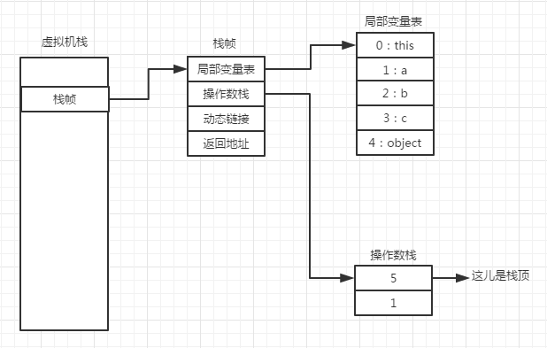
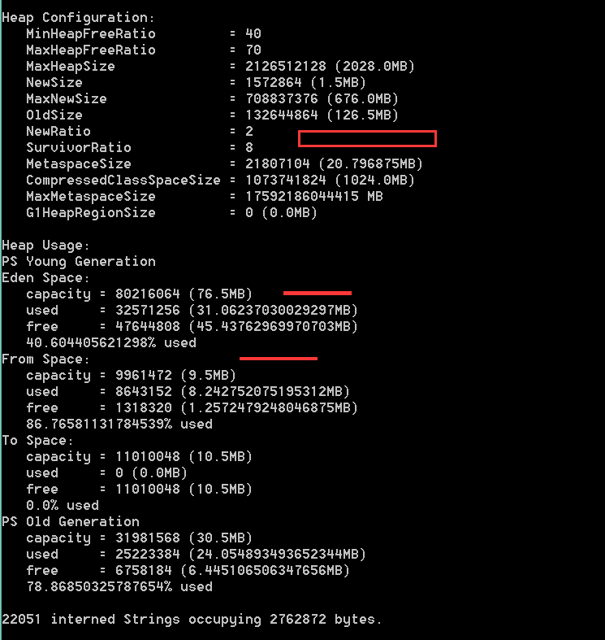
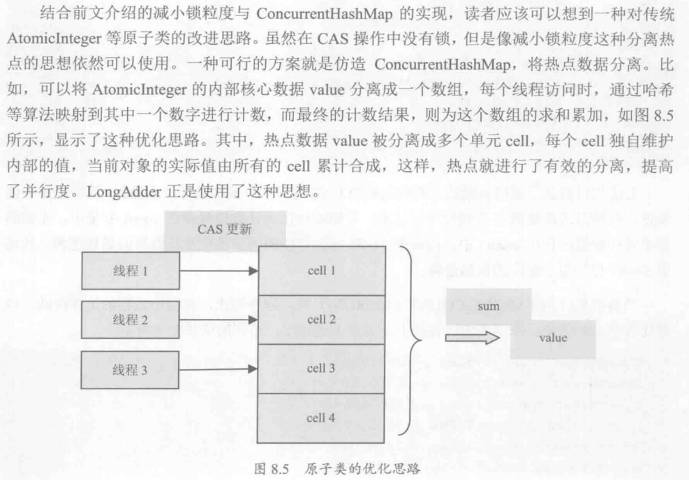
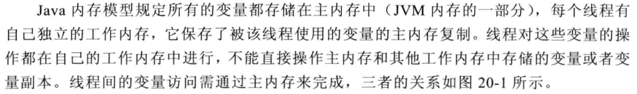
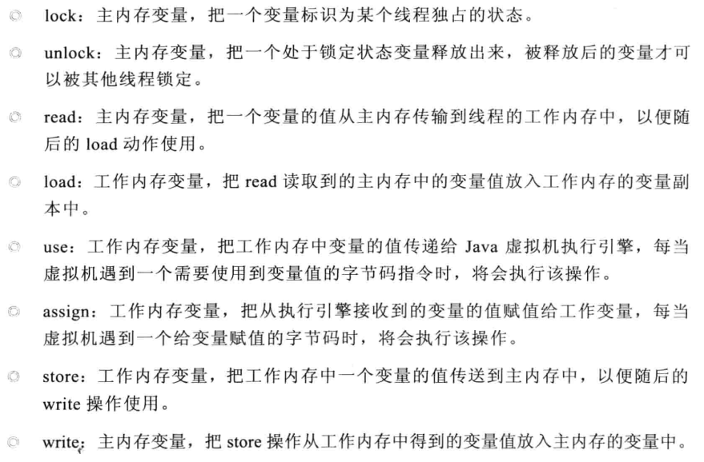
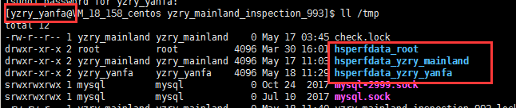

# 类加载

把描述累的数据从Class文件加载到内存，并对数据进行校验、转换解析和初始化，最终形成可以被虚拟机直接使用的Java类型，这就是虚拟机的**类加载机制**。

作用：

​    1.加载字节码文件就是 .class文件。

​    2.加载Java 应用所需要的资源，如图像或者配置文件

## 类加载的时机

什么情况下需要开始类加载过程的第一个阶段：加载？Java虚拟机规范中**并没有进行强制约束**，这点可以交给虚拟机的具体实现来自己把握。但是对于初始化阶段，虚拟机规范则是严格规定了有且只有五种情况**必须立即对类进行“初始化”**：

1. 遇到这四条字节码指令的时候`new`、`getstatic`、`putstatic`、`invokestatic`,如果类没有进行过初始化，则需要先触发其初始化，生成这4条指令常见的Java代码场景就是：

   使用 new 关键字实例化对象的时候

   读取和设置一个类的静态字段，被final修饰除外

   调用一个类的静态方法的时候

2. 使用`java.lang.reflect`包中的方法对类进行反射调用的时候

3. 初始化某个类的子类，则其父类也会被初始化

4. Java虚拟机启动时被标明为启动类的类（ JavaTest），直接使用 java.exe命令来运行某个主类

5. 第五条有点复杂，参看《深入理解Java虚拟机：高级特性》的类加载机制

## 类加载的过程


类从被加载到虚拟机内存中开始，到卸载出内存为止，它的整个生命周期包括：

加载（Loading）、验证（Verification）、准备（Preparation）、

解析（Resolution）、初始化（Initialization）、使用（Using）和卸载（Unloading）七个阶段

ps：验证，准备，解析 统称为连接

### 加载

1.通过一个类的全限定名来获取定义此类的二进制字节流。

2.将这个字节流所代表的静态存储结构转为方法区的运行时数据结构。

3.在内存中生成一个代表这个类的java.lang.Class 对象，作为方法区这个类的各种数据的访问入口。

**ps：原先我以为加载和连接这两个阶段是独立进行的，但是其实它们是交叉进行的，加载阶段尚未完成，连接阶段可能已经开始，但这些夹在加载阶段之中进行的动作，仍然属于连接阶段的内容，这两个阶段的开始仍然保持固定的先后顺序。**

### 解析

解析阶段是虚拟机将常量池内的符号引用替换为直接引用的过程

我的理解就是符号引用就是类如

Ljava/lang/Integer 这类的字符串，而直接引用可以是直接指向目标的指针、相对偏移量活是一个能间接定位到目标的句柄。

### 初始化

目前我们可以理解为初始化就是执行类的静态代码块，或者说<clinit>() 方法，

> <clinit>() 方法是由编译器自动收集类中的所有 _类变量的赋值动作 _和 _静态语句块_（static{} 块）中的语句合并产生的。
>
> 类初始化阶段是类加载过程的最后一步，前面的类加载过程中，除了在加载阶段用户程序可以**自定义类加载器**参与之外，其余动作完全由虚拟机主导和控制。到了初始化阶段，才真正开始执行类中定义的 Java 程序代码（或者说字节码）。

#### 实例

借助如下的代码片段来理解初始化：

测试类：

```java
public class Example {

    static int a = 3;

    static {
        System.out.println("Example " + a);
    }
    public void methodA(){
    }
}
```

片段一：

```java
Main main = new Main();
final ClassLoader classLoader = main.getClass().getClassLoader();
System.out.println(classLoader);
final Class<?> aClass = Class.forName("com.Example",true, classLoader);
System.out.println("我是分割线:"+aClass);
final Object newInstance = aClass.newInstance();
```

结果：

```
Example 3
我是分割线:class com.Example
```

片段二：

```java
Main main = new Main();
final ClassLoader classLoader = main.getClass().getClassLoader();
System.out.println(classLoader);
final Class<?> aClass = Class.forName("com.Example",false, classLoader);
System.out.println("我是分割线:"+aClass);
final Object newInstance = aClass.newInstance();
```

结果：

```java
我是分割线:class com.Example
Example 3
```

两段代码的区别，就是 `forName` 方法的第二个参数，一个是true 一个是false，我们来看看这个方法：

```java
   /**
    * //第二个参数表示是否初始化
    * @param initialize whether the class must be initialized
    */
	public static Class<?> forName(String name, boolean initialize,
                                   ClassLoader loader)
        throws ClassNotFoundException
    {
        if (loader == null) {
            SecurityManager sm = System.getSecurityManager();
            if (sm != null) {
                ClassLoader ccl = ClassLoader.getCallerClassLoader();
                if (ccl != null) {
                    sm.checkPermission(
                        SecurityConstants.GET_CLASSLOADER_PERMISSION);
                }
            }
        }
        return forName0(name, initialize, loader);
    }
```

这也就是为什么上面设置为false的时候，结果是 Example 3 这句话在后面，因为，在用Class 的 newInstance 方法创建一个 Example 的实例的时候才初始化的，如果设为true，在得到 Example 的 Class 的时候就初始化了！

## 类加载器分类

### 启动类加载器（Bootstrap ClassLoader）

特点：

1. C++实现，java 代码获取的时候为null
2. 负责<JAVA_HOME>\lib 目录，或者 -Xbootclasspath 参数指定的路径中类库加载，并且按照文件名识别，不符合不被加载

### 扩展类加载器（Extension ClassLoader）

1. 负责加载<JAVA_HOME>\lib\ext 目录中，或者被 `java.ext.dirs` 系统变量指定路径中的类库
2. 由`sun.misc.Launcher.ExtClassLoader` 实现

### 系统类加载器（Application ClassLoader） 

1. 负责加载用户类路径（ClassPath）上指定的类库
2. 由`sun.misc.Launcher.AppClassLoader` 实现
3. 一般我们自定义类加载就是继承`sun.misc.Launcher.AppClassLoader` 类
4. 可以通过 `ClassLoader.getSystemClassLoader()`来获取它

## 双亲委派模式


# 基础

## 运行时数据区

### 程序计数器

1.这个计数器记录的是正在执行的虚拟机字节码指令的地址。

2.如果正在执行的是native方法，这个计数器值为空（UnDefined）

3.每个线程有一个独立的程序计数器，所以说它是"**线程私有**"的，因为程序执行的最小单位是线程，然而线程之间会互相切换，所以为了线程切换后能恢复到正确的执行位置，每个线程读有一个程序计数器

### 虚拟机栈

1.也是线程私有

2.每个方法在执行的时候都会创建一个**栈帧**用于存储局部变量表，操作数栈，动态链接，方法出口等信息。

3.局部变量表的大小在编译的时候就确定了，结合下面的例子可以理解


下面的图结合实例来熟悉这些知识：

代码如下：

```java
public class TestStackModel {

    public static void main(String[] args) {
        new TestStackModel().add(1, 5);
    }

    public int add(int a, int b){
        int c = a + b;
        Object object = new Object();
        return c;
    }
}
```

反编译结果：

```
Compiled from "TestStackModel.java"
public class com.yumoon.test.TestStackModel {
  public com.yumoon.test.TestStackModel();
    Code:
       0: aload_0
       1: invokespecial #8                  // Method java/lang/Object."<init>":()V
       4: return

  public static void main(java.lang.String[]);
    Code:
       0: new           #1                  // class com/yumoon/test/TestStackModel
       3: dup
       4: invokespecial #16                 // Method "<init>":()V
       7: iconst_1
       8: iconst_5
       9: invokevirtual #17                 // Method add:(II)I
      12: pop
      13: return

  public int add(int, int);
    Code:
       0: iload_1
       1: iload_2
       2: iadd
       3: istore_3
       4: new           #3                  // class java/lang/Object
       7: invokespecial #8                  // Method java/lang/Object."<init>":()V
      10: iload_3
      11: ireturn
}

```

我们主要关注这么一段反编译结果，即add方法：

```
public int add(int, int);
Code:
0: iload_1
1: iload_2
2: iadd
3: istore_3
4: new           #3                  // class java/lang/Object
7: invokespecial #8                  // Method java/lang/Object."<init>":()V
10: iload_3
11: ireturn

```

上面这些jvm指令解释如下：

```
0x1b          iload_1                      将第二个int型本地变量推送至栈顶
0x1c          iload_2                      将第三个int型本地变量推送至栈顶
0x60          iadd                将栈顶两int型数值相加并将结果压入栈顶
0x3e          istore_3                将栈顶int型数值存入第四个本地变量
0xbb          new                        创建一个对象，并将其引用值压入栈顶
0xac          ireturn                                从当前方法返回int

```


结构图：



简要描述一下：

1.从局部变量表的一位置读取数据放入栈顶

2.从局部变量表的二位置读取数据放入栈顶（因为操作数栈是动态的我就只画了这个状态）

3.取出操作数栈顶的两个相加得到一个数

4.把栈顶的数也就是6，存放早局部变量表的四位置，也就是c

后面的就不多说了，通过上面的描述，对于操作数栈的认识应该比较深刻了，后续继续补充

## 虚拟机参数

[点我了解更多](http://www.oracle.com/technetwork/java/javase/tech/vmoptions-jsp-140102.html)

### 常见格式

关于虚拟机参数我们常见三种格式：

#### -

标准参数，所有的JVM必须实现这些参数的功能，并且向后兼容

#### -x

非标准参数，默认的JVM（hotspot）实现这些参数的功能，但是不保证所有的jvm实现，且不保证向后兼容

#### -xx

非stable参数，此参数各个jvm实现回有所不同，将来可能会随时取消，需要谨慎使用。

这种格式的参数使用要分为三种情况

- Boolean options are turned on with `-XX:+<option>` and turned off with `-XX:-<option>`.Disable
- Numeric options are set with `-XX:<option>=<number>`. Numbers can include 'm' or 'M' for megabytes, 'k' or 'K' for kilobytes, and 'g' or 'G' for gigabytes (for example, 32k is the same as 32768).


- String options are set with `-XX:<option>=<string>`, are usually used to specify a file, a path, or a list of commands（设置文件或者路径或者命令）

### 常用参数

可以尝试象形的记住最后一个字母代表的单词，也可以**参考这节最上面提供的网址**

#### -

##### -verbose[:class|gc|jni] （在输出设备上显示虚拟机运行信息）

**1.java -verbose:class**

在程序运行的时候有多少类被加载！你可以用verbose:class来监视，在命令行输入java -verbose:class XXX  (XXX为程序名)你会在控制台看到加载的类的情况。

verbose和verbose:class含义相同，输出虚拟机装入的类的信息，显示的信息格式如下： 

```
[Opened D:\Java\jdk1.6.0_25\jre\lib\rt.jar]
[Loaded java.lang.Object from D:\Java\jdk1.6.0_25\jre\lib\rt.jar]
[Loaded java.io.Serializable from D:\Java\jdk1.6.0_25\jre\lib\rt.jar]
[Loaded java.lang.Comparable from D:\Java\jdk1.6.0_25\jre\lib\rt.jar]
```

**2.java –verbose:gc**

在虚拟机发生内存回收时在输出设备显示信息，格式如下： [Full GC 256K->160K(124096K), 0.0042708 secs] 该参数用来监视虚拟机内存回收的情况。

**3.java –verbose:jni**

-verbose:jni输出native方法调用的相关情况，一般用于诊断jni调用错误信息。

在虚拟机调用native方法时输出设备显示信息, 该参数用来监视虚拟机调用本地方法的情况，在发生jni错误时可为诊断提供便利。格式如下：

```
[Dynamic-linking native method java.util.zip.ZipFile.getEntryBytes ... JNI]
[Dynamic-linking native method java.util.zip.ZipFile.freeEntry ... JNI]
[Dynamic-linking native method java.util.zip.ZipFile.read ... JNI]
[Dynamic-linking native method java.util.zip.Inflater.initIDs ... JNI]
```


####-X

##### -Xms（设置初始堆大小）

s = starting

##### -Xmn（设置年轻代大小）

n = new

持久代一般固定大小为64m，所以增大年轻代后，将会减小年老代大小。此值对系统性能影响较大，Sun官方推荐配置为整个堆的**3/8**。

##### -Xmx（设置JVM内存大小）

整个JVM内存大小=年轻代大小 + 年老代大小 + 持久代大小

##### -Xss（设置每个线程的堆栈大小）

JDK5.0以后每个线程堆栈大小为1M，以前每个线程堆栈大小为256K。更具应用的线程所需内存大小进行调整。在相同物理内存下，减小这个值能生成更多的线程。但是操作系统对一个进程内的线程数还是有限制的，不能无限生成，经验值在3000~5000左右。

####-XX

##### -XX:SurvivorRatio（设置伊甸区和一个from区的比例）

**Ratio of eden/from** space size. The default value is 8.

我们怎么验证这个比例就是8呢，使用如下的命令

```shell
jmap -jeap PID
```

效果图如下：



上面这个图中是没有永久代的，因为我们使用的1.8的jdk

##### -XX:NewRatio=2（设置老年代/新生代的比例）

Ratio of old/new generation sizes. The default value is 2.

同理也可以参看上面的图来证明


##### -XX:MaxPermSize=64M 设置最大方法区（永久区）

最大方法区（永久区）默认情况下为64Mb


##### -XX:PermSize=16M：初始化方法区（永久区）

##### –XX:+UseXXX（回收器开启参数）

–XX:+UseSerialGC 

–XX:+UseParallelGC 

–XX:+UseParallelOldGC 

–XX:+UseConcMarkSweepGC 

### 安全点


# 锁

在Java 虚拟机的实现中每个对象都有一个对象头，用于保存对象的系统信息。对象头中有一个称为Mark Word 的部分，它是实现锁的关键。在32位系统中，Mark Word 位一个32位的数据，在64系统中，它占64位。它是一个多功能的数据区，可以存放对象的哈希值、对象年龄、锁的指针等信息。一个对象是否占有锁占有哪个锁，就记录在这个Mark Word 中。

Mark Word 的前25 bit表示对象的hash值，4位bit表示对象的年龄，1位bit表示是否为偏向锁，2位bit 表示锁的信息。

## JVM层面锁分类和技术

### 1. 偏向锁

### 2.轻量级锁

### 3. 锁膨胀

### 4. 自旋锁

### 5. 锁消除

逃逸分析和锁消除分别可以使用参数

-XX:+DoEscapeAnalysis 

-XX:+EliminateLocks

来开启，（PS：锁消除必须工作在-server 模式下）

## 锁在应用层面的优化思路

### 1.减少锁持有时间

思路就是只有必要的代码才加锁，看下面的例子：

```java
public synchronized void syncMethod(){
  otherCode1();
  mutextMethod();
  otherCode2();
}
```

对于上面的代码，假设只有`mutextMethod` 方法是需要同步的，而其他两个方法不需要，那么最好改为下面的方式

```java
public void syncMethod(){
  otherCode1();
  synchronized(this){
    mutextMethod();
  }
  otherCode2();
}
```

减少锁的持有时间有助于降低锁冲突的可能性，进而提升系统的并发能力。

### 2.减小锁粒度

典型的技术使用场景就是1.7的`ConcurrentHashMap`，这个类使用的锁分段技术

### 3.锁分离

锁分离是减小锁粒度的一个特例，它依据应用程序的功能特点，将一个独占锁分为多个锁。典型的案例就是

`LinkedBlockingQueue`的实现。

在`LinkedBlockingQueue` 中，take（）函数和put（）函数分别从队列中取和增加数据的功能。虽然两个函数都是对当前队列进行修改操作，但是一个是操作链表的前端，一个是后端，所以可以从take的时候一把锁，put的时候一把锁，来结合源码看看：

```java
/** Lock held by take, poll, etc */
private final ReentrantLock takeLock = new ReentrantLock();

/** Wait queue for waiting takes */
private final Condition notEmpty = takeLock.newCondition();

/** Lock held by put, offer, etc */
private final ReentrantLock putLock = new ReentrantLock();
```

从属性的名字定义和类型来看似乎就是一个take锁和put锁，两个锁分开，然后我们来看看take和put的方法是不是这样的呢

```java
    public E take() throws InterruptedException {
        E x;
        int c = -1;
        final AtomicInteger count = this.count;
        final ReentrantLock takeLock = this.takeLock;
        takeLock.lockInterruptibly();	//不能有两个线程同时取数据
        try {
            while (count.get() == 0) {
                notEmpty.await();
            }
            x = dequeue();
            c = count.getAndDecrement();
            if (c > 1)
                notEmpty.signal();
        } finally {
            takeLock.unlock();
        }
        if (c == capacity)
            signalNotFull();
        return x;
    }

    public void put(E e) throws InterruptedException {
        if (e == null) throw new NullPointerException();
        // Note: convention in all put/take/etc is to preset local var
        // holding count negative to indicate failure unless set.
        int c = -1;
        Node<E> node = new Node(e);
        final ReentrantLock putLock = this.putLock;
        final AtomicInteger count = this.count;
        putLock.lockInterruptibly();	//不能有两个线程同时放数据
        try {
            /*
             * Note that count is used in wait guard even though it is
             * not protected by lock. This works because count can
             * only decrease at this point (all other puts are shut
             * out by lock), and we (or some other waiting put) are
             * signalled if it ever changes from capacity. Similarly
             * for all other uses of count in other wait guards.
             */
            while (count.get() == capacity) {
                notFull.await();
            }
            enqueue(node);
            c = count.getAndIncrement();
            if (c + 1 < capacity)
                notFull.signal();
        } finally {
            putLock.unlock();
        }
        if (c == 0)
            signalNotEmpty();
    }
```

从上面两个方法的实现，它们的确是使用两个锁来操作的

### 4.锁粗化

当虚拟机遇到一连串连续地对同一锁进行请求和释放的操作时，便会把所有的锁操作整合成对所的一次请求，从而减少对所锁的请求同步次数。这个操作叫锁的粗化。看看下面的例子：

```java
    public void method(){
        synchronized (this){
            //do something
        }
        //做其他不需要同步的工作，但是能很快完成
        synchronized (this){
            //do other something
        }
    }
```

或者如下的情况也应该将锁粗化

```java
    public void method1(){
        for (int i = 0; i < 1000; i++) {
            synchronized (this) {
                //do something
            }
        }
    }

    public void method1(){
        synchronized (this) {
            for (int i = 0; i < 1000; i++) {
                //do something
            }
        }
    }
```


## 无锁

### CAS（Compare And Swap）

比较并交换

### 原子操作

在Java并发包下有一些基于上面的CAS无锁算法实现的原子操作类，如`AtomicInteger`等等，这些类主要使用基于系统的CAS指令。相较与锁性能会高一些。

实现机制：

在一个死循环中不断尝试修改值，知道成功为止。比如如下的一段代码：

```java
//AtomicInteger 的递减方法
public final int getAndDecrement() {
  for (;;) {
    int current = get();
    int next = current - 1;
    if (compareAndSet(current, next))
      return current;
  }
}
```

### 新宠儿LongAddr

在jdk 1.8中引入了这个类，此类也在java的并发包下面，它也是使用CAS指令。前文提过对于像`AtomicInteger`等原子类，是在一个死循环中进行操作，这样在高并发的场景，性能可能会受到影响，应该有大量的尝试修改但是又失败了的线程。



## 分布式锁

### 分布式锁特点：

首先，为了确保分布式锁可用，我们至少要确保锁的实现同时满足以下四个条件：

1.  互斥性。在任意时刻，只有一个客户端能持有锁。
2.  不会发生死锁。即使有一个客户端在持有锁的期间崩溃而没有主动解锁，也能保证后续其他客户端能加锁。
3.  具有容错性。只要大部分的Redis节点正常运行，客户端就可以加锁和解锁。
4.  解铃还须系铃人。加锁和解锁必须是同一个客户端，客户端自己不能把别人加的锁给解了。

### 分布式锁一般的实现方式有如下三个：

#### 数据库的乐观锁

#### 基于Redis的分布式锁

##### 组件依赖

首先我们要通过Maven引入`Jedis`开源组件，在`pom.xml`文件加入下面的代码：

```
1<dependency>
2    <groupId>redis.clients</groupId>
3    <artifactId>jedis</artifactId>
4    <version>2.9.0</version>
5</dependency>

```

##### 加锁

###### 正确姿势

Talk is cheap, show me the code。先展示代码，再带大家慢慢解释为什么这样实现：

```
 1public class RedisTool {
 2    private static final String LOCK_SUCCESS = "OK";
 3    private static final String SET_IF_NOT_EXIST = "NX";
 4    private static final String SET_WITH_EXPIRE_TIME = "PX";
 5    /**
 6     * 尝试获取分布式锁
 7     * @param jedis Redis客户端
 8     * @param lockKey 锁
 9     * @param requestId 请求标识
10     * @param expireTime 超期时间
11     * @return 是否获取成功
12     */
13    public static boolean tryGetDistributedLock(Jedis jedis, String lockKey, String requestId, int expireTime) {
14        String result = jedis.set(lockKey, requestId, SET_IF_NOT_EXIST, SET_WITH_EXPIRE_TIME, expireTime);
15        if (LOCK_SUCCESS.equals(result)) {
16            return true;
17        }
18        return false;
19    }
20}

```

可以看到，我们加锁就一行代码：`jedis.set(String key, String value, String nxxx, String expx, int time)`，这个set()方法一共有五个形参：

- 第一个为key，我们使用key来当锁，因为key是唯一的。
- 第二个为value，我们传的是requestId，很多童鞋可能不明白，有key作为锁不就够了吗，为什么还要用到value？原因就是我们在上面讲到可靠性时，分布式锁要满足第四个条件解铃还须系铃人，通过给value赋值为requestId，我们就知道这把锁是哪个请求加的了，在解锁的时候就可以有依据。requestId可以使用`UUID.randomUUID().toString()`方法生成。
- 第三个为nxxx，这个参数我们填的是NX，意思是SET IF NOT EXIST，即当key不存在时，我们进行set操作；若key已经存在，则不做任何操作；
- 第四个为expx，这个参数我们传的是PX，意思是我们要给这个key加一个过期的设置，具体时间由第五个参数决定。
- 第五个为time，与第四个参数相呼应，代表key的过期时间。

总的来说，执行上面的set()方法就只会导致两种结果：1. 当前没有锁（key不存在），那么就进行加锁操作，并对锁设置个有效期，同时value表示加锁的客户端。2. 已有锁存在，不做任何操作。

心细的童鞋就会发现了，我们的加锁代码满足我们可靠性里描述的三个条件。首先，set()加入了NX参数，可以保证如果已有key存在，则函数不会调用成功，也就是只有一个客户端能持有锁，满足互斥性。其次，由于我们对锁设置了过期时间，即使锁的持有者后续发生崩溃而没有解锁，锁也会因为到了过期时间而自动解锁（即key被删除），不会发生死锁。最后，因为我们将value赋值为requestId，代表加锁的客户端请求标识，那么在客户端在解锁的时候就可以进行校验是否是同一个客户端。由于我们只考虑Redis单机部署的场景，所以容错性我们暂不考虑。

###### 错误示例1

比较常见的错误示例就是使用`jedis.setnx()`和`jedis.expire()`组合实现加锁，代码如下：

```
1public static void wrongGetLock1(Jedis jedis, String lockKey, String requestId, int expireTime) {
2    Long result = jedis.setnx(lockKey, requestId);
3    if (result == 1) {
4        // 若在这里程序突然崩溃，则无法设置过期时间，将发生死锁
5        jedis.expire(lockKey, expireTime);
6    }
7}

```

setnx()方法作用就是SET IF NOT EXIST，expire()方法就是给锁加一个过期时间。乍一看好像和前面的set()方法结果一样，然而由于这是两条Redis命令，不具有原子性，如果程序在执行完setnx()之后突然崩溃，导致锁没有设置过期时间。那么将会发生死锁。网上之所以有人这样实现，是因为低版本的jedis并不支持多参数的set()方法。

###### 错误示例2

这一种错误示例就比较难以发现问题，而且实现也比较复杂。实现思路：使用`jedis.setnx()`命令实现加锁，其中key是锁，value是锁的过期时间。执行过程：1. 通过setnx()方法尝试加锁，如果当前锁不存在，返回加锁成功。2. 如果锁已经存在则获取锁的过期时间，和当前时间比较，如果锁已经过期，则设置新的过期时间，返回加锁成功。代码如下：

```
 1public static boolean wrongGetLock2(Jedis jedis, String lockKey, int expireTime) {
 2    long expires = System.currentTimeMillis() + expireTime;
 3    String expiresStr = String.valueOf(expires);
 4    // 如果当前锁不存在，返回加锁成功
 5    if (jedis.setnx(lockKey, expiresStr) == 1) {
 6        return true;
 7    }
 8    // 如果锁存在，获取锁的过期时间
 9    String currentValueStr = jedis.get(lockKey);
10    if (currentValueStr != null && Long.parseLong(currentValueStr) < System.currentTimeMillis()) {
11        // 锁已过期，获取上一个锁的过期时间，并设置现在锁的过期时间
12        String oldValueStr = jedis.getSet(lockKey, expiresStr);
13        if (oldValueStr != null && oldValueStr.equals(currentValueStr)) {
14            // 考虑多线程并发的情况，只有一个线程的设置值和当前值相同，它才有权利加锁
15            return true;
16        }
17    }
18    // 其他情况，一律返回加锁失败
19    return false;
20}

```

那么这段代码问题在哪里？1. 由于是客户端自己生成过期时间，所以需要强制要求分布式下每个客户端的时间必须同步。 2. 当锁过期的时候，如果多个客户端同时执行`jedis.getSet()`方法，那么虽然最终只有一个客户端可以加锁，但是这个客户端的锁的过期时间可能被其他客户端覆盖。3. 锁不具备拥有者标识，即任何客户端都可以解锁。

##### 解锁

###### 正确姿势

还是先展示代码，再带大家慢慢解释为什么这样实现：

```
 1public class RedisTool {
 2    private static final Long RELEASE_SUCCESS = 1L;
 3    /**
 4     * 释放分布式锁
 5     * @param jedis Redis客户端
 6     * @param lockKey 锁
 7     * @param requestId 请求标识
 8     * @return 是否释放成功
 9     */
10    public static boolean releaseDistributedLock(Jedis jedis, String lockKey, String requestId) {
11        String script = "if redis.call('get', KEYS[1]) == ARGV[1] then return redis.call('del', KEYS[1]) else return 0 end";
12        Object result = jedis.eval(script, Collections.singletonList(lockKey), Collections.singletonList(requestId));
13        if (RELEASE_SUCCESS.equals(result)) {
14            return true;
15        }
16        return false;
17    }
18}

```

可以看到，我们解锁只需要两行代码就搞定了！第一行代码，我们写了一个简单的Lua脚本代码，上一次见到这个编程语言还是在《黑客与画家》里，没想到这次居然用上了。第二行代码，我们将Lua代码传到`jedis.eval()`方法里，并使参数KEYS[1]赋值为lockKey，ARGV[1]赋值为requestId。eval()方法是将Lua代码交给Redis服务端执行。

那么这段Lua代码的功能是什么呢？其实很简单，首先获取锁对应的value值，检查是否与requestId相等，如果相等则删除锁（解锁）。那么为什么要使用Lua语言来实现呢？因为要确保上述操作是原子性的。关于非原子性会带来什么问题，可以阅读【解锁代码-错误示例2】 。那么为什么执行eval()方法可以确保原子性，源于Redis的特性，下面是官网对eval命令的部分解释：

简单来说，就是在eval命令执行Lua代码的时候，Lua代码将被当成一个命令去执行，并且直到eval命令执行完成，Redis才会执行其他命令。

###### 错误示例1

最常见的解锁代码就是直接使用`jedis.del()`方法删除锁，这种不先判断锁的拥有者而直接解锁的方式，会导致任何客户端都可以随时进行解锁，即使这把锁不是它的。

```
1public static void wrongReleaseLock1(Jedis jedis, String lockKey) {
2    jedis.del(lockKey);
3}

```

###### 错误示例2

这种解锁代码乍一看也是没问题，甚至我之前也差点这样实现，与正确姿势差不多，唯一区别的是分成两条命令去执行，代码如下：

```
1public static void wrongReleaseLock2(Jedis jedis, String lockKey, String requestId) {
2    // 判断加锁与解锁是不是同一个客户端
3    if (requestId.equals(jedis.get(lockKey))) {
4        // 若在此时，这把锁突然不是这个客户端的，则会误解锁
5        jedis.del(lockKey);
6    }
7}

```

如代码注释，问题在于如果调用`jedis.del()`方法的时候，这把锁已经不属于当前客户端的时候会解除他人加的锁。那么是否真的有这种场景？答案是肯定的，比如客户端A加锁，一段时间之后客户端A解锁，在执行`jedis.del()`之前，锁突然过期了，此时客户端B尝试加锁成功，然后客户端A再执行del()方法，则将客户端B的锁给解除了。

#### 基于Zookeeper的分布式锁

# 内存模型（JMM）

JVM规范定义了Java内存模型(Java Memory Model) 来屏蔽掉各种操作系统，虚拟机实现厂商和硬件的内存访问差异，以确保Java程序在所有操作系统和平台上能够实现一次编写、到处运行的效果。

## 1、工作内存和主内存




## 2、Java内存交互协议

Java内存协议规定了8种操作来完成主内存和工作内存的变量访问，具体如下：

lock：主内存变量，把一个变量标识为某个线程独占的状态。

unlock：主内存变量，把一个处于锁定状态的变量释放出来，被释放出来的变量才可以被其他的线程锁定。

read：主内存变量，把一个变量的值从主内存传输到线程的工作内存中，以便随后的load动作。

load：工作内存变量，把read读取到的主内存中的变量值放入工作内存的变量副本中。

use：工作内存变量，把工作内存中的变量的值传递给Java虚拟机执行引擎，每当




## volatile 关键字

关键字 volatile 是Java提供的最轻量级的同步机制，Java内存模型对volatile专门定义了一些特殊的访问规则，下面我们就看看它的规则。

当一个变量被 volatile 修饰后，它将具备以下的两种特性。

1. 线程可见性：当一个线程修改了被volatile修饰的变量后，无论是否加锁，其他的线程都可以立即看到最新的修改，而普通变量却做不到这点。

2. 禁止指令重排序优化，普通的变量仅仅保证在该方法的执行过程中所有依赖赋值结果的地方都能获取正确的结果，而不能保证变量赋值操作的顺序与程序代码的执行顺序一致。举个简单的例子说明下指令重排序优化问题。

   ```java
   public class TestVolatile {
       public static boolean stop;

       public static void main(String[] args) throws InterruptedException {
           Runnable myTask = new Runnable() {
               @Override
               public void run() {
                   int i = 0;
                   while (!stop) {
                       i++;
                   }
                   System.out.println("finish");
               }
           };
           Thread thread = new Thread(myTask);
           thread.start();
           TimeUnit.SECONDS.sleep(3);
           System.out.println("down");
           stop = true;
       }
   }
   ```

   最后子线程就不会终止，不会打印`finish`


# JVM实战

打印堆栈信息

添加虚拟机运行参数： -XX:+HeapDumpOnOutOfMemoryError

让堆在出资按OutOfMemoryError的时候，转储堆信息

# JVM工具

## Jmap

用法：

```shell
#jmap -F -dump:format=b,file=testtestdump.bin <pid>
jmap -F -dump:format=b,file=testtestdump.bin 6248
```


### 常见问题

#### JVM中jmap无法连接java进程的问题

当我们使用jmap命令连接虚拟机的时候报如下的错误：

```
[xxx@xxx ~]$ jmap -heap 9683  
Attaching to process ID 9683, please wait...  
Error attaching to process: sun.jvm.hotspot.debugger.DebuggerException: Can't attach to the process 
```

  **问题分析：**

 正常来说，服务器上是使用标准的JDK基础包，无特殊设置，jmap是JVM自带的命令，无法连接上process，因为什么原因?

 正常来说，肯定是可以的。 

 Java进程肯定存在的，没有消失。

难道是OS的权限屏蔽， 忽然意识到，我当前使用的是普通用户，而这个java进程是由root用户来启动的。

**问题解决：**

sudo su -　　

　　切换到root用户，重新执行jmap pid, 即可正常访问命令输出的内容了。

## Jps

用来查看基于HotSpot的JVM里面中，所有具有**<u>访问权限</u>**的Java进程的具体状态, 包括进程ID，进程启动的路径及启动参数等等，与unix上的ps类似，只不过jps是用来显示java进程，可以把jps理解为ps的一个子集。

 使用jps时，如果没有指定hostid，它只会显示本地环境中所有的Java进程；如果指定了hostid，它就会显示指定hostid上面的java进程，不过这需要远程服务上开启了jstatd服务，可以参看前面的jstatd章节来启动jstad服务。

简单说就是：查看某虚拟机下面运行的所有有权限查看的Java进程，其实主要是为了获取进程的pid。

### 常见问题：

#### 问题一

在Linux服务器上使用 ps -ef|grep java 明明有java的应用，但是使用 jps 什么结果也没有

问题分析：

java程序启动后，默认（请注意是默认）会在/tmp/hsperfdata_userName目录下以该进程的id为文件名新建文件，并在该文件中存储jvm运行的相关信息，其中的userName为当前的用户名，/tmp/hsperfdata_userName目录会存放该用户所有已经启动的java进程信息。对于windows机器/tmp用Windows存放临时文件目录代替。

而jps、jconsole、jvisualvm等工具的数据来源就是这个文件（/tmp/hsperfdata_userName/pid)。**所以当该文件不存在或是无法读取时就会出现jps无法查看该进程号**，jconsole无法监控等问题。


原因：

（1）、磁盘读写、目录权限问题

若该用户没有权限写/tmp目录或是磁盘已满，则无法创建/tmp/hsperfdata_userName/pid文件。或该文件已经生成，但用户没有读权限

 

（2）、临时文件丢失，被删除或是定期清理

对于linux机器，一般都会存在定时任务对临时文件夹进行清理，导致/tmp目录被清空。这也是我第一次碰到该现象的原因。常用的可能定时删除临时目录的工具为crontab、redhat的tmpwatch、ubuntu的tmpreaper等等

这个导致的现象可能会是这样，用jconsole监控进程，发现在某一时段后进程仍然存在，但是却没有监控信息了。

 

（3）、java进程信息文件存储地址被设置，不在/tmp目录下

上面我们在介绍时说默认会在/tmp/hsperfdata_userName目录保存进程信息，但由于以上1、2所述原因，可能导致该文件无法生成或是丢失，所以java启动时提供了参数(-Djava.io.tmpdir)，可以对这个文件的位置进行设置，而jps、jconsole都只会从/tmp目录读取，而无法从设置后的目录读物信息，这是我第二次碰到该现象的原因


关于设置该文件位置的参数为-Djava.io.tmpdir 。**也就是说最好别设置这个参数**



在tmp 目录下面有这么一些关于JVM的问句，但是这个账户是 yzry_yanfa ，所以使用Jps 和 JMap之类的命令只能看见自己的用户名对应的信息