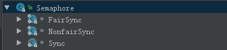
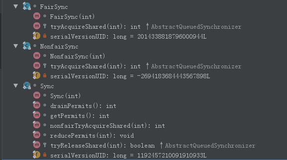
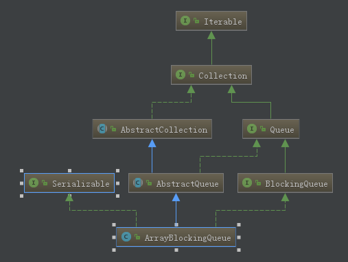
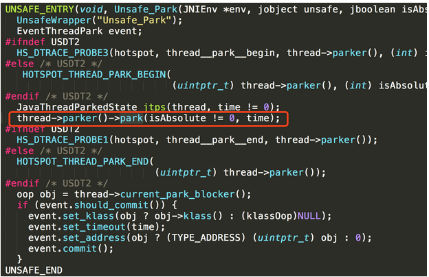
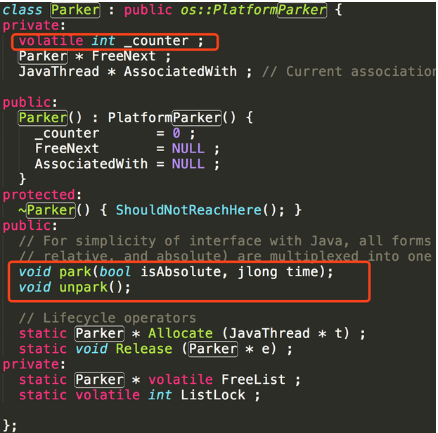
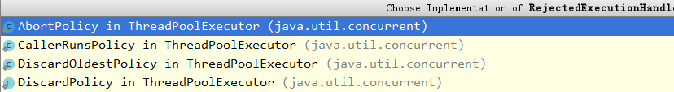

# 线程

## 主线程去 catch 子线程的异常

先看看下面的一段代码

```java
public class TestExceptionCatch {

    public static void main(String[] args) {
        final ExecutorService executorService = Executors.newCachedThreadPool(new MyThreadFactory());
        Thread.setDefaultUncaughtExceptionHandler(new MyUncaughtExceptionHandler());
        for (int i = 0; i < 10; i++) {
            executorService.submit(new MyTask());
        }

        try {
            final Thread thread = new Thread(new MyTask());
            //重点
            thread.setUncaughtExceptionHandler(new MyUncaughtExceptionHandler());
            thread.start();
        } catch (Exception e) {
            System.out.println("main Thread:");
            e.printStackTrace();
        }
    }

    public static class MyTask implements Runnable {
        @Override
        public void run() {
            System.out.println(Thread.currentThread().getName() + "");
            throw new RuntimeException("jiu shi gu yi de");
        }
    }

    public static class MyUncaughtExceptionHandler implements Thread.UncaughtExceptionHandler {
        @Override
        public void uncaughtException(Thread t, Throwable e) {
            System.out.println(t.getName() + ":");
            e.printStackTrace();
        }
    }

    public static class MyThreadFactory implements ThreadFactory {
        @Override
        public Thread newThread(Runnable r) {
            Thread t = new Thread(r);
            System.out.println("create " + t.getName());
            t.setUncaughtExceptionHandler(new MyUncaughtExceptionHandler());//为每一个线程添加一个处理线程异常的类
            return t;
        }
    }
}
```

在 myTask 类的 call 方法是会执行报错的，我们的try - catch是写在main函数里面，所以最后的执行结果就是没有捕获到这个异常，

```
java.lang.RuntimeException: jiu shi gu yi de
	at com.yumoon.concurrent.TestExceptionCatch$MyTask.run(TestExceptionCatch.java:33)
	at java.lang.Thread.run(Thread.java:722)
```

### 捕获子线程异常

#### 方法一：只针对这个线程

我们要捕获子线程的异常可以做如下的操作，给子线程增加一个`UncaughtExceptionHandler` 实现

```java
thread.setUncaughtExceptionHandler(new MyUncaughtExceptionHandler());
```

`setUncaughtExceptionHandler`的源码如下：

```java
public void setUncaughtExceptionHandler(UncaughtExceptionHandler eh) {
  checkAccess();
  uncaughtExceptionHandler = eh;
}
// uncaughtExceptionHandler 是线程实例私有的
private volatile UncaughtExceptionHandler uncaughtExceptionHandler;
```

#### 方法二：针对所以线程

```java
Thread.setDefaultUncaughtExceptionHandler(new MyUncaughtExceptionHandler());
```

这样的操作表示所有的线程都有这个UncaughtExceptionHandler ，包括主线程

`setDefaultUncaughtExceptionHandler` 的源码如下：

```java
public static void setDefaultUncaughtExceptionHandler(UncaughtExceptionHandler eh) {
  SecurityManager sm = System.getSecurityManager();
  if (sm != null) {
    sm.checkPermission(
      new RuntimePermission("setDefaultUncaughtExceptionHandler")
    );
  }

  defaultUncaughtExceptionHandler = eh;
}
// defaultUncaughtExceptionHandler 是static变量
private static volatile UncaughtExceptionHandler defaultUncaughtExceptionHandler;
```

### 注意

ps：对于线程池创建的对象这种操作是没有用的，对于上面的例子最后只打印了一次错误，但是我们的线程池实际调用了10，所以对于线程池的对象，`setUncaughtExceptionHandler`这种异常的回调感觉没有用，要找找原因

## 为什么主线程不应该处理子线程的异常

线程设计的理念：“线程的问题应该线程自己本身来解决，而不要委托到外部。


# 并发

wait和notify/notifyAll方法只能在同步代码块里用

## 中断

它并不像stop方法那样会中断一个正在运行的线程。线程会不时地检测中断标识位，以判断线程是否应该被中断（中断标识值是否为true）。中断只会影响到**wait**状态、**sleep**状态和**join**状态。

被打断的线程会抛出 InterruptedException。Thread.interrupted()检查当前线程是否发生中断，返回boolean
synchronized在获锁的过程中是不能被中断的。

中断是一个状态！interrupt()方法只是将这个状态置为true而已。**所以说正常运行的程序不去检测状态，就不会终止，而wait等阻塞方法会去检查并抛出异常**。如果在正常运行的程序中添加while(!Thread.interrupted()) ，则同样可以在中断后离开代码体。

# 并发包的类

## AbstractQueuedSynchronizer

队列同步器AQS是用来构建锁或其他同步组件的基础框架(比如`ReentrantLock` 、`Semaphore`、`CountDownLatch`等)，内部使用一个**int成员变量表示同步状态**，通过内置的FIFO队列来完成资源获取线程的排队工作，其中内部状态state，等待队列的头节点head和尾节点head，都是通过volatile修饰，保证了多线程之间的可见。

### 总览

我们先来看看这个类定义的一些属性：

```java
//等待队列的头节点
private transient volatile Node head;
//等待队列的尾节点
private transient volatile Node tail;

//状态
private volatile int state;
```

### 状态

此同步状态在AQS中只是简单的提供了修改此状态的`protected` 方法，具体的含义都是在实现类中定义的。比如在`Semaphore`中就表示剩余可访问当前资源的线程数量，或者说机会

### 等待队列

此等待队列中存放的是等待获取资源的线程队列，其每个节点是`AQS` 的内部类`Node`, 下面就来看看这个Node

```java
static final class Node {
	/** Marker to indicate a node is waiting in shared mode */
	static final Node SHARED = new Node();
	/** Marker to indicate a node is waiting in exclusive mode */
	static final Node EXCLUSIVE = null;

	/** waitStatus 值以指示线程已取消 */
	static final int CANCELLED =  1;
  
	/** waitStatus 值以指示后续线程需要 unparking */
	static final int SIGNAL    = -1;
  
	/** waitStatus 值以指示线程正在等待条件 */
	static final int CONDITION = -2;
  
	/** waitStatus 值以指示下一个 acquireShared 应无条件传播 */
	static final int PROPAGATE = -3;

	/**
	 * Status field, taking on only the values:
	 *   SIGNAL:     The successor of this node is (or will soon be)
	 *               blocked (via park), so the current node must
	 *               unpark its successor when it releases or
	 *               cancels. To avoid races, acquire methods must
	 *               first indicate they need a signal,
	 *               then retry the atomic acquire, and then,
	 *               on failure, block.
	 *   CANCELLED:  This node is cancelled due to timeout or interrupt.
	 *               Nodes never leave this state. In particular,
	 *               a thread with cancelled node never again blocks.
	 *   CONDITION:  This node is currently on a condition queue.
	 *               It will not be used as a sync queue node
	 *               until transferred, at which time the status
	 *               will be set to 0. (Use of this value here has
	 *               nothing to do with the other uses of the
	 *               field, but simplifies mechanics.)
	 *   PROPAGATE:  A releaseShared should be propagated to other
	 *               nodes. This is set (for head node only) in
	 *               doReleaseShared to ensure propagation
	 *               continues, even if other operations have
	 *               since intervened.
	 *   0:          None of the above
	 *
	 * The values are arranged numerically to simplify use.
	 * Non-negative values mean that a node doesn't need to
	 * signal. So, most code doesn't need to check for particular
	 * values, just for sign.
	 *
	 * The field is initialized to 0 for normal sync nodes, and
	 * CONDITION for condition nodes.  It is modified using CAS
	 * (or when possible, unconditional volatile writes).
	 */
	volatile int waitStatus;

	volatile Node prev;

	volatile Node next;

	/**
	 * The thread that enqueued this node.  Initialized on
	 * construction and nulled out after use.
	 */
	volatile Thread thread;

	/**
	 * Link to next node waiting on condition, or the special
	 * value SHARED.  Because condition queues are accessed only
	 * when holding in exclusive mode, we just need a simple
	 * linked queue to hold nodes while they are waiting on
	 * conditions. They are then transferred to the queue to
	 * re-acquire. And because conditions can only be exclusive,
	 * we save a field by using special value to indicate shared
	 * mode.
	 */
	Node nextWaiter;

	/**
	 * Returns true if node is waiting in shared mode
	 */
	final boolean isShared() {
		return nextWaiter == SHARED;
	}

	/**
	 * Returns previous node, or throws NullPointerException if null.
	 * Use when predecessor cannot be null.  The null check could
	 * be elided, but is present to help the VM.
	 *
	 * @return the predecessor of this node
	 */
	final Node predecessor() throws NullPointerException {
		Node p = prev;
		if (p == null)
			throw new NullPointerException();
		else
			return p;
	}

	Node() {    // Used to establish initial head or SHARED marker
	}

	Node(Thread thread, Node mode) {     // Used by addWaiter
		this.nextWaiter = mode;
		this.thread = thread;
	}

	Node(Thread thread, int waitStatus) { // Used by Condition
		this.waitStatus = waitStatus;
		this.thread = thread;
	}
}
```

这个队列的结构大概如下：


### 获取排他锁

```java
public final void acquire(int arg) {
	if (!tryAcquire(arg) &&
		acquireQueued(addWaiter(Node.EXCLUSIVE), arg))
		selfInterrupt();
}
```

**一：**这段代码会使用 try 开头的`!tryAcquire(arg)` 方法来尝试获取排他锁，然后我们打开方法`tryAcquire` 看看：

```java
protected boolean tryAcquire(int arg) {
	throw new UnsupportedOperationException();
}
```

发现不能用，都是子类实现，然后使用子类的实现（PS：AQS中try开头的方法用来尝试获取公平和非公平，以及释放公平和非公平锁都是不能用，需要使用子类的）。

好的既然是不能用，那么我们继续走流程；

二：使用`addWaiter`创建一个该线程对应的Node节点，并通过CAS指令插入到等待队列的队尾（同一时刻可能会有多个Node节点插入到等待队列中）并且**直到它成功加入等待队列**的队尾。具体参看 #`addWaiter`这一块


三：node插入到队尾后，该线程不会立马挂起，会进行自旋操作。因为在node的插入过程，线程B（即之前没有阻塞的线程）可能已经执行完成，所以要判断该node的前一个节点pred是否为head节点（代表线程B），如果pred == head，表明当前节点是队列中第一个“有效的”节点，因此再次尝试tryAcquire获取锁，

1、如果成功获取到锁，表明线程B已经执行完成，线程A不需要挂起。

2、如果获取失败，表示线程B还未完成，至少还未修改state值。进行步骤四。具体参看 #acquireQueued


四：前面我们已经说过只有前一个节点`pred`的线程状态为SIGNAL(-1)时，当前节点的线程才能被挂起。

1、如果pred的waitStatus == 0，则通过CAS指令修改waitStatus为Node.SIGNAL。

2、如果pred的waitStatus > 0，表明pred的线程状态CANCELLED，需从队列中删除。

3、如果pred的waitStatus为Node.SIGNAL，则通过LockSupport.park()方法把线程A挂起，并等待被唤醒，被唤醒后进入步骤五。具体参看#shouldParkAfterFailedAcquire


五：线程每次被唤醒时，都要进行中断检测，如果发现当前线程被中断，那么抛出InterruptedException并退出循环。从无限循环的代码可以看出，并不是被唤醒的线程一定能获得锁，必须调用tryAccquire重新竞争，因为锁是非公平的，有可能被新加入的线程获得，从而导致刚被唤醒的线程再次被阻塞，这个细节充分体现了“非公平”的精髓。

### 释放排他锁

```java
public final boolean release(int arg) {
	if (tryRelease(arg)) {
		Node h = head;
		if (h != null && h.waitStatus != 0)
			unparkSuccessor(h);
		return true;
	}
	return false;
}
```

这个方法中，会使用`tryRelease` 来尝试释放排他锁，同理，这个方法也是需要子类实现的，这儿就不多说了，重点看看这个方法

`unparkSuccessor` 

1. 如果头结点head的waitStatus值为-1，则用CAS指令重置为0；
2. 找到waitStatus值小于0的节点s，通过LockSupport.unpark(s.thread)唤醒线程。

```java
private void unparkSuccessor(Node node) {
	/*
	 * If status is negative (i.e., possibly needing signal) try
	 * to clear in anticipation of signalling.  It is OK if this
	 * fails or if status is changed by waiting thread.
	 */
	int ws = node.waitStatus;
	if (ws < 0)
		compareAndSetWaitStatus(node, ws, 0);

	/*
	 * Thread to unpark is held in successor, which is normally
	 * just the next node.  But if cancelled or apparently null,
	 * traverse backwards from tail to find the actual
	 * non-cancelled successor.
	 */
	Node s = node.next;
	if (s == null || s.waitStatus > 0) {
		s = null;
		for (Node t = tail; t != null && t != node; t = t.prev)
          	 //找到waitStatus值小于0的节点s
			if (t.waitStatus <= 0)
				s = t;
	}
	if (s != null)
		LockSupport.unpark(s.thread);
}
```


###重要方法

#### acquireQueued

```java
final boolean acquireQueued(final Node node, int arg) {
	boolean failed = true;
	try {
		boolean interrupted = false;
		for (;;) {
              //获取该Node的前一个节点
			final Node p = node.predecessor();
              //如果该前节点是head节点，并且，改线程成功获取到锁，说明头结点的线程已经执行完成，当前线程不需要挂起
			if (p == head && tryAcquire(arg)) {
				setHead(node);
				p.next = null; // help GC
				failed = false;
				return interrupted;
			}
			if (shouldParkAfterFailedAcquire(p, node) &&
				parkAndCheckInterrupt())
				interrupted = true;
		}
	} finally {
		if (failed)
			cancelAcquire(node);
	}
}	
```


#### addWaiter

```java
private Node addWaiter(Node mode) {
  	//mode 指定是独占还是共享式的，然后和当前执行的线程一起构成了这个Node节点
	Node node = new Node(Thread.currentThread(), mode);
	// Try the fast path of enq; backup to full enq on failure
	Node pred = tail;
	if (pred != null) {
		node.prev = pred;
		if (compareAndSetTail(pred, node)) {
			pred.next = node;
			return node;
		}
	}
	enq(node);
	return node;
}
```

#### shouldParkAfterFailedAcquire

此方法传入的是一个节点 node， 和它的前一个节点 pred

```java
private static boolean shouldParkAfterFailedAcquire(Node pred, Node node) {
	int ws = pred.waitStatus;
    //如果前节点的状态为 SINGAL，就表示应该park
	if (ws == Node.SIGNAL)
		/*
		 * This node has already set status asking a release
		 * to signal it, so it can safely park.
		 */
		return true;
    //如果前节点的状态大于0，表示前节点状态为 CANCELLED，需要从等待队列中移除
	if (ws > 0) {
		/*
		 * Predecessor was cancelled. Skip over predecessors and
		 * indicate retry.
		 */
		do {
             //这儿会一直移除，知道找到一个节点的状态小于等于0
			node.prev = pred = pred.prev;
		} while (pred.waitStatus > 0);
		pred.next = node;
	} else {
		/*
		 * waitStatus must be 0 or PROPAGATE.  Indicate that we
		 * need a signal, but don't park yet.  Caller will need to
		 * retry to make sure it cannot acquire before parking.
		 */
      
      	//如果pred的waitStatus == 0，则通过CAS指令修改waitStatus为Node.SIGNAL。
		compareAndSetWaitStatus(pred, ws, Node.SIGNAL);
	}
	return false;
}
```

## Condition

Condition提供了一系列的方法来对阻塞和唤醒线程：

1. **await()** ：造成当前线程在接到信号或被中断之前一直处于等待状态。
2. **await(long time, TimeUnit unit) **：造成当前线程在接到信号、被中断或到达指定等待时间之前一直处于等待状态。
3. **awaitNanos(long nanosTimeout) **：造成当前线程在接到信号、被中断或到达指定等待时间之前一直处于等待状态。返回值表示剩余时间，如果在nanosTimesout之前唤醒，那么返回值 = nanosTimeout - 消耗时间，如果返回值 <= 0 ,则可以认定它已经超时了。
4. **awaitUninterruptibly() **：造成当前线程在接到信号之前一直处于等待状态。【注意：该方法对中断不敏感】。
5. **awaitUntil(Date deadline) **：造成当前线程在接到信号、被中断或到达指定最后期限之前一直处于等待状态。如果没有到指定时间就被通知，则返回true，否则表示到了指定时间，返回返回false。
6. **signal()**：唤醒一个等待线程。该线程从等待方法返回前必须获得与Condition相关的锁。
7. **signal()All**：唤醒所有等待线程。能够从等待方法返回的线程必须获得与Condition相关的锁。

Condition是一种广义上的条件队列。他为线程提供了一种更为灵活的等待/通知模式，线程在调用await方法后执行挂起操作，直到线程等待的某个条件为真时才会被唤醒。Condition必须要配合锁一起使用，因为对共享状态变量的访问发生在多线程环境下。一个Condition的实例必须与一个Lock绑定，因此Condition一般都是作为Lock的内部实现。

### Condtion的实现

获取一个Condition必须要通过Lock的newCondition()方法。该方法定义在接口Lock下面，返回的结果是绑定到此 Lock 
实例的新 Condition 实例。Condition为一个接口，其下仅有一个实现类ConditionObject，由于Condition的操作需要获取相关的锁，而AQS则是同步锁的实现基础，所以ConditionObject则定义为AQS的内部类。定义如下：

```java
public class ConditionObject implements Condition, java.io.Serializable {
}
```

每个Condition对象都包含着一个FIFO队列，该队列是Condition对象通知/等待功能的关键。在队列中每一个节点都包含着一个线程引用，该线程就是在该Condition对象上等待的线程。我们看Condition的定义就明白了：

```java
public class ConditionObject implements Condition, java.io.Serializable {
	private static final long serialVersionUID = 1173984872572414699L;
	/** First node of condition queue. */
	private transient Node firstWaiter;
	/** Last node of condition queue. */
	private transient Node lastWaiter;

	/**
	 * Creates a new <tt>ConditionObject</tt> instance.
	 */
	public ConditionObject() { }
}
```

从上面代码可以看出Condition拥有首节点（firstWaiter），尾节点（lastWaiter）。当前线程调用await()方法，将会以当前线程构造成一个节点（Node），并将节点加入到该队列的尾部。参看如下的`addConditionWaiter` 方法：

```java
/**
         * Adds a new waiter to wait queue.
         * @return its new wait node
         */
private Node addConditionWaiter() {
  Node t = lastWaiter;
  // If lastWaiter is cancelled, clean out.
  if (t != null && t.waitStatus != Node.CONDITION) {
    unlinkCancelledWaiters();
    t = lastWaiter;
  }
  Node node = new Node(Thread.currentThread(), Node.CONDITION);
  if (t == null)
    firstWaiter = node;
  else
    //加入队列的尾部
    t.nextWaiter = node;
  lastWaiter = node;
  return node;
}
```

Node里面包含了当前线程的引用。Node定义与AQS的CLH同步队列的节点使用的都是同一个类（AbstractQueuedSynchronized.Node静态内部类）。

Condition的队列结构比CLH同步队列的结构简单些，新增过程较为简单只需要将原尾节点的nextWaiter指向新增节点，然后更新lastWaiter即可。

### Condition的等待实现

调用Condition的await()方法会使当前线程进入等待状态，同时会加入到Condition等待队列同时释放锁。当从await()方法返回时，当前线程一定是获取了Condition相关连的锁。

```java
    public final void await() throws InterruptedException {
        // 当前线程中断
        if (Thread.interrupted())
            throw new InterruptedException();
        //当前线程加入等待队列
        Node node = addConditionWaiter();
        //释放锁
        long savedState = fullyRelease(node);
        int interruptMode = 0;
        /**
         * 检测此节点的线程是否在同步队上，如果不在，则说明该线程还不具备竞争锁的资格，则继续等待
         * 直到检测到此节点在同步队列上
         */
        while (!isOnSyncQueue(node)) {
            //线程挂起
            LockSupport.park(this);
            //如果已经中断了，则退出
            if ((interruptMode = checkInterruptWhileWaiting(node)) != 0)
                break;
        }
        //竞争同步状态
        if (acquireQueued(node, savedState) && interruptMode != THROW_IE)
            interruptMode = REINTERRUPT;
        //清理下条件队列中的不是在等待条件的节点
        if (node.nextWaiter != null) // clean up if cancelled
            unlinkCancelledWaiters();
        if (interruptMode != 0)
            reportInterruptAfterWait(interruptMode);
    }
```


## ReentrantLock

之前在AQS中提到过，可重入锁的实现依靠了AQS，我们就来看看`ReentrantLock`的具体实现

先来说说里面的内部类的结构


公平同步器，和非公平同步器，都是继承自`Sync`

###获取独占锁

由`lock` 方法开始;

```java
public void lock() {
	sync.lock();
}
```

上面的代码中sync 是`ReentrantLock` 的内部实现类，可以是`NonfairSync` 非公平锁和`FairSync` 公平锁，两种实现，具体使用哪种可以在构造方法指定：

```java
public ReentrantLock(boolean fair) {
	sync = fair ? new FairSync() : new NonfairSync();
}
```

###FairSync的实现

我们先来看看公平锁:`FairSync` ,其`lock` 方法如下：

lock 方法中的`acquire(1);`,其实就是调用的是AQS 的`acquire`，

```java
final void lock() {
	acquire(1);
}
```

 在之前学习这个方法 (acquire) 的时候提到，里面的 tryAcquire 方法需要子类实现，这儿此实现就是下面

1.当状态是0的时候，代码中`hasQueuedPredecessors` 是AQS的一个方法，用来判断，当前等待队列中是否还有其他的线程正在等待，之所以这么做，因为我们这是一个公平的实现，那么只能先来后到了，

2.如果没有线程正在等待，那么使用cas来改变状态，若果成功就表示获取锁成功

```java
/**
 * Fair version of tryAcquire.  Don't grant access unless
 * recursive call or no waiters or is first.
 */
protected final boolean tryAcquire(int acquires) {
	final Thread current = Thread.currentThread();
	int c = getState();
  	//如果状态为0，表示一个线程都没有进来过，就
	if (c == 0) {
		if (!hasQueuedPredecessors() &&
			compareAndSetState(0, acquires)) {
			setExclusiveOwnerThread(current);
			return true;
		}
	}
  	//如果当前线程就是已经独占了这个资源的线程，就状态值变大，一般是加1，这就是为什么是可重入锁
	else if (current == getExclusiveOwnerThread()) {
		int nextc = c + acquires;
		if (nextc < 0)
			throw new Error("Maximum lock count exceeded");
		setState(nextc);
		return true;
	}
  	//上面两种情况都不是那么自然返回false，表示获取锁失败
	return false;
}
```

### NonfairSync的实现

还是先从这个类的`lock` 方法开始：

1.一上来就直接开干，如果能直接把状态从0设置为1，就直接设置好独占线程就是当前线程完事，

2.如果设置失败，才调用AQS的`acquire` 方法

```java
final void lock() {
	if (compareAndSetState(0, 1))
		setExclusiveOwnerThread(Thread.currentThread());
	else
		acquire(1);
}
```

同理我们来看看`NonfairSync`的`tryAcquire` 方法：

```java
protected final boolean tryAcquire(int acquires) {
	return nonfairTryAcquire(acquires);
}
```

看看`nonfairTryAcquire` 方法：这个方法是其父类`Sync`的一个方法

```java
final boolean nonfairTryAcquire(int acquires) {
	final Thread current = Thread.currentThread();
	int c = getState();
	if (c == 0) {
		if (compareAndSetState(0, acquires)) {
			setExclusiveOwnerThread(current);
			return true;
		}
	}
	else if (current == getExclusiveOwnerThread()) {
		int nextc = c + acquires;
		if (nextc < 0) // overflow
			throw new Error("Maximum lock count exceeded");
		setState(nextc);
		return true;
	}
	return false;
}
```

这个方法乍一看有点像，`FairSync`的 `tryAcquire`方法，的确，除了是状态为0的时候没有调用`hasQueuedPredecessors`方法来判断是否有线程正在等待队列中等待

 

### 释放独占锁

```java
public void unlock() {
	sync.release(1);
}
```

上面代码中的release 方法就是AQS中一个释放方法，同理我们直接来看子类（Sync）的`tryRelease` 方法，

```java
protected final boolean tryRelease(int releases) {
	int c = getState() - releases;
	if (Thread.currentThread() != getExclusiveOwnerThread())
		throw new IllegalMonitorStateException();
	boolean free = false;
	if (c == 0) {
		free = true;
		setExclusiveOwnerThread(null);
	}
	setState(c);
	return free;
}
```

这个方法很简单，就是，如果是已经独占了资源的线程在释放，那么没释放一次，就把状态减少一般是减一，知道状态减为0，才算是释放成功了。

## Semaphore

先来说说里面的内部类的结构



公平同步器，和非公平同步器，都是继承自`Sync`

### 用法

这个类的字面意思翻译为信号量，作用是用来控制访问某个资源的线程数量，比如我设定访问当前资源最多只能有五个线程，那么此类内部维护了一个状态用来表示剩余可以访问的线程数量，如果大于0，当前线程就可以进入，如果等于0，这个线程就只能等待。

### 构造器

```java
public Semaphore(int permits) {
	sync = new NonfairSync(permits);
}

public Semaphore(int permits, boolean fair) {
	sync = fair ? new FairSync(permits) : new NonfairSync(permits);
}
```

可以看出，默认的实现时候非公平的同步器，但是我们也可以使用第二个构造器来自己设定使用公平还是非公平的同步器

### 获取一个信号

```java
public void acquire() throws InterruptedException {
	sync.acquireSharedInterruptibly(1);
}
```



sync中没有这个方法，从上图可以看出，这个`acquireSharedInterruptibly` 方法是来自AQS，我们展开看看

```java
public final void acquireSharedInterruptibly(int arg)
		throws InterruptedException {
	if (Thread.interrupted())
		throw new InterruptedException();
	if (tryAcquireShared(arg) < 0)
		doAcquireSharedInterruptibly(arg);
}
```

接下来重点看看这个`tryAcquireShared(arg)` 方法，同理，这个方法AQS没有实现，来看看子类是怎么实现的

### FairSync的实现

```java
protected int tryAcquireShared(int acquires) {
	for (;;) {
      	//如果等待队列中还有其他的等待线程就直接返回-1
		if (hasQueuedPredecessors())
			return -1;
      	//获取状态值，也就是还可以有多少个线程可以进来
		int available = getState();
		int remaining = available - acquires;
		if (remaining < 0 ||
			compareAndSetState(available, remaining))
			return remaining;
	}
}
```

### NonFairSync的实现

```java
protected int tryAcquireShared(int acquires) {
  	return nonfairTryAcquireShared(acquires);
}

//这个方法是父类Sync的
final int nonfairTryAcquireShared(int acquires) {
	for (;;) {
		int available = getState();
		int remaining = available - acquires;
		if (remaining < 0 ||
			compareAndSetState(available, remaining))
			return remaining;
	}
}
```

## ArrayBlockingQueue

ArrayBlockingQueue，一个由数组实现的有界阻塞队列。该队列采用FIFO的原则对元素进行排序添加的。 

ArrayBlockingQueue为有界且固定，其大小在构造时由构造函数来决定，确认之后就不能再改变了。ArrayBlockingQueue支持对等待的生产者线程和使用者线程进行排序的可选公平策略，但是在默认情况下不保证线程公平的访问，在构造时可以选择公平策略（fair = true）。公平性通常会降低吞吐量，但是减少了可变性和避免了“不平衡性”。 

先来看看这个类的类继承图：



## LockSupport

它主要用来实现线程的挂起和唤醒

### 唤醒与挂起（简单）

俗话说，没有比较就没有伤害。这里咱们还是通过对比来介绍LockSupport的简单。

在没有LockSupport之前，线程的挂起和唤醒咱们都是通过Object的wait和notify/notifyAll方法实现。

写一段例子代码，线程A执行一段业务逻辑后调用wait阻塞住自己。主线程调用notify方法唤醒线程A，线程A然后打印自己执行的结果。

```java
public class TestObjWait {

    public static void main(String[] args)throws Exception {
        final Object obj = new Object();
        Thread A = new Thread(new Runnable() {
            @Override
            public void run() {
                int sum = 0;
                for(int i=0;i<10;i++){
                    sum+=i;
                }
                try {
                    synchronized (obj){
                       // wait 
                        obj.wait();
                    }
                }catch (Exception e){
                    e.printStackTrace();
                }
                System.out.println(sum);
            }
        });
        A.start();
        //睡眠一秒钟，保证线程A已经计算完成，阻塞在wait方法
        Thread.sleep(1000);
        synchronized (obj){
            //notify
            obj.notify();
        }
    }
}
```

**ps:wait和notify/notifyAll方法只能在同步代码块里用**

那如果咱们换成LockSupport呢？简单得很，看代码：

```java
public class TestObjWait {

    public static void main(String[] args)throws Exception {
        Thread A = new Thread(new Runnable() {
            @Override
            public void run() {
                int sum = 0;
                for(int i=0;i<10;i++){
                    sum+=i;
                }
                //挂起
                LockSupport.park();
                System.out.println(sum);
            }
        });
        A.start();
        //睡眠一秒钟，保证线程A已经计算完成，阻塞在wait方法
        Thread.sleep(1000);
        //唤醒
        LockSupport.unpark(A);
    }
}
```

### 灵活

如果只是LockSupport在使用起来比Object的wait/notify简单，那还真没必要专门讲解下LockSupport。最主要的是灵活性。

上边的例子代码中，主线程调用了Thread.sleep(1000)方法来等待线程A计算完成进入wait状态。如果去掉Thread.sleep()调用，代码如下：

```java
public class TestObjWait {

    public static void main(String[] args)throws Exception {
        final Object obj = new Object();
        Thread A = new Thread(new Runnable() {
            @Override
            public void run() {
                int sum = 0;
                for(int i=0;i<10;i++){
                    sum+=i;
                }
                try {
                    synchronized (obj){
                        obj.wait();
                    }
                }catch (Exception e){
                    e.printStackTrace();
                }
                System.out.println(sum);
            }
        });
        A.start();
        //睡眠一秒钟，保证线程A已经计算完成，阻塞在wait方法
        //Thread.sleep(1000);
        synchronized (obj){
            obj.notify();
        }
    }
}
```

多运行几次上边的代码，有的时候能够正常打印结果并退出程序，但有的时候线程无法打印结果阻塞住了。原因就在于：主线程调用完notify后，线程A才进入wait方法，导致线程A一直阻塞住。由于线程A不是后台线程，所以整个程序无法退出。

那如果换做LockSupport呢？LockSupport就支持主线程先调用unpark后，线程A再调用park而不被阻塞吗？是的，没错。代码如下：

```java
public class TestObjWait {

    public static void main(String[] args)throws Exception {
        final Object obj = new Object();
        Thread A = new Thread(new Runnable() {
            @Override
            public void run() {
                int sum = 0;
                for(int i=0;i<10;i++){
                    sum+=i;
                }
                LockSupport.park();
                System.out.println(sum);
            }
        });
        A.start();
        //睡眠一秒钟，保证线程A已经计算完成，阻塞在wait方法
        //Thread.sleep(1000);
        LockSupport.unpark(A);
    }
}
```

**不管你执行多少次，这段代码都能正常打印结果并退出。这就是LockSupport最大的灵活所在。**

**总结一下，LockSupport比Object的wait/notify有两大优势**：

①LockSupport不需要在同步代码块里 。所以线程间也不需要维护一个共享的同步对象了，实现了线程间的解耦。

②unpark函数可以先于park调用，所以不需要担心线程间的执行的先后顺序。

### 应用广泛(jdk使用场景)

#### Callable 的 get() 阻塞

LockSupport在Java的工具类用应用很广泛，咱们这里找几个例子感受感受。以Java里最常用的类ThreadPoolExecutor为例。先看如下代码：

```java
public class TestObjWait {

    public static void main(String[] args)throws Exception {
        ArrayBlockingQueue<Runnable> queue = new ArrayBlockingQueue<Runnable>(1000);
        ThreadPoolExecutor poolExecutor = new ThreadPoolExecutor(5,5,1000, TimeUnit.SECONDS,queue);

        Future<String> future = poolExecutor.submit(new Callable<String>() {
            @Override
            public String call() throws Exception {
                TimeUnit.SECONDS.sleep(5);
                return "hello";
            }
        });
        String result = future.get();
        System.out.println(result);
    }
}
```

代码中我们向线程池中扔了一个任务，然后调用Future的get方法，同步阻塞等待线程池的执行结果。

这里就要问了：**get方法是如何组塞住当前线程？线程池执行完任务后又是如何唤醒线程的呢？**

咱们跟着源码一步步分析，先看线程池的submit方法的实现：

```java
public Future<?> submit(Runnable task) {
	if (task == null) throw new NullPointerException();
	RunnableFuture<Void> ftask = newTaskFor(task, null);
	execute(ftask);
	return ftask;
}
```

在submit方法里，线程池将我们提交的基于Callable实现的任务，封装为基于RunnableFuture实现的任务，然后将任务提交到线程池执行，并向当前线程返回RunnableFutrue。

进入newTaskFor方法，就一句话：return new FutureTask<T>(callable);

所以，咱们主线程调用future的get方法就是FutureTask的get方法，线程池执行的任务对象也是FutureTask的实例。

接下来看看FutureTask的`get`方法的实现：

```java
public V get() throws InterruptedException, ExecutionException {
  int s = state;
  if (s <= COMPLETING)
    s = awaitDone(false, 0L);
  return report(s);
}
```

比较简单，就是判断下当前任务是否执行完毕，如果执行完毕直接返回任务结果，否则进入awaitDone方法阻塞等待。

```java
private int awaitDone(boolean timed, long nanos)
	throws InterruptedException {
	final long deadline = timed ? System.nanoTime() + nanos : 0L;
	WaitNode q = null;
	boolean queued = false;
	for (;;) {
		if (Thread.interrupted()) {
			removeWaiter(q);
			throw new InterruptedException();
		}

		int s = state;
		if (s > COMPLETING) {
			if (q != null)
				q.thread = null;
			return s;
		}
		else if (s == COMPLETING) // cannot time out yet
			Thread.yield();
		else if (q == null)
			q = new WaitNode();
		else if (!queued)
			queued = UNSAFE.compareAndSwapObject(this, waitersOffset,
												 q.next = waiters, q);
		else if (timed) {
			nanos = deadline - System.nanoTime();
			if (nanos <= 0L) {
				removeWaiter(q);
				return state;
			}
			LockSupport.parkNanos(this, nanos);
		}
		else
              //挂起
			LockSupport.park(this);
	}
}
```

awaitDone方法里，首先会用到上节讲到的cas操作，将线程封装为WaitNode，保持下来，以供后续唤醒线程时用。再就是调用了LockSupport的park/parkNanos组塞住当前线程。

 

上边已经说完了阻塞等待任务结果的逻辑，接下来再看看线程池执行完任务，唤醒等待线程的逻辑实现。

前边说了，咱们提交的基于Callable实现的任务，已经被封装为FutureTask任务提交给了线程池执行，任务的执行就是FutureTask的run方法执行。如下是FutureTask的run方法：

```java
public void run() {
	if (state != NEW ||
		!UNSAFE.compareAndSwapObject(this, runnerOffset,
									 null, Thread.currentThread()))
		return;
	try {
		Callable<V> c = callable;
		if (c != null && state == NEW) {
			V result;
			boolean ran;
			try {
				result = c.call();
				ran = true;
			} catch (Throwable ex) {
				result = null;
				ran = false;
				setException(ex);
			}
			if (ran)
				set(result);
		}
	} finally {
		// runner must be non-null until state is settled to
		// prevent concurrent calls to run()
		runner = null;
		// state must be re-read after nulling runner to prevent
		// leaked interrupts
		int s = state;
		if (s >= INTERRUPTING)
			handlePossibleCancellationInterrupt(s);
	}
}
```

c.call()就是执行我们提交的任务，任务执行完后调用了set方法，进入set方法发现set方法调用了finishCompletion方法，想必唤醒线程的工作就在这里边了，看看代码实现吧：

```java
protected void set(V v) {
	if (UNSAFE.compareAndSwapInt(this, stateOffset, NEW, COMPLETING)) {
		outcome = v;
		UNSAFE.putOrderedInt(this, stateOffset, NORMAL); // final state
		finishCompletion();
	}
}

private void finishCompletion() {
	// assert state > COMPLETING;
	for (WaitNode q; (q = waiters) != null;) {
		if (UNSAFE.compareAndSwapObject(this, waitersOffset, q, null)) {
			for (;;) {
				Thread t = q.thread;
				if (t != null) {
					q.thread = null;
                       //线程唤醒
					LockSupport.unpark(t);
				}
				WaitNode next = q.next;
				if (next == null)
					break;
				q.next = null; // unlink to help gc
				q = next;
			}
			break;
		}
	}
	done();
	callable = null;        // to reduce footprint
}
```

没错就在这里边，先是通过cas操作将所有等待的线程拿出来，然后便使用LockSupport的unpark唤醒每个线程。

####  线程池中线程没有任务时

在使用线程池的过程中，不知道你有没有这么一个疑问：线程池里没有任务时，线程池里的线程在干嘛呢？

看过我的这篇文章[《线程池的工作原理与源码解读》](http://www.cnblogs.com/qingquanzi/p/8146638.html)的读者一定知道，线程会调用队列的take方法阻塞等待新任务。那队列的take方法是不是也跟Future的get方法实现一样呢？咱们来看看源码实现。

以ArrayBlockingQueue为例，take方法实现如下：

```java
public E take() throws InterruptedException {
	final ReentrantLock lock = this.lock;
	lock.lockInterruptibly();
	try {
		while (count == 0)
             //Condition的实例的await方法
			notEmpty.await();
		return extract();
	} finally {
		lock.unlock();
	}
}
```

与想象的有点出入，他是使用了Lock的Condition的await方法（notEmpty 是一个Condition的实例）实现线程阻塞。但当我们继续追下去进入await方法，发现还是使用了LockSupport：

```java
public final void await() throws InterruptedException {
	if (Thread.interrupted())
		throw new InterruptedException();
	Node node = addConditionWaiter();
	int savedState = fullyRelease(node);
	int interruptMode = 0;
	while (!isOnSyncQueue(node)) {
         //线程挂起
		LockSupport.park(this);
		if ((interruptMode = checkInterruptWhileWaiting(node)) != 0)
			break;
	}
	if (acquireQueued(node, savedState) && interruptMode != THROW_IE)
		interruptMode = REINTERRUPT;
	if (node.nextWaiter != null) // clean up if cancelled
		unlinkCancelledWaiters();
	if (interruptMode != 0)
		reportInterruptAfterWait(interruptMode);
}
```

### LockSupport的实现

学习要知其然，还要知其所以然。接下来不妨看看LockSupport的实现。

进入LockSupport的park方法，可以发现它是调用了Unsafe的park方法，这是一个本地native方法，只能通过openjdk的源码看看其本地实现了。 



它调用了线程的Parker类型对象的park方法，如下是Parker类的定义：



参看下面的链接

https://www.cnblogs.com/qingquanzi/p/8228422.html

## FutureTask

先看看这个类的定义：

```java
public class FutureTask<V> implements RunnableFuture<V> {
    /** The result to return or exception to throw from get() */
    //存放执行结果
    private Object outcome; // non-volatile, protected by state reads/writes
  
    /** The thread running the callable; CASed during run() */
    private volatile Thread runner;
  
    /** Treiber stack of waiting threads */
    //我目前的理解就是存放 等待获取运行结果的线程列表
    private volatile WaitNode waiters;
}
```

## CountDownLatch

##

# 多线程问题

## ArrayList 报 数组越界异常

使用ArrayList在多线程环境可能会出现`ArrayIndexOutOfBoundsException` 异常，先看看下面的实例：

```java
public class ArrayListConcurrent {

    private static List<Integer> numberList = new ArrayList<>(100000);

    public static class AddToArrayList extends Thread{
        int startNum = 0;

        public AddToArrayList(int startNum){
            this.startNum = startNum;
        }

        @Override
        public void run() {
            int count = 0;
            while (count < 1000000){
                numberList.add(startNum);
                startNum += 2;
                count++;
            }
        }
    }

    public static void main(String[] args) {
        Thread thread1 = new Thread(new AddToArrayList(0));
        Thread thread2 = new Thread(new AddToArrayList(1));
        thread1.start();
        thread2.start();
    }
}
```

在运行时报了如下的错误：

```
Exception in thread "Thread-1" java.lang.ArrayIndexOutOfBoundsException: 174718
	at java.util.ArrayList.add(ArrayList.java:412)
	at com.yumoon.concurrent.ArrayListConcurrent$AddToArrayList.run(ArrayListConcurrent.java:24)
	at java.lang.Thread.run(Thread.java:722)
```

我们打开`ArrayList`的412这一行，看看源码：

```java
public boolean add(E e) {
  ensureCapacityInternal(size + 1);  // Increments modCount!!
  //这儿就是分行符，两个线程先后到达这儿，检查都发现不需要扩容，第一个线程在执行下面的步骤的时候没有问题，第二个就有数组越界了。
  elementData[size++] = e;		//这儿是412
  return true;
}
```

下面是几组测试数据：

| 序号   | ArrayList初始化大小 | 报错数据   | 是否满足扩容规则 |
| ---- | -------------- | ------ | -------- |
| 1    | 10             | 15     | 是        |
| 2    | 10             | 22     | 是        |
| 3    | 10000          | 10000  | 是        |
| 4    | 10000          | 256285 | 是        |
| 5    | 10000          | 384427 | 是        |
| 6    | 100000         | 506250 | 是        |

结合源码分析，看看`ensureCapacityInternal` 方法

```java
//这个方法就是用来判断是否需要扩容的方法
//结合前面的代码就是说只有有一个位置都可以
private void ensureCapacityInternal(int minCapacity) {
        modCount++;
        // overflow-conscious code
        if (minCapacity - elementData.length > 0)
            grow(minCapacity);
    }
```

比如 22 这儿报错就是因为 10 + 5 + （10+5）>> 1 = 22, (PS:需要熟悉ArrayList的扩容操作)


# 线程池

## 线程池的创建

一般我们可以使用`Executors`这个工具类来创建一些我们想要的线程池，

常用的使用方法是：

```java
//固定数量的线程池    
	public static ExecutorService newFixedThreadPool(int nThreads) {
        return new ThreadPoolExecutor(nThreads, nThreads,
                                      0L, TimeUnit.MILLISECONDS,
                                      new LinkedBlockingQueue<Runnable>());
    }
//只有一个线程的线程池
    public static ExecutorService newSingleThreadExecutor() {
        return new FinalizableDelegatedExecutorService
            (new ThreadPoolExecutor(1, 1,
                                    0L, TimeUnit.MILLISECONDS,
                                    new LinkedBlockingQueue<Runnable>()));
    }
//线程数量从0 - 最大值的线程池
    public static ExecutorService newCachedThreadPool() {
        return new ThreadPoolExecutor(0, Integer.MAX_VALUE,
                                      60L, TimeUnit.SECONDS,
                                      new SynchronousQueue<Runnable>());
    }
```

其实线程池的基础就是`ThreadPoolExecutor` ,接下来可以研究一下这个类

## ThreadPoolExecutor

直接开门见山来看这个

这个类有四个构造器，但是前面的三个都是调用最后的那个，看看最后的那个构造器：

```java
public ThreadPoolExecutor(int corePoolSize,
                          int maximumPoolSize,
                          long keepAliveTime,
                          TimeUnit unit,
                          BlockingQueue<Runnable> workQueue,
                          ThreadFactory threadFactory,
                          RejectedExecutionHandler handler) {
    if (corePoolSize < 0 ||
        maximumPoolSize <= 0 ||
        maximumPoolSize < corePoolSize ||
        keepAliveTime < 0)
        throw new IllegalArgumentException();
    if (workQueue == null || threadFactory == null || handler == null)
        throw new NullPointerException();
    this.corePoolSize = corePoolSize;
    this.maximumPoolSize = maximumPoolSize;
    this.workQueue = workQueue;
    this.keepAliveTime = unit.toNanos(keepAliveTime);
    this.threadFactory = threadFactory;
    this.handler = handler;
}
```

几个参数重点介绍一下：

```
corePoolSize:池内线程初始值与最小值，就算是空闲状态，也会保持该数量线程。
maximumPoolSize:线程最大值，线程的增长始终不会超过该值。
keepAliveTime：当池内线程数高于corePoolSize时，经过多少时间多余的空闲线程才会被回收。回收前处于wait状态
unit：时间单位，可以使用TimeUnit的实例，如TimeUnit.MILLISECONDS　
workQueue:待入任务（Runnable）的等待场所，该参数主要影响调度策略，如公平与否，是否产生饿死(starving)
threadFactory:线程工厂类，有默认实现，如果有自定义的需要则需要自己实现ThreadFactory接口并作为参数传入。

```

在`ThreadPoolExecutor` 内部使用一个`AtomicInteger`来同时保存线程池的状态和工作线程的数量

```java
private final AtomicInteger ctl = new AtomicInteger(ctlOf(RUNNING, 0));
private static int ctlOf(int rs, int wc) { return rs | wc; }
```

由上面的代码可以看出线程池的初始化状态是 `RUNNING`,并且工作线程的数量是0，

rs 是 runState的缩写， wc 是workCount的缩写

下面是对`ct1`的几个包装和解包装的方法：

```java
// Packing and unpacking ctl

//获取线程池状态（unpacking）
private static int runStateOf(int c)     { return c & ~CAPACITY; }
//获取工作线程数量（unpacking）
private static int workerCountOf(int c)  { return c & CAPACITY; }
//根据状态和数量来包装ct1（Packing）
private static int ctlOf(int rs, int wc) { return rs | wc; }
```

### 线程池状态

```java
//Integer.SIZE = 32
private static final int COUNT_BITS = Integer.SIZE - 3;

// runState is stored in the high-order bits
private static final int RUNNING    = -1 << COUNT_BITS;
private static final int SHUTDOWN   =  0 << COUNT_BITS;
private static final int STOP       =  1 << COUNT_BITS;
private static final int TIDYING    =  2 << COUNT_BITS;
private static final int TERMINATED =  3 << COUNT_BITS;
```

### 线程池状态变化

初始化是 **`RUNNING`** 状态，

```java
private final AtomicInteger ctl = new AtomicInteger(ctlOf(RUNNING, 0));
```

调用 `shutdown`方法，状态为**`SHUTDOWN`**

```
advanceRunState(SHUTDOWN);

```

调用 `shutdownNow`方法，状态为**`STOP`**

```java
advanceRunState(STOP);
```

### 拒绝任务处理

在我们创建`ThreadPoolExecutor`对象的时候传入了一个`RejectedExecutionHandler`对象，

这个对象在`ThreadPoolExecutor`中的`reject`方法中使用

```java
final void reject(Runnable command) {
    handler.rejectedExecution(command, this);
}
```

jdk中的默认实现是`AbortPolicy`

```java
/**
 * The default rejected execution handler
 */
private static final RejectedExecutionHandler defaultHandler =
    new AbortPolicy();
```

也就是说我们可以自定义拒绝执行handler，实现`RejectedExecutionHandler`即可

```java
public interface RejectedExecutionHandler {
    void rejectedExecution(Runnable r, ThreadPoolExecutor executor);
}
```

jdk 已经实现的拒绝凡是有：



### 执行流程分析

我们提交任务都是从下面的方法开始：

```java
public void execute(Runnable command) {
}
```

让我们看看这个方法的具体内容：

```java
public void execute(Runnable command) {
    if (command == null)
        throw new NullPointerException();

    int c = ctl.get();
  	//如果线程数小于基本线程数，则创建线程并执行当前任务
    if (workerCountOf(c) < corePoolSize) {
        if (addWorker(command, true))
            return;
        c = ctl.get();
    }
    //如线程数大于等于基本线程数或线程创建失败，则将当前任务放到工作队列中。
    if (isRunning(c) && workQueue.offer(command)) {
        //再次获取最新的状态和线程数量
        int recheck = ctl.get();
        //1.如果不为RUNNING状态，就从队列中移除这个任务，如果移除成功了，就正常的拒绝这个任务就是
        if (! isRunning(recheck) && remove(command))
            reject(command);
        //2.如果是还是 RUNNING 状态，并且线程数量为0，就创建一个初始化任务为null的工作线程
        else if (workerCountOf(recheck) == 0)
            addWorker(null, false);
        //3.这儿还有一种情况没有出，就是状态为 RUNNING 并且工作线程也不为 0 的时候就不做处理，因为任务已经加入队列		//中了
    }
    //如果状态不为 RUNNING，那么addWorker 方法会返回false，这样也可以正常的拒绝任务
    else if (!addWorker(command, false))
        reject(command);
}

```

线程池的流程总结：

1.一开始有一个线程变量poolSize维护当前线程数量.此时poolSize=0

2.此时来了一个任务.需要创建线程.`poolSize(0)` < `corePoolSize(1)`,那么直接创建线程

3.此时来了一个任务.需要创建线程.`poolSize(1)` >= `corePoolSize(1)`,此时队列没满,那么就丢到队列中去

4.如果队列也满了,但是`poolSize` < `mamximumPoolSize`,那么继续创建线程

5.如果`poolSize == maximumPoolSize`,那么此时再提交一个一个任务,就要执行`handler`,默认就是抛出异常

6.此时线程池有3个线程(poolSize == maximumPoolSize(3)),假如都处于空闲状态,但是`corePoolSize=1`,那么就有(3-1 =2),那么这超出的2个空闲线程,空闲超过60s,就会给回收掉.


