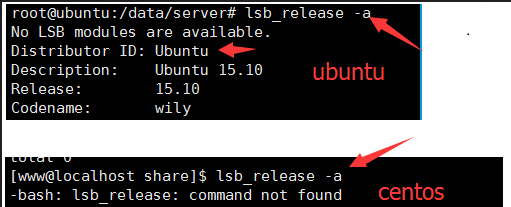
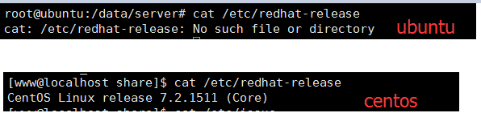

## vim操作

### vim 简介

 它是一个强大的的全屏幕的文本编辑器，是Linux/UNIX 上最常用的文本编辑器，他的作用是建立，编辑，显示文本。

 Vim 没有菜单，只有命令。

### vim 中有三种模式：

#### 一般模式：

使用 vim 文件名，就会进入命令模式，这个时候你输入的任何的字母，系统都会当成是命令来处理。

该模式下的一些常见用法：

```
dd:删除当前光标所在行
```

```
yy:复制当前光标行
```

```
数字N + Shift + g ：移动到目标行
```


#### 编辑模式：

在一般模式下使用下面的六个字母可以进入编辑模式，就可以自由编辑这个文件了

该模式下的一些常见用法：

```
i: 在光标所在的字符   前面  插入
I: 在光标所在的   行首   插入
a: 在光标所在的字符   后面  插入
A: 在光标所在的   行尾   插入
o: 在光标下插入新行
O: 在光标上插入新行
```


#### 指令模式：

在一般模式下输入[:/?]这三个符号就可以进入指令模式

该模式下的一些常见用法：

```
/被查找字符串：n 是查找下一个，shift + n 是往上查找
```

```
:set nu : 开启行号  ;   :set nonu : 关闭行号
```


## 常用命令

### df

显示文件系统的磁盘使用情况统计

```shell
df -h /home
```

以对人类友好的方式显示/home 目录的文件大小情况

-h 可以理解为human

### chown(改变文件主人和组)

格式如下：

```shell
chown [OPTION]... [OWNER][:[GROUP]] FILE...
```

示例如下：

```shell
chown zcd:root elasticsearch.log
```

改变`elasticsearch.log` ，zcd 是owner，root 是组

### free

用来查看系统的内存信息

```shell
free -g
```

表示内存单位是G来展示内存信息

```shell
free -m
```

表示内存单位是MB来展示内存信息

在使用这个命令的时候有两个字段分别是`buffers` 和`cached` ,为了提升读写的性能，在写入数据的时候，不是一个字节一个字节的写，而是先写入`buffers` ，然后一整块的写入磁盘，读也是类似的

### iostat

查看磁盘io的一些信息

```shell
iostat 2
```

每隔两秒打印一次io信息

```shell
iostat -dx 2
```

是每隔2秒显示一次IO扩展信息

介绍一下相关参数的含义： 

rrqm/s：队列中每秒钟合并的读请求数量 
wrqm/s：队列中每秒钟合并的写请求数量 
r/s：每秒钟完成的读请求数量 
w/s：每秒钟完成的写请求数量 
rsec/s：每秒钟读取的扇区数量 
wsec/s：每秒钟写入的扇区数量 
avgrq-sz：平均请求扇区的大小 
avgqu-sz：平均请求队列的长度 
await：平均每次请求的等待时间 
svctm：平均每次请求的服务时间 
util：设备的利用率 

### procs


### scp

这个命令用在 linux 跨机器复制文件，格式为

```shell
scp [-1246BCpqrv] [[user@]host1:]file1 [...] [[user@]host2:]file2
```

举例：

```shell
scp root@192.168.1.38:/home/sevendoor/kaifa/gameserver.tar.gz ./game
```

### su（ Switch User 切换用户）

可让一个普通用户切换为[超级用户](https://baike.baidu.com/item/%E8%B6%85%E7%BA%A7%E7%94%A8%E6%88%B7)或其他用户，并可临时拥有所切换用户的[权限](https://baike.baidu.com/item/%E6%9D%83%E9%99%90)，切换时需输入欲切换用户的密码；也可以让超级用户切换为普通用户，临时以低权限身份处理事务，切换时无需输入欲切换用户的密码。

### systemctl

此命令是系统服务管理器指令，它实际上将 [service](http://man.linuxde.net/service) 和 [chkconfig](http://man.linuxde.net/chkconfig) 这两个命令组合到一起。

| 任务         | 旧指令                                      | 新指令                                      |
| ---------- | ---------------------------------------- | ---------------------------------------- |
| 使某服务自动启动   | chkconfig --level 3 [httpd](http://man.linuxde.net/httpd) on | systemctl [enable](http://man.linuxde.net/enable) httpd.service |
| 使某服务不自动启动  | chkconfig --level 3 httpd off            | systemctl disable httpd.service          |
| 检查服务状态     | service httpd status                     | systemctl status httpd.service （服务详细信息） systemctl is-active httpd.service （仅显示是否 Active) |
| 显示所有已启动的服务 | chkconfig --list                         | systemctl list-units --[type](http://man.linuxde.net/type)=service |
| 启动某服务      | service httpd start                      | systemctl start httpd.service            |
| 停止某服务      | service httpd stop                       | systemctl stop httpd.service             |
| 重启某服务      | service httpd restart                    | systemctl restart httpd.service          |

### tar

常用命令：

解压：

```shell
[root@linux ~]# tar -cvf /tmp/etc.tar /etc <==仅打包，不压缩！
[root@linux ~]# tar -zcvf /tmp/etc.tar.gz /etc <==打包后，以 gzip 压缩
[root@linux ~]# tar -jcvf /tmp/etc.tar.bz2 /etc <==打包后，以 bzip2 压缩
```


参数：
-c ：建立一个压缩文件的参数指令(create 的意思)；
-x ：解开一个压缩文件的参数指令！
-t ：查看 tarfile 里面的文件！
特别注意，在参数的下达中， c/x/t 仅能存在一个！不可同时存在！
因为不可能同时压缩与解压缩。
-z ：是否同时具有 gzip 的属性？亦即是否需要用 gzip 压缩？
-j ：是否同时具有 bzip2 的属性？亦即是否需要用 bzip2 压缩？
-v ：压缩的过程中显示文件！这个常用，但不建议用在背景执行过程！
-f ：使用档名，请留意，在 f 之后要立即接档名喔！不要再加参数！
　　　例如使用『 tar -zcvfP tfile sfile』就是错误的写法，要写成
　　　『 tar -zcvPf tfile sfile』才对喔！
-p ：使用原文件的原来属性（属性不会依据使用者而变）
-P ：可以使用绝对路径来压缩！
-N ：比后面接的日期(yyyy/mm/dd)还要新的才会被打包进新建的文件中！

### top

查看当前系统进程状态

在top命令的使用界面中，

1.按`1` 可以显示每个cpu核心的使用情况

2.`top -H -p <pid>` 来查看某个进程的所以线程

### uname

```shell
uname -r 		#查看kernel version
```


### vmstat

`vmstat`  加上间隔时间，来查看系统的一些进程运行情况

### yum

列出所有已安装的软件包 

```shell
yum list installed 
```


yum update -y  和 yum update 的区别

如果使用`yum install xxxx`，会找到安装包之后，询问你`Is this OK[y/d/N]`，需要你手动进行选择。但是如果加上参数`-y`，就会自动选择`y`，不需要你再手动选择！

## 经验

### 查看系统是ubuntu 还是centos

有三种方法：

1、执行： lsb_release -a



2、命令： cat /etc/redhat-release

