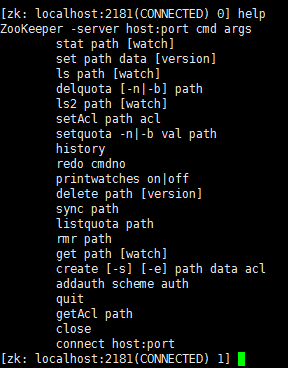
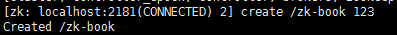
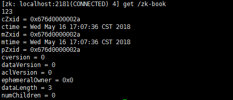
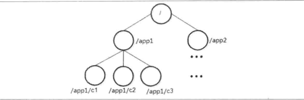
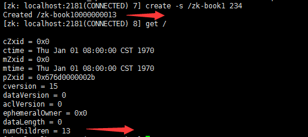
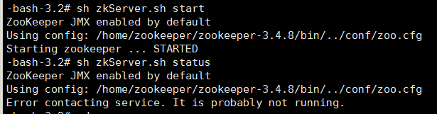
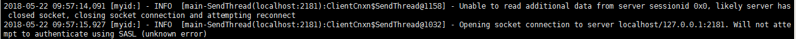

# 简介

Zookeeper作为一个分布式服务协调框架，主要是用来解决分布式数据一致性问题。

# 安装

## 集群安装

这儿我准备了三台服务器：

192.168.1.34

192.168.1.36

192.168.1.38

 

1：解压Zookeeper

**tar -zxvf zookeeper-3.4.10.tar.gz**

** **

2：集群配置（配置zoo.cfg 文件）

在conf目录下有下面一些文件

 

Zookeeper启动的时候可以**指定使用什么配置**，也可以不指定，不指定默认就是使用conf/zoo.cfg 这个配置文件，所以一般的做法就是**cp zoo_sample.cfg zoo.cfg** 然后我们只修改zoo.cfg 就行了

 

在zoo.cfg 配置文件的后面追加下面这些内容：表示三台机器组成了这个集群

格式为：**server.{id}={host}:{port_01}:{port_02}**

id的取值范围： 1~255； 用id来标识该机器在集群中的机器序号

2188是zookeeper之间数据同步的端口； 

3188表示leader选举的端口

看看这个配置文件：

```properties
# The number of milliseconds of each tick
tickTime=2000
# The number of ticks that the initial 
# synchronization phase can take
initLimit=10
# The number of ticks that can pass between 
# sending a request and getting an acknowledgement
syncLimit=5
# the directory where the snapshot is stored.
# do not use /tmp for storage, /tmp here is just 
# example sakes.
dataDir=/tmp/zookeeper
# the port at which the clients will connect
clientPort=2181
# the maximum number of client connections.
# increase this if you need to handle more clients
#maxClientCnxns=60
#
# Be sure to read the maintenance section of the 
# administrator guide before turning on autopurge.
#
# http://zookeeper.apache.org/doc/current/zookeeperAdmin.html#sc_maintenance
#
# The number of snapshots to retain in dataDir
#autopurge.snapRetainCount=3
# Purge task interval in hours
# Set to "0" to disable auto purge feature
#autopurge.purgeInterval=1

server.1=192.168.1.34:2188:3188
server.2=192.168.1.36:2188:3188
server.3=192.168.1.38:2188:3188
```


 

3：创建myid文件

在zoo.cfg配置文件中有这么一项配置dataDir=/tmp/zookeeper

然后在每一个服务器的dataDir目录下创建一个myid的文件，文件就一行数据，数据内容是每台机器对应的server id的数字

 

4：启动zookeeper

在bin目录下有很多的脚本，我们使用zkServer.sh 来启动zookeeper，命令如下：

sh zkServer.sh start

三台服务器都这样启动

 

可以使用如下的命令来查看zookeeper的状态

sh zkServer.sh status

 

这个命令可以看出当前的zookeeper节点是leader 还是follower

# 自带客户端脚本

可以使用bin下面的zkCli.sh 脚本来连接zookeeper，格式为 sh zkCli.sh -参数名 参数值

可以使用的参数情况又下面一些：

1> -timeout：表示客户端向zk服务器发送心跳的时间间隔，单位为毫秒。因为zk客户端与服务器的连接状态是通过心跳检测来维护的，如果在指定的时间间隔内，zk客户端没有向服务器发送心跳包，服务器则会断开与该客户端的连接。参数5000，表示zk客户端向服务器发送心跳的间隔为5秒。

2> -r：表示客户端以只读模式连接

3> -server：指定zk服务器的IP与端口，zk默认的客户端端口为2181

 

我们一般使用如下的连接方式：

```shell
sh zkCli.sh -server 192.168.1.38:2181
```

在连接上`Zookeeper` 之后我们就可以使用help 命令查看可以使用的命令，及其格式：



**注意**

zookeeper 在创建节点的时候是必须从跟路径开始

删除必须从子节点开始，从下往上删除

## 创建（create）

命令格式为，从上面的截图也可以看出来

```shell
create [-e] [-s] path data acl
```

-e 和 -s 分别置顶节点特性：临时节点和顺序节点

如果不加这两个创建的就是持久节点。


看看下面的实际例子：

```shell
create /zk-book 123
```

结果如下：



## 读取（ls & get）

### ls

格式：

```shell
ls path [watch]
```

使用ls命令可以列出指定的Zookeeper节点下的所有子节点。当然这个命令只能看见指定节点下**第一级**的所有节点

看看一个实例：


ps：在zookeeper中 / 表示根节点，类似linux的根节点，而且第一次部署的zookeeper集群，默认在根路径下（“/”），**有一个保留节点叫 /zookeeper**

### get

使用get命令，可以获取Zookeeper 指定节点的数据内容和属性信息。用法如下：

```shell
get path [watch]
```

看一个实例：



## 更新（set）

使用set命令，可以更新指定节点的数据内容，用法如下：

```shell
set path data [version]
```

## 删除（delete）

使用delete 命令，可以删除 Zookeeper上的指定节点。用法如下：

```shell
delete path [version]
```

# 客户端

## Java 客户端API

Zookeeper自己提供了Java的API 客户端：

如果使用maven可以如下的导入：

```xml
<!-- https://mvnrepository.com/artifact/org.apache.zookeeper/zookeeper -->
<dependency>
    <groupId>org.apache.zookeeper</groupId>
    <artifactId>zookeeper</artifactId>
    <version>3.4.6</version>
    <type>pom</type>
</dependency>

```

## Curator 客户端

### 简介：

Curator包含了几个包：

**curator-framework：**对zookeeper的底层api的一些封装

**curator-client：**提供一些客户端的操作，例如重试策略等

**curator-recipes：**封装了一些高级特性，如：Cache事件监听、选举、分布式锁、分布式计数器、分布式Barrier等

### 导包：

```xml
  <dependencies>
    <dependency>
      <groupId>org.apache.curator</groupId>
      <artifactId>curator-framework</artifactId>
      <version>2.12.0</version>
    </dependency>
    <dependency>
      <groupId>org.apache.curator</groupId>
      <artifactId>curator-recipes</artifactId>
      <version>2.12.0</version>
    </dependency>
  </dependencies>
```

这次导包，导入了`framework` 和 `recipes` 的包

### 操作

#### 创建会话

##### 方法一：使用静态工程方法创建客户端

```java
public static final String connectString = "192.168.1.34:2181,192.168.1.36:2181,192.168.1.38:2181";

public static void main( String[] args ) {
  //重试策略
  RetryPolicy retryPolicy = new ExponentialBackoffRetry(1000, 3);
  CuratorFramework client = CuratorFrameworkFactory.newClient( 
    connectString, 5000, 3000, retryPolicy);
}
```

这儿介绍一下，newClient 方法的几个参数的含义：


connectionString 服务器列表，格式host1:port1,host2:port2,...


retryPolicy 重试策略,内建有四种重试策略,也可以自行实现RetryPolicy接口


sessionTimeoutMs 会话超时时间，单位毫秒，默认60000ms

connectionTimeoutMs 连接创建超时时间，单位毫秒，默认60000ms

##### 方法二：使用Fluent风格的Api创建会话

核心参数为流式设置，一个例子如下：

```java
public static final String connectString = "192.168.1.34:2181,192.168.1.36:2181,192.168.1.38:2181";

public static void main(String[] args) {
  RetryPolicy retryPolicy = new ExponentialBackoffRetry(1000, 3); 
  CuratorFramework client = CuratorFrameworkFactory.builder() 
    .connectString(connectString) 
    .sessionTimeoutMs(5000) 
    .connectionTimeoutMs(5000)
    .retryPolicy(retryPolicy)
    .build();
}
```

##### 方法三:创建包含隔离命名空间的会话

为了实现不同的Zookeeper业务之间的隔离，需要为每个业务分配一个独立的命名空间（**NameSpace**），即指定一个Zookeeper的根路径（官方术语：**为Zookeeper添加“Chroot”特性**）。例如（下面的例子）当客户端指定了独立命名空间为“/base”，那么该客户端对Zookeeper上的数据节点的操作都是基于该目录进行的。通过设置Chroot可以将客户端应用与Zookeeper服务端的一课子树相对应，在多个应用共用一个Zookeeper集群的场景下，这对于实现不同应用之间的相互隔离十分有意义。

看一个例子如下：

```java
public static final String connectString = "192.168.1.34:2181,192.168.1.36:2181,192.168.1.38:2181";

public static void main(String[] args) {
  RetryPolicy retryPolicy = new ExponentialBackoffRetry(1000, 3);
  CuratorFramework client = CuratorFrameworkFactory.builder()
    .connectString(connectString)
    .sessionTimeoutMs(5000)
    .connectionTimeoutMs(5000)
    .retryPolicy(retryPolicy)
    .namespace("base")   //我在这儿, 注意这儿不要加根目录的 /,因为默认就是加上了的
    .build();
}
```

#### 启动客户端

当创建会话成功，得到client的实例然后可以直接调用其start( )方法：

```java
client.start();
```

#### 创建数据节点

看下面几个例子就知道一些常规的操作了：

**创建一个节点，初始内容为空 **

```
client.create().forPath("path");
```

注意：如果没有设置节点属性，节点创建模式默认为持久化节点，内容默认为空

**创建一个节点，附带初始化内容**

```java
final String path = client.create().forPath("/gameserver", "init".getBytes());
System.out.println(path);

//答案   /gameserver
```

**创建一个节点，指定创建模式（临时节点），内容为空**

```
client.create().withMode(CreateMode.EPHEMERAL).forPath("path");
```

**创建一个节点，指定创建模式（临时节点），附带初始化内容**

```
client.create().withMode(CreateMode.EPHEMERAL).forPath("path","init".getBytes());
```

**创建一个节点，指定创建模式（临时节点），附带初始化内容，并且自动递归创建父节点**

```
client.create()
      .creatingParentContainersIfNeeded()
      .withMode(CreateMode.EPHEMERAL)
      .forPath("path","init".getBytes());
```

这个`creatingParentContainersIfNeeded`()接口非常有用，因为一般情况开发人员在创建一个子节点必须判断它的父节点是否存在，如果不存在直接创建会抛出`NoNodeException`，使用creatingParentContainersIfNeeded()之后Curator能够自动递归创建所有所需的父节点。

#### 删除数据节点

**删除一个节点**

```java
client.delete().forPath("/child-1");
```

注意：此方法只能删除**叶子节点**，否则会抛出如下异常。

```
org.apache.zookeeper.KeeperException$NotEmptyException: KeeperErrorCode = Directory not empty for /gameserver/level
```


**删除一个节点，并且递归删除其所有的子节点**

```java
client.delete().deletingChildrenIfNeeded().forPath("path");
```

**删除一个节点，强制指定版本进行删除**

```
client.delete().withVersion(10086).forPath("path");
```

**删除一个节点，强制保证删除**

```
client.delete().guaranteed().forPath("path");
```

guaranteed()接口是一个保障措施，只要客户端会话有效，那么Curator会在后台持续进行删除操作，直到删除节点成功。

**注意：**上面的多个流式接口是可以自由组合的，例如：

```
client.delete().guaranteed().deletingChildrenIfNeeded().withVersion(10086).forPath("path");
```

#### 读取数据节点数据

**读取一个节点的数据内容**

```
client.getData().forPath("path");
```

注意，此方法返的返回值是byte[ ];

**读取一个节点的数据内容，同时获取到该节点的stat**

```
Stat stat = new Stat();
client.getData().storingStatIn(stat).forPath("path");
```

#### 更新数据节点数据

**更新一个节点的数据内容**

```
client.setData().forPath("path","data".getBytes());
```

注意：该接口会返回一个Stat实例

**更新一个节点的数据内容，强制指定版本进行更新**

```
client.setData().withVersion(10086).forPath("path","data".getBytes());
```

#### 检查节点是否存在

```
client.checkExists().forPath("path");
```

注意：该方法返回一个Stat实例，用于检查ZNode是否存在的操作. 可以调用额外的方法(监控或者后台处理)并在最后调用forPath( )指定要操作的ZNode

#### 获取节点的所有子节点路径

```
client.getChildren().forPath("path");
```

注意：该方法的返回值为List<String>,获得ZNode的子节点Path列表。 可以调用额外的方法(监控、后台处理或者获取状态watch, background or get stat) 并在最后调用forPath()指定要操作的父ZNode

#### 事务

CuratorFramework的实例包含inTransaction( )接口方法，调用此方法开启一个ZooKeeper事务. 可以复合create, setData, check, and/or delete 等操作然后调用commit()作为一个原子操作提交。一个例子如下：

```
client.inTransaction().check().forPath("path")
      .and()
      .create().withMode(CreateMode.EPHEMERAL).forPath("path","data".getBytes())
      .and()
      .setData().withVersion(10086).forPath("path","data2".getBytes())
      .and()
      .commit();
```

### 异步接口

上面提到的创建、删除、更新、读取等方法都是同步的，Curator提供异步接口，引入了**BackgroundCallback**接口用于处理异步接口调用之后服务端返回的结果信息。**BackgroundCallback**接口中一个重要的回调值为CuratorEvent，里面包含事件类型、响应吗和节点的详细信息。

#### `BackgroundCallback` 接口定义如下：

```java
public interface BackgroundCallback {
    public void processResult(CuratorFramework client, CuratorEvent event) throws Exception;
}
```

#### CuratorEvent 接口

```java
package org.apache.curator.framework.api;

import org.apache.zookeeper.WatchedEvent;
import org.apache.zookeeper.data.ACL;
import org.apache.zookeeper.data.Stat;
import java.util.List;

/**
 * A super set of all the various Zookeeper events/background methods.
 *
 * IMPORTANT: the methods only return values as specified by the operation that generated them. Many methods
 * will return <tt>null</tt>
 */
public interface CuratorEvent
{
    /**
     * check here first - this value determines the type of event and which methods will have
     * valid values
     *
     * @return event type
     */
    public CuratorEventType getType();

    /**
     * @return "rc" from async callbacks
     */
    public int getResultCode();

    /**
     * @return the path
     */
    public String getPath();

    /**
     * @return the context object passed to {@link Backgroundable#inBackground(Object)}
     */
    public Object getContext();

    /**
     * @return any stat
     */
    public Stat getStat();

    /**
     * @return any data
     */
    public byte[] getData();

    /**
     * @return any name
     */
    public String getName();

    /**
     * @return any children
     */
    public List<String> getChildren();

    /**
     * @return any ACL list or null
     */
    public List<ACL> getACLList();

    /**
     * If {@link #getType()} returns {@link CuratorEventType#WATCHED} this will
     * return the WatchedEvent
     *
     * @return any WatchedEvent
     */
    public WatchedEvent getWatchedEvent();
}

```

#### CuratorEventType 枚举

```java
public enum CuratorEventType
{
    /**
     * Corresponds to {@link CuratorFramework#create()}
     */
    CREATE,

    /**
     * Corresponds to {@link CuratorFramework#delete()}
     */
    DELETE,

    /**
     * Corresponds to {@link CuratorFramework#checkExists()}
     */
    EXISTS,

    /**
     * Corresponds to {@link CuratorFramework#getData()}
     */
    GET_DATA,

    /**
     * Corresponds to {@link CuratorFramework#setData()}
     */
    SET_DATA,

    /**
     * Corresponds to {@link CuratorFramework#getChildren()}
     */
    CHILDREN,

    /**
     * Corresponds to {@link CuratorFramework#sync(String, Object)}
     */
    SYNC,

    /**
     * Corresponds to {@link CuratorFramework#getACL()}
     */
    GET_ACL,

    /**
     * Corresponds to {@link CuratorFramework#setACL()}
     */
    SET_ACL,

    /**
     * Corresponds to {@link Watchable#usingWatcher(Watcher)} or {@link Watchable#watched()}
     */
    WATCHED,

    /**
     * Event sent when client is being closed
     */
    CLOSING
}
```

一个异步创建节点的例子如下：

```
Executor executor = Executors.newFixedThreadPool(2);
client.create()
      .creatingParentsIfNeeded()
      .withMode(CreateMode.EPHEMERAL)
      .inBackground((curatorFramework, curatorEvent) -> {      System.out.println(String.format("eventType:%s,resultCode:%s",curatorEvent.getType(),curatorEvent.getResultCode()));
      },executor)
      .forPath("path");

```

注意：如果#inBackground()方法不指定executor，那么会默认使用Curator的EventThread去进行异步处理。


# 数据模型

对于Zookeeper上的每一个数据节点被称为一个ZNode，所有的ZNode 按层次化结构进行组织，形成一棵树。类似如下：



# 节点特性

基于连个维度；顺序性 和 生命周期，可以分为下面的四种类型

## 持久节点（PERSISTENT）

最常见的节点类型

只有主动删除，才会从Zookeeper服务器上，清除这个节点

## 持久节顺序点（PERSISTENT_SEQUENTIAL）

在创建这类节点的时候，会默认在节点的后面加上一个数字后缀，代表节点创建的顺序，看如下实例：



在上图中的第一处红色位置，就是我们基于名字 `zk-book1`创建的一个顺序节点，然后名字后面加了0000000013，这个13就是目前的子节点的顺序，为了验证，我就查看节点 / 信息，发现果然目前有13个节点

## 临时节点(EPHEMERAL)

这类节点的生命周期和客户端的会话绑定在一起。

ps：这个客户端创建了一个临时节点，另一个客户也是可以看见的，只要创建的客户端的会话未断

## 顺序性临时节点(EPHEMERAL_SEQUENTIAL)

带创建顺序的临时节点


# zxid

全称是：ZooKeeper Transaction Id

##zxid是什么

每次修改ZooKeeper状态都会收到一个zxid形式的时间戳，也就是ZooKeeper事务ID。

事务ID是ZooKeeper中所有修改总的次序。每个修改都有唯一的zxid，如果zxid1小于zxid2，那么zxid1在zxid2之前发生。

***即，zxid是整个zookeeper服务器集群共同关注的***

# ZooKeeper的Stat结构体

**czxid- 引起这个znode创建的zxid，创建节点的事务的zxid（ZooKeeper Transaction Id）**

**ctime - znode被创建的毫秒数(从1970年开始)**

**mzxid - znode最后更新的zxid**

**mtime - znode最后修改的毫秒数(从1970年开始)**

**pZxid-znode最后更新的子节点zxid**

cversion - znode子节点变化号，znode子节点修改次数

dataversion - znode数据变化号

aclVersion - znode访问控制列表的变化号

**ephemeralOwner- 如果是临时节点，这个是znode拥有者的session id。如果不是临时节点则是0。**

**dataLength- znode的数据长度**

**numChildren - znode子节点数量**

# 通知机制

 客户端注册监听它关心的目录节点，当目录节点发生变化（**数据改变、被删除、子目录节点增加删除**）时，
zookeeper会通知客户端。

Zookeeper 客户端里的所有读取操作：getData(),getChildren()和exists()都有设置watch的选项。


# 常见错误

## 1.启动zookeeper未成功

大概的错误如下：就是在使用启动命令启动之后显示`STARTED`了，但是用状态命令查看确是`Error Contactin service`



### 原因

myid文件不在了，然后在`zoo.cfg`配置中对应的`dataDir`配置的目录下检查，果然发现`myid`文件不见了，重新创建一个，重启就ok。

## 2.用curator无法创建节点

### 现象

从下面的代码来看呢，就是在创建节点的时候报的如下的错误：

```java
org.apache.zookeeper.KeeperException$ConnectionLossException: KeeperErrorCode = ConnectionLoss for /gameserver/localhost
	at org.apache.zookeeper.KeeperException.create(KeeperException.java:99)
	at org.apache.zookeeper.KeeperException.create(KeeperException.java:51)
	at org.apache.zookeeper.ZooKeeper.create(ZooKeeper.java:783)
```

然后我就检查zookeeper服务器的一个节点，发现一直报如下的错误：



### 原因：

由于我在zoo.cfg中配置了3台机器，但是宕机了两台，zookeeper就会认为服务处于不可用状态。

zookeeper有个选举算法，当整个集群超过半数机器宕机，zookeeper会认为集群处于不可用状态。

所有，3台机器只启动一台无法连接，如果启动2台及以上就可以连接了。

### 解决办法

把那两台启动一台就ok，或者都启动